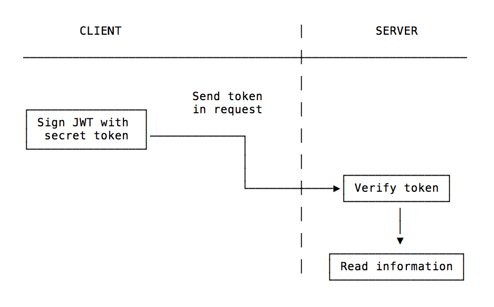

JSON Web Token is a standard used to create access tokens for an application.

It works this way: the server generates a token that certifies the user identity, and sends it to the client.

The client will send the token back to the server for every subsequent request, so the server knows the request comes from a particular identity.

This architecture proves to be very effective in modern Web Apps, where after the user is authenticated we perform API requests either to a REST or a GraphQL API.

Who uses JWT? Google, for example. If you use the Google APIs, you will use JWT.

A JWT is cryptographically signed (but _not_ encrypted, hence using HTTPS is mandatory when storing user data in the JWT), so there is a guarantee we can trust it when we receive it, as no middleman can intercept and modify it, or the data it holds, without invalidating it.

That said, JWTs are often criticized for their overuse, and especially for them being used when less problematic solutions can be used.

You need to form your opinion around the subject. I'm not advocating for a technology over another, just presenting all the opportunities and tools you have at your disposal.

What are they good for? Mainly API authentication, and server-to-server authorization.

## How is a JWT token generated?

Using Node.js you can generate the first part of the token by using this code:

```js
const header = { "alg": "HS256", "typ": "JWT" }
const encodedHeader = Buffer.from(JSON.stringify(header)).toString('base64')
```

We set the signing algorithm to be `HMAC SHA256` (JWT supports multiple algorithms), then we create a buffer from this JSON-encoded object, and we encode it using base64.

The partial result is `eyJhbGciOiJIUzI1NiIsInR5cCI6IkpXVCJ9`.

Next we add the payload, which we can customize with any kind of data. There are reserved keys, including `iss` and `exp` which identify the issuer and the expiration time of the token.

You can add your own data to the token by using an object:

```js
const payload = { username: 'Flavio' }
```

We convert this object, JSON-encoded, to a Buffer and we encode the result using base64, just like we did before:

```js
const encodedPayload = Buffer.from(JSON.stringify(payload)).toString('base64')
```

In this case the partial result is `eyJ1c2VybmFtZSI6IkZsYXZpbyJ9`.

Next, we get a signature from the header and payload content, which makes sure our content can't be changed even if intercepted as our signature will be invalidated. To do this, we'll use the [`crypto` Node module](https://nodejs.org/api/crypto.html):

```js
const crypto = require('crypto')
const jwtSecret = 'secretKey'

const signature = crypto.createHmac('sha256', jwtSecret).update(encodedHeader + '.' + encodedPayload).digest('base64')
```

We use the `secretKey` secret key and create a base64 encoded representation of the encrypted signature.

The value of the signature in our case is

`MQWECYWUT7bayj8miVgsj8KdYI3ZRVS+WRRZjfZrGrw=`

We are almost done, we just need to concatenate the 3 parts of header, payload and signature by separating them with a dot:

```js
const jwt = `${encodedHeader}.${encodedPayload}.${signature}`
```

## API authentication

This is probably the only sensible way to use JWT.

A common scenario is: you sign up for a service and download a JWT from the service dashboard. This is what you will use from now on to authenticate all your requests to the server.



Another use case, which is the opposite, is sending the JWT when you manage the API and clients connect to you, and you want your users to send subsequent requests by just passing the token.

In this case, the client needs to store the token somewhere. Where is the best place? In an **HttpOnly cookie**. The other methods are all prone to XSS attacks and as suche they should be avoided. An HttpOnly cookie is not accessible from JavaScript, and is automatically sent to the origin server upon every request, so it perfectly suits the use case.

## Choose the best JWT library

Depending on the language and environment you use, you can choose from a number of libraries. The most popular are listed in the [jwt.io](https://jwt.io/#libraries-io) website.

## Don't use JWTs as session tokens

You should not use JWTs for sessions. Use a regular server-side session mechanism, as it's much more efficient and less prone to data exposure.

## Resources

- [The JST Debugger](https://jwt.io/#debugger)
- [JWT Libraries](https://jwt.io/#libraries-io)

## Read more

There is a lot of literature covering JWTs on the internet.

You can literally lose hours reading blog posts and opinions. Some of those posts are

- [Why JWTs Suck as Session Tokens](https://developer.okta.com/blog/2017/08/17/why-jwts-suck-as-session-tokens)
- [Stop using JWT for sessions](http://cryto.net/~joepie91/blog/2016/06/13/stop-using-jwt-for-sessions/)
- [Stop using JWT for sessions, part 2: Why your solution doesn't work](http://cryto.net/~joepie91/blog/2016/06/19/stop-using-jwt-for-sessions-part-2-why-your-solution-doesnt-work/)
