I started programming when I was 15, and since I'm now 36, I have a long list of projects I built that looking back were complete failures, **but** all contributed to creating the 36 years old **solopreneur**.

In the meantime I graduated in Computer Engineering and worked for 10 years as a contractor and freelancer for several companies.

The first time I met programming was with the Amiga that came included with the encyclopedia package 😄. There was something called RexxMast which you could open and you could type anything. The only thing was I didn't know what to type. There was no Internet at the time. Not as we know it.

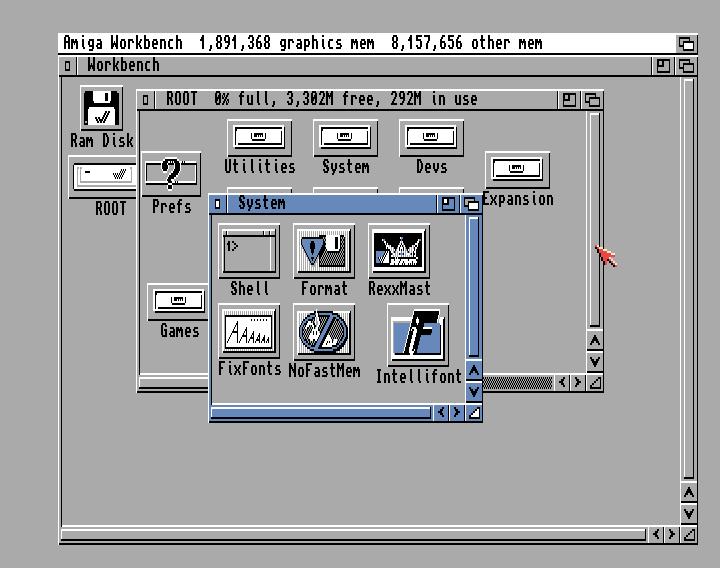

In 1997, I became a huge Linux fan, when Linux was sold in 4-CD packs (you could not really download it from the Internet, as it would take an overnight telephone call, blocking the line).

I started making little websites, bought a huge JavaScript book covering Netscape 3.0 in 1997, which means that technically I'm a JS dev since 20 years (but that was a **very** different JS).

I learned PHP 3 which at the time was really advanced, printing the entire reference manuals (a lot of wasted paper). I think I ended up with a 10cm self-printed book.

Here is the first project I ever published: a website dedicated to Linux, in italian. I wanted to be a resource for the italian scene, which was very, very small at the time. The site launched on my ISP servers, which thanks to a friend (and "co-founder" of the project) that worked there. Domains and hosting used to cost a lot back then, but they were using Linux, they supported the project and we ended up with a nice subdomain: `linux.clavis.it`.

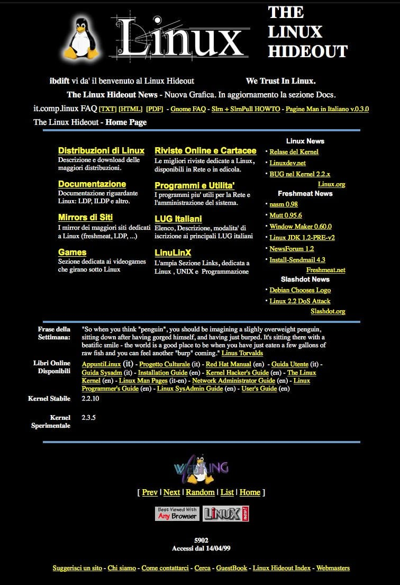

You can see the design was "inspired" by Yahoo.

In this image, it's 1999 and the site had 5902 visits (visitors counters were a cool thing, and Webrings too!).

The next project I remember was a website dedicated to programming. Written in italian, started while I was at the university.

At the time I knew some C, some Java and dabbled with Web stuff.

I wrote a few articles and shared in a forum (I remember one about AJAX), only to be told they were poorly written, so I stopped (we can talk on the importance of getting good feedback early on...).

In 2005 I got a Mac, it was an awesome machine, an entry level iBook 12". So white. So small. So nice. Now it looks like thrash, but I remember how call it was that it could talk, out of the box!

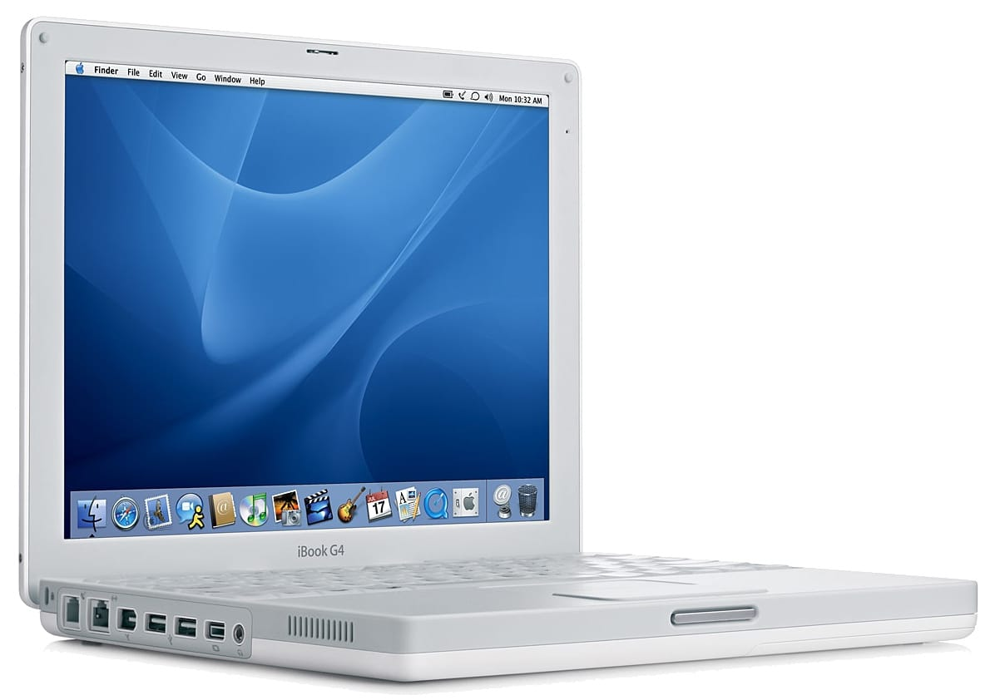

Notice how the apps, 14+ years later, are still nearly the same - iTunes, iPhoto, iMovie, GarageBand, Mail, Safari. An early OSX version made me buy a **huge**, used Cocoa Programming book which was *way* too complex to digest (on the importance of getting the right book at the right time...).

I started getting into automation, and as I was an ebook collector I figured I could create a website using a CMS, and generate pages automatically by scanning through my huge ebook list, pick a phrase from one book, one from another, and combine lots of them to form a page that looked legit but was completely unreadable.

Somehow this site started to rank, as I got an email from a published saying I was violating some trademark on their books, so I put it offline.

Anyway this got me into CMSs, which were also the topic of my thesis. Immediately after getting the degree I started my own company to freelance.

I already had a blog, in italian, where I wrote about Web Development (recurring pattern here).

The idea, in addition to client work, was to get an audience and then write books.

I started with a premium product first, an **online course** about Joomla.

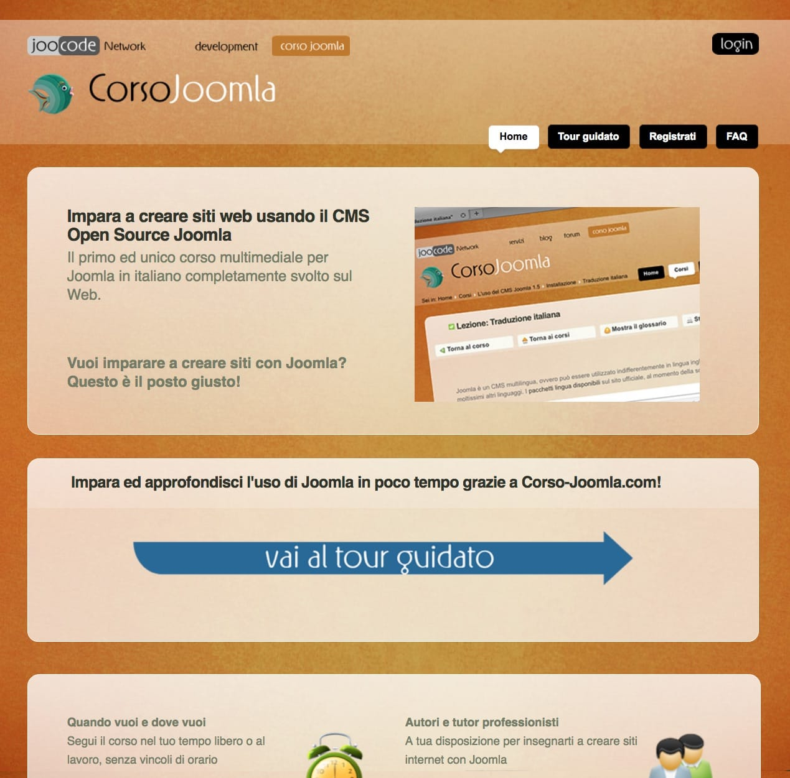

Back then there was no real platform to host courses, so I built mine (on a site based on Joomla). It was a fairly complex website with quizzes, video playback, text lessons and more.

The course did pretty well, but not super well, but since the course site was a pain to write, it gave me the idea of making a platform for others to use. Think Udemy, many years earlier. It had a nice name (and domain): `learnerhq.com`

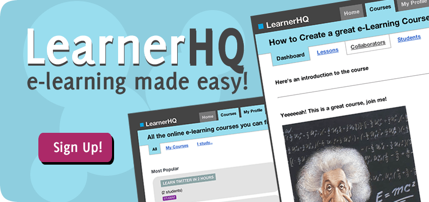

I wrote it and used it to host my Joomla course, and I had the idea of making more courses on it but when I finished writing the software I also lost motivation to do courses (lesson learned).

If you read Joomla and laugh, at the time it was the only decent alternative to Drupal, which was the other big Open Source CMS. WordPress was only capable of making a blog. It was good at that, but only at that.

It's not the beast that it is today.

I used it to host my blog, so I wrote my first free WordPress plugin which was some kind of Search Engine Marketing tool, as it detected the keyword that people used to get to your site (which at the time was freely given to you by Google), and based on that keyword it could show a different message.

A very nice marketing tool, one could say, but didn't get much traction.

After a couple years I created my first Joomla plugin, and this time it was a paid plugin. It did something very easy: at the time when you registered on the site, you then had to log in separately, which was a nonsense in my opinion. The plugin took me 1 hour to write, while on the sofa, and sold really well for the ROI.

Encouraged by the initial success, the products strategy then revolved around creating a more widespread portfolio of plugins. I launched 15 of them. I now actively maintain 4 of them.

One of these is [JooCommerce](https://joocommerce.com), the best and simplest to use Joomla e-commerce extension.

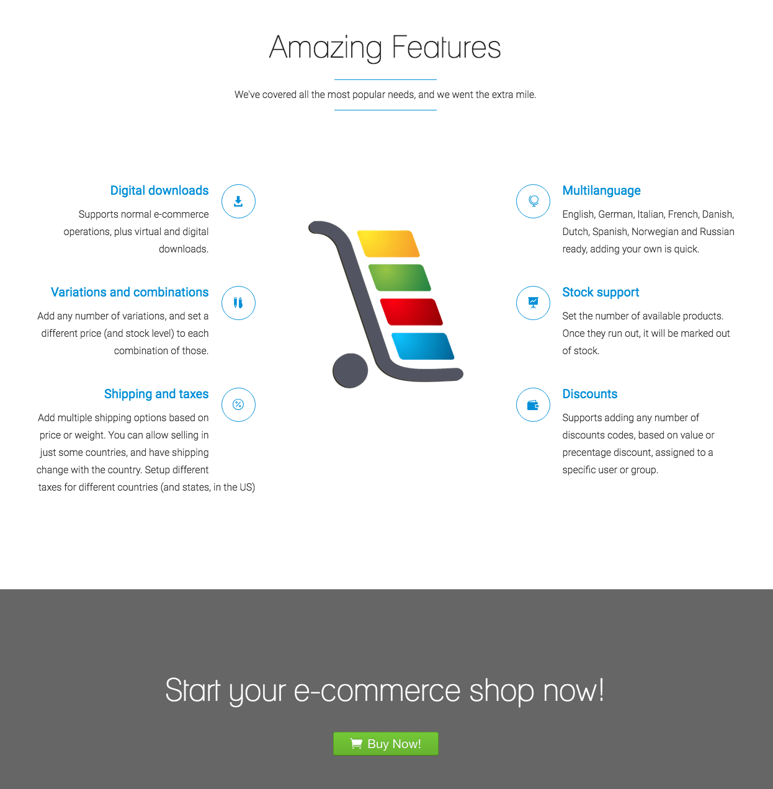

The logo was created via a design contest on 99designs.

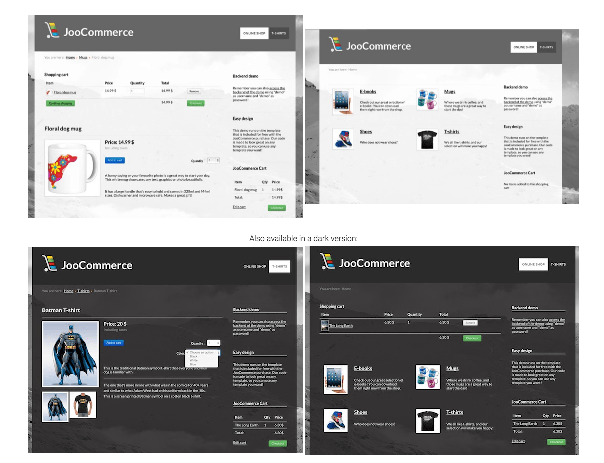

Another one is a way to add Google Maps to your site.

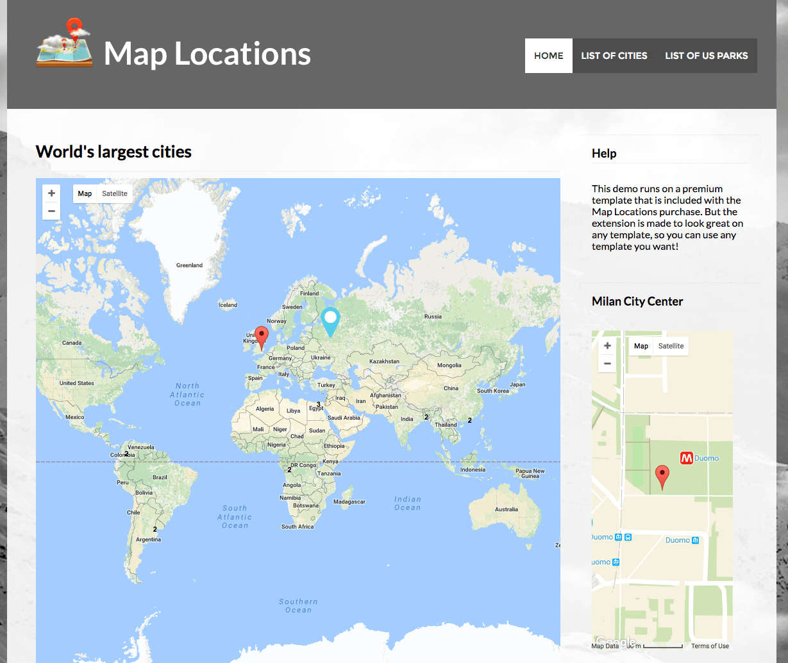

Overall those plugins have been purchased by thousands of developers.

Many of them use **Ember.js** for their admin-side interface, and of course PHP as they are built on top of a PHP CMS.

I created about 2 dozens iPhone and iPad apps and games. Now I removed them all from the store. I remember a [windsurfing sessions tracker](https://itunes.apple.com/it/app/windsurf/id453000648?mt=8), and a [Naval Battles app](http://www.148apps.com/app/432893420/) which was amazing. Countless hours learning Objective-C and iOS.

I made a nice 2D graphics game [involving birds and a squirrel](http://www.148apps.com/app/517486655/) with a cool usage of game physics to emulate gravity (Cocos2D), now retired.

I wrote a few apps about music, showing lyrics and song previews of artists using the iTunes APIs, but was asked to remove them due to copyright issues.

I later rewrote a couple apps with Swift, but apps never really took off. They paid the yearly Apple membership and maybe a coffee from time to time.

Then I decided to migrate my Joomla eCommerce plugin to WordPress, as the user base of Joomla was going down and my plugins sales slowed down.

I released it with a splash, no one seemed to download it even if it was free, so I removed it after a few months. It was called CommerceKit. A cool name, until Apple released a library with the same name. It had an innovative approach. While all WP plugins were going into the "more complex" route, I aimed for simplicity and integration. No addons, for example, was a big decision.

I created and released half a dozen utility [OSX apps](https://tailapps.com) based on a web stack (**Ember.js** and MacGap), before Electron existed, most notably a code snippets database

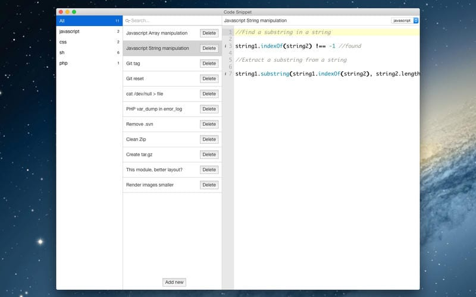

a text notes app, a recipes app, a devices management app (a database for your devices), and a bills manager:

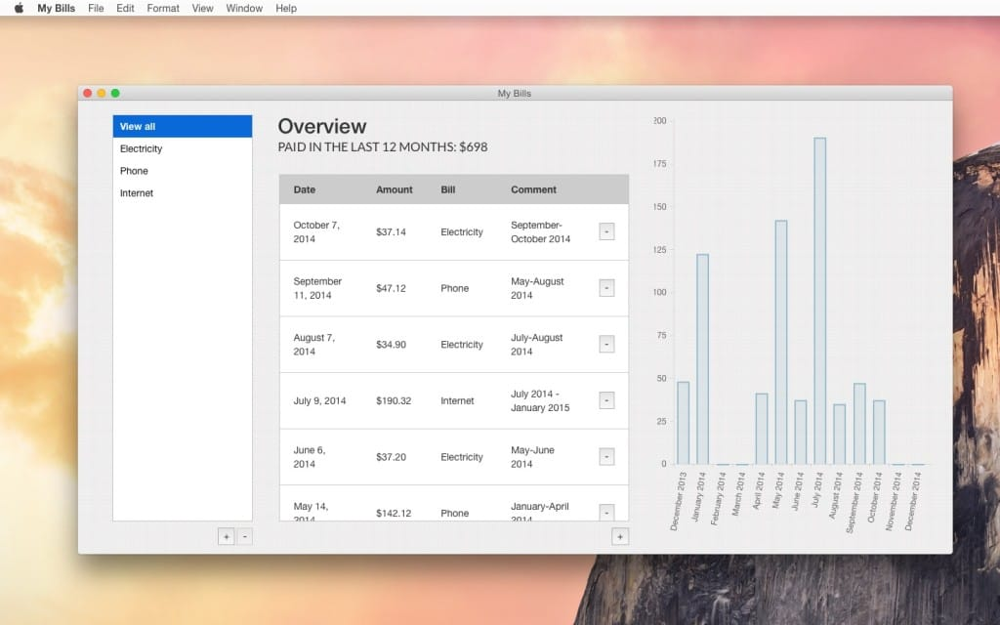

Utility apps.

For years they sold a few units per week, but basically none created a relevant income stream.

While working for the Grav CMS as a part-time developer, I migrated my Joomla ecommerce plugin idea to that CMS, and created an open source ecommerce plugin with commercial addons.

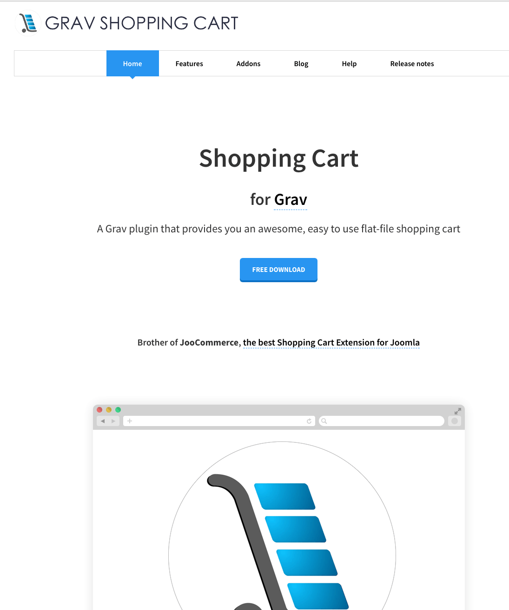

I now don't actively maintain it, as adoption was very slow and I envisioned a bit more collaboration from the community as well, but that didn't happen.

The last public project I built was **Gitometer**, a Git repository stats visualization tool. My idea was to have a private portion of the app for companies, and a public part for individual users.

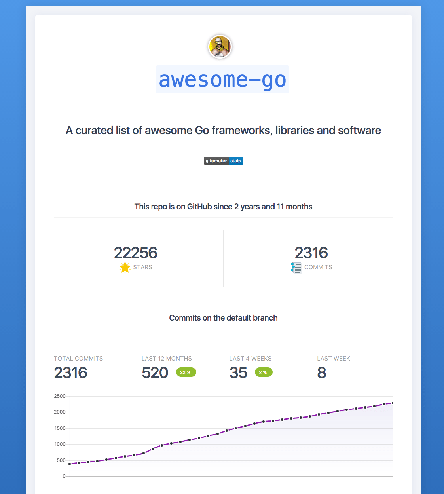

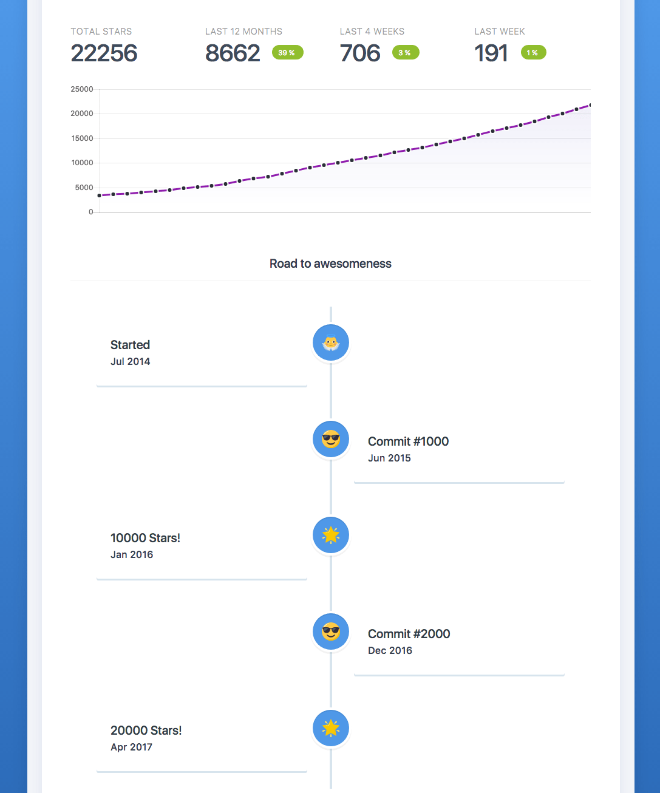

It used the GitHub GraphQL APIs to gather the data. I wrote it in Laravel first, then migrated to Go to make it faster, but after pitching the idea to some GitHub users it was not well received, and I just used it for some tutorials.

It's now been 2 years since my last public project release, and I decided to stop making software projects for sale.

After more than a decade, I am now focusing on creating educational material, projects just for fun, things to help other people and empower them to create their own vision for the future.
