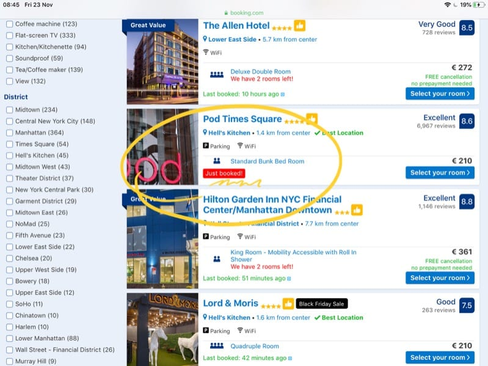
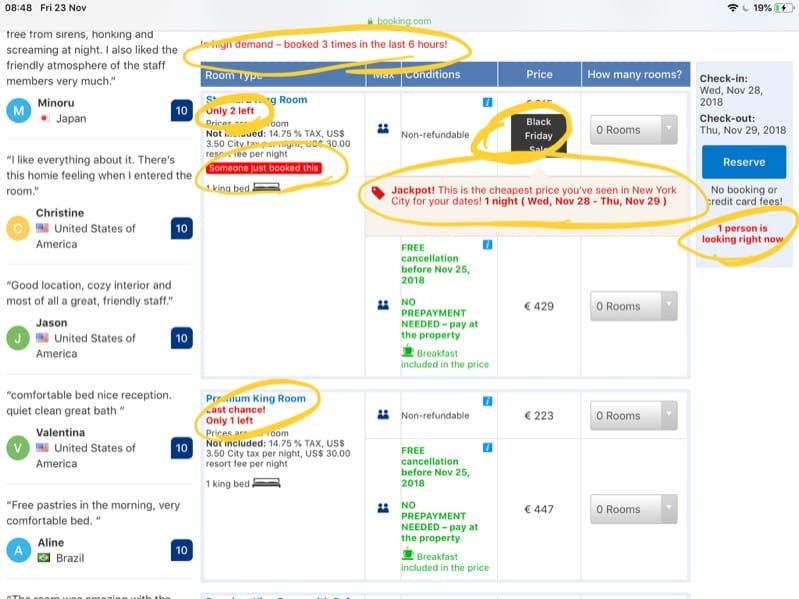
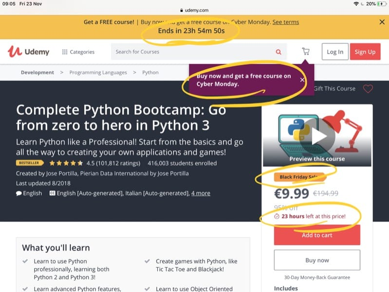

> This post is part of a series focused on psychology principles, specifically applied to software.

When was the last time you looked up something online and that particular item you were looking for was sold out? Did that increase your desire for that item? Did you check back 2 days, one week later? Did you subscribe to the "back in stock" email notification?

I certainly did, and many times.

You know that feeling when there is a shortage of tickets for a particular event, and you buy them thinking that since it's about to sell out, it must be a good one?

If the item was in stock, I'd not bother and think "I'll buy it next week".
If the event had many unsold tickets, I'd wait until the same day and buy them at the entrance.

There's a feeling of rush and urgency that is derived from what we call **scarcity**.

Companies use scarcity to take advantage of this feeling, which is mechanical, it works all the time - but you can control it when you recognize it.

Booking.com adds little popups to a room that's the **last** in the hotel, to show you that 2 other people are looking at this same room *right now* - better hurry up!

Amazon shows "want you get it tomorrow? Order it within 12 minutes". Also Amazon has daily deals that end at midnight. Every day different deals, but every day they end at midnight. Nearly all e-commerce sites get mad with scarcity on all levels, up to clothes sizes.

Auctions (think eBay) are designed around scarcity. One product, many people want it, time is running out, bid higher!

Udemy always has those courses at 95% off, $9.99 instead of $189.99, only for 1 day, except they repeat this promotion every week or so (which is great for us consumers, maybe not for authors that might never sell at full price once the consumer knows this "trick").

How do I know? I've published a course on Udemy and from this experience - also by talking to other authors - I realized people very rarely buy at full price on that site.

You can also take advantage of this principle yourself.

Think about *time*.

[**Parkinson's law**](https://en.wikipedia.org/wiki/Parkinson%27s_law) tells us that **work expands so as to fill the time available for its completion**.

Wikipedia lists a few corollaries to this law:

- If you wait until the last minute, it only takes a minute to do
- Work contracts to fit in the time we give it
- In ten hours a day you have time to fall twice as far behind your commitments as in five hours a day
- The amount of time that one has to perform a task is the amount of time it will take to complete the task.

This is why hackathons are so effective. You have a fixed amount of time, and so you make all your project fit into that time. [The 24 Hour Startup Challenge](https://24hrstartup.com/) is a great example. You have 24 hours to complete your goal.

Time is limited and as the clock ticks, you feel more pressure to deliver and you work even harder (and smarter), eliminating distractions, procrastination and *you just do the work*.

Scarcity is such a powerful force. How can you apply it to your business?

The most common case is **launches**. You drum up a launch that lasts a week, or a few days. You inform your users (hopefully you have an email list of prospects or existing customers) and when you launch, you have a **discount that lasts all the launch phase**.  Once the launch phase is over, the price goes up to normal.

This gives a sense of urgency to get the discounted price which will last only a few days (hence scarcity).

It's common practice to repeat this discount for a limited time practice from time to time (e.g. for Black Friday, product anniversaries or for Christmas). The key thing is to not do it too often to avoid people always waiting for a discount and never purchasing at the full price.

Another option is to have a **closing date** for the launch. I plan this for my upcoming Node.js course - instead of having a discount, I launch at full price and the sales are only open for four days, after that you can't buy the course any more. In this case the discount is not applicable, as it would always be the full price (you can't say 50% OFF and sales close, as it makes no sense).

In both cases, in all the case studies I read, the **first day** and the **last day** are the ones where you make most sales. The first day is typically when people that are eager to buy from you make the purchase. The last day is when the scarcity principle really comes into play.

"Tomorrow I will lose the launch discount"
"This is the last day I can buy this, then they will take it away form me!".

This is something I discovered in the last few years: **you can't just put a product out there and wait for sales to happen**. The launch is the moment when most of your sales will happen. The important thing is to try to **repeat the launch periodically**, and how do you do so? Big releases for example. Offer discounts every time you do a big release. If you have an app, your 1.0 is the best day for sales. 1.1 is the next big day. 2.0 can be your best day ever.

Before the launch, scarcity can be present the form of private betas: enter your email and I'll add you to the next batch of enrollment. We have a high number of applicants and a limited capacity. *Scarcity*  (+ social proof).

I currently launch my courses with an open and a closing date. 4 days of launch. You can't purchase a course outside of this 4-days launch period. *Scarcity*. Why I do so? Because when I launch the course I need to be 100% present and make sure all works great for the next few months where people get in the course, consume the content and ask me for help and mentoring.

Launches repeat over time. I launched a Vue.js course during the summer, I plan to update it, add more content and relaunch it during the summer of next year. This will give me time to grow my email list, build anticipation for the launch, and do a big splash.

A couple ideas in addition to launches?

- have a product that once sells out, you won't make it any more. Think about The Boring Company (not a) Flamethrower. Numbers were limited to 20.000 and sold out in a very small amount of time. You are not Elon Musk though, so do things at your scale. For example I have an optional mentoring package for my online courses, where I review projects and exercises I assign to people. Since this is a time consuming activity, and I have no other people working with me, I have a fixed amount of those packages for sale, for example 100. Once they sell out, you can't buy it any more, and I make sure this number is shown in the landing page and automatically updates as the sales happen.
- an invite-only beta, although it might only work on products that get lucky and go "viral", think about the Mailbox app.
- have a closed signup process. People can't just pay and join. They need to sign up to a waiting list, which increases the perceived value. I've seen several of these examples. You need to fill a form, tell why you absolutely need to join, and wait a couple weeks.

Whatever your business model is, **try to think of ways to bake in scarcity in a natural way**.