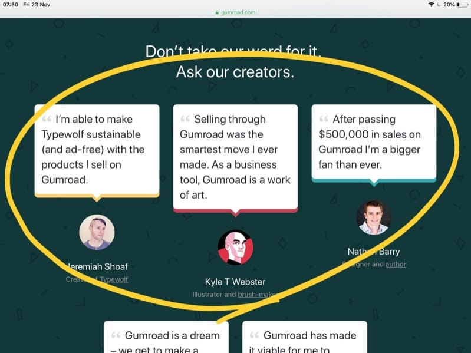
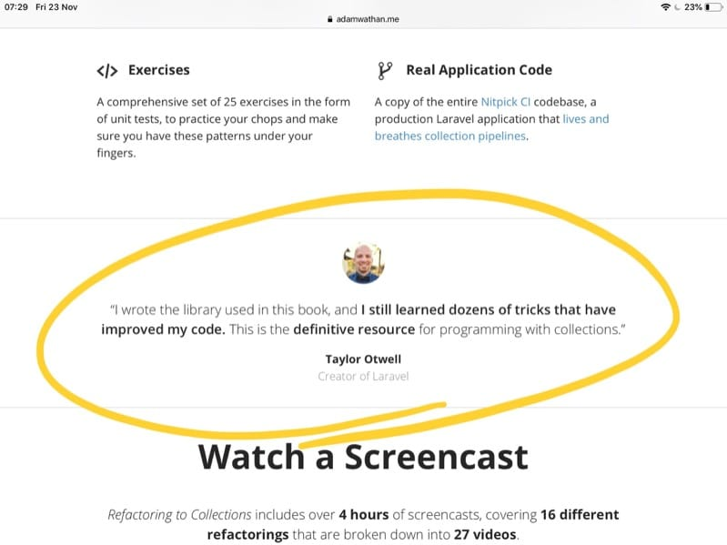
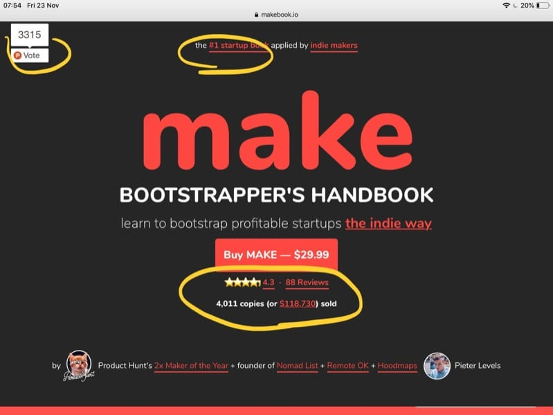
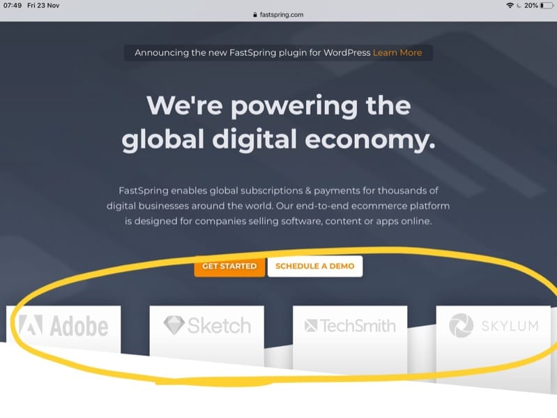
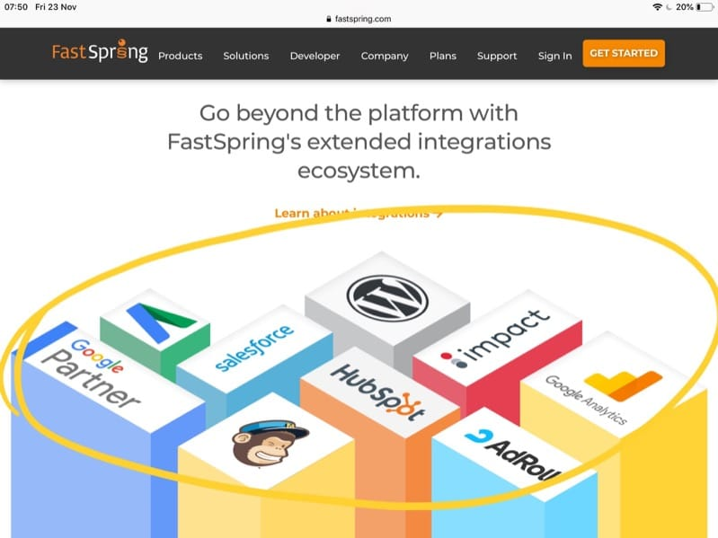
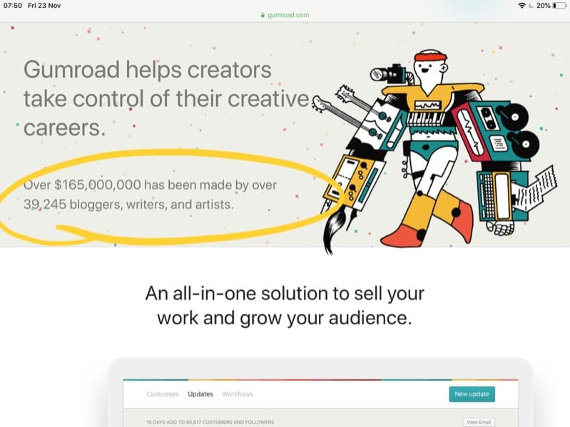
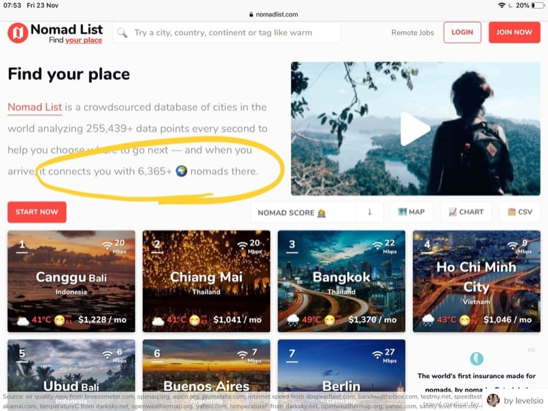

> This post is part of a series focused on psychology principles, specifically applied to indie developers and solopreneurs.

In a world filled with so much opportunities and choices, one guiding principle we can use to drive ourselves to do the best thing is **social proof**.

We are **pack animals** and since the ancient times, looking at what other people do and following them is a wise choice,  most of the times. You can't go wrong making a popular choice, the subconscious thinks.

> "At least you can blame the others, right? Do what others do, you don't want to be kicked out of this tribe, there's danger outside of the cavern"

This is social proof: looking at the signals that are associated with something, in relation to other people.

We live in a world where companies, products and apps constantly send us social proof signals.

Every single page when you can buy something has testimonials, people that reviewed the product or service and which you can trust.

Even one testimonial, when trustworthy and known, can be vetry effective:

Facebook shows you how many likes a page has, and how many friends one has.

Instagram and Twitter show you how many followers a person or company has.

Web pages happily show how many times people shared them on social media.

People with big newsletters happily tell you how many people they already have - why wouldn't you join?

If you have ever checked TripAdvisor before choosing a restaurant, you know how reviews of other people (even if you don't know them) can be a very powerful influence on your choice.

The same goes for Booking.com, Airbnb, Amazon, the App Stores, and many others.

Airbnb puts those trust signals everywhere: reviews, ratings, "super host". Booking.com in particular shows tells you how many people booked this particular hotel in the last 24 hours. They trusted us and chose this hotel. It's trusted, we're trusted, trust us too.

You can do it too outside of those big platforms. Here's an example of the social signals Pieter Levels added to its Make book landing page:

Another big social proof signal is those landing pages that add a section on their page with a list of company logos that are in some way or another associated with the product (or service). If you have been cited by *The New York Times*, make sure you let your users know - that's a very strong social signal: an institution already *examined* you and decided to talk about you. **I trust them, hence I should trust you**.

When you associate yourself with the more trusted company, *trust is passed down to you whatever the reason you are associated with it*.

In this example, Fastspring associates with brands that use it:

and also with products it integrates with:

If you have built a WordPress plugin that integrates with newsletter software, include all the logos of those popular apps, like MailChimp, ConvertKit, and others. People know those brands and now associate you with them.

I mentioned that people with big newsletters happily tell you how many people they already have. This is a very common pattern. You are more likely to join a newsletter of 50.000 people rather than a newsletter with 10 people. Right?
I've seen this applied to sales too. 2000 people already bought this course. It's trusted, why wouldn't you?

Gumroad tells you how many people use it, and their success with the platform:

Nomadlist tells you know many people you'll find in there if you join:

This number can also go hand in hand with *scarcity* during a launch. I might have a fixed amount of availability for a product or a service. If you add this number to your landing page with a countdown, you are doing 2 things:

- people know other people bought it already
- people feel the urgency to buy it too, before it runs out

When it runs out, it's still a social signal: lots of people bought that premium, limited option. You'd better hurry up and purchase the other option available (or be faster next time, sign up to be notified when the next launch happens).

Social signals also power your bio: "who is this person?" is a question a lot of people have when they stumble on you on social media or on your website. Your "About me" snipped should vehicle trust in a fast way. Degrees (or other kinds of certifications) are a powerful social signal: an organization already verified and certified this person is worth that piece of paper, it's trustworthy.
