> See my [how to use the macOS terminal](/macos-terminal/) post too

# How to setup the macOS command line
I just got a new MacBook Air to replace my beloved 2010 MacBook Pro, and I decided to document the process of setting up the command line.

By default here's what we have:

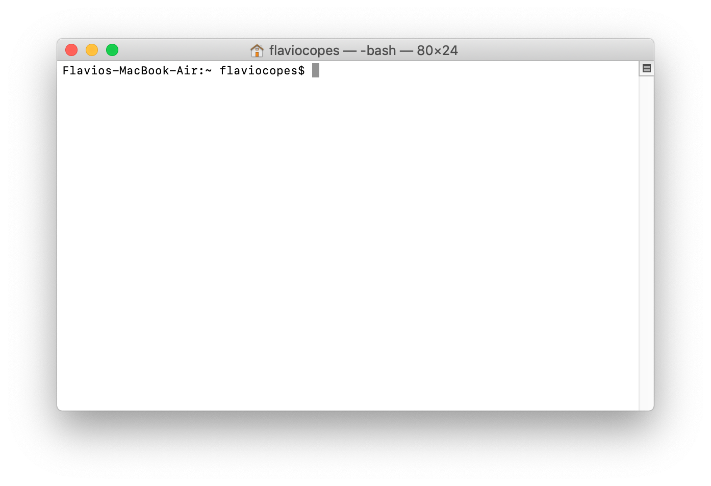

We're going to have a much better terminal at the end of this article.

First thing is, install *Homebrew*. Head to https://brew.sh and copy the magic formula in your terminal, which should be:

```bash
/usr/bin/ruby -e "$(curl -fsSL https://raw.githubusercontent.com/Homebrew/install/master/install)"
```

This will take care of installing the Brew package manager, which is an incredible tool. It will take some time as it needs to download the Xcode command line tools from Apple.

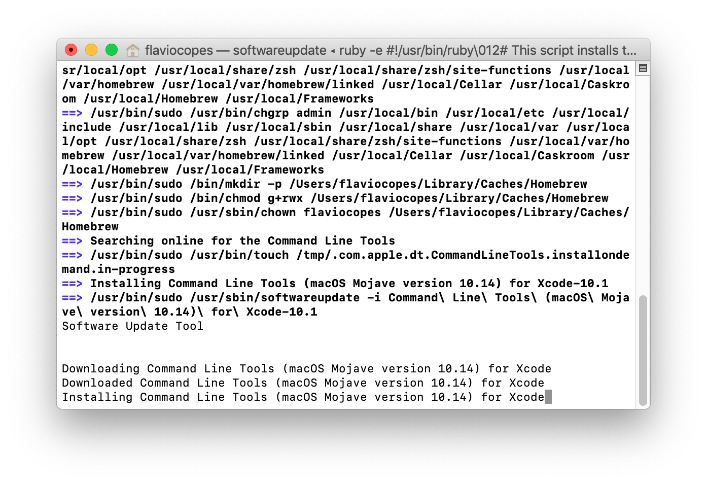

Next thing, we install the [*Fish Shell*](/fish-shell/). Run `brew install fish`.

Now we need to make Fish our default shell. Run `sudo vim /etc/shells`, and press the `i` key to enter *insert mode*, then add `/usr/local/bin/fish` at the end of this list.

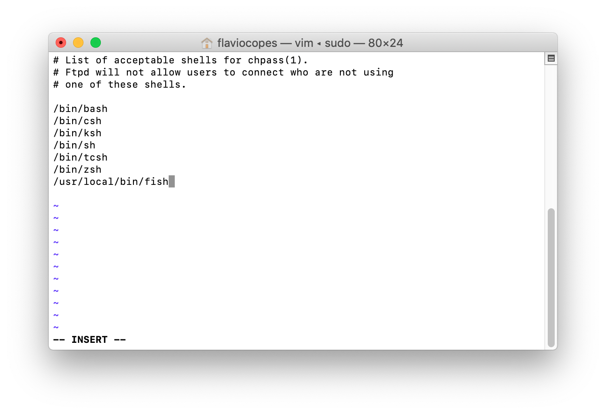

Now press the `esc` key and then type `:wq` to save the file and exit the editor.

Type `chsh -s /usr/local/bin/fish` to change your default shell to Fish.

Try opening a new terminal window, you'll see Fish greeting you:

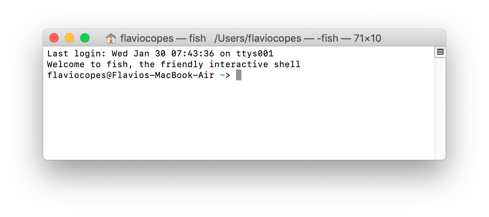

Time to add some colour. Type `fish_config` to enter the (awesome) configuration tool:

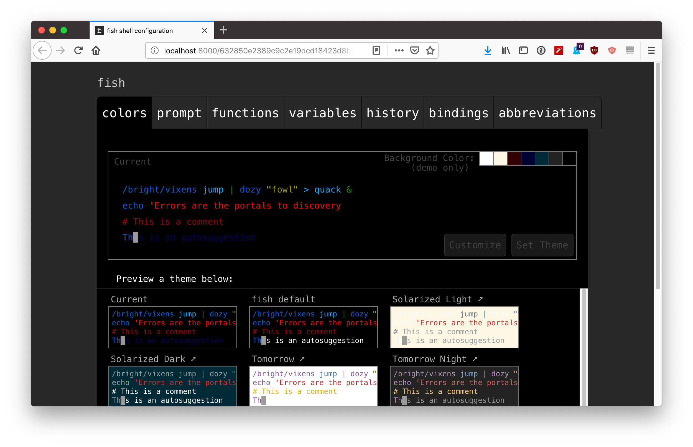

Pick one theme and press "Set Theme". Then click the  `prompt`  to set the favourite prompt and click "Set Prompt". My favourite is Rubbyrussell:

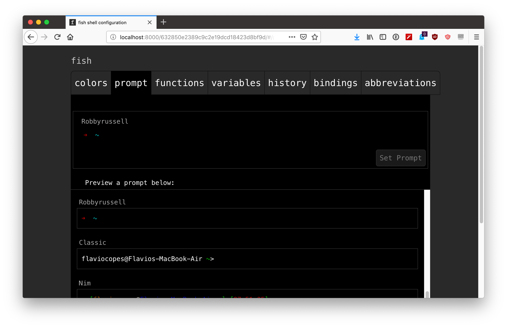

Now exit and press `enter` in the shell, to close the configuration program.

Your shell should now have a nice prompt, and colours! We just need to change the background - that needs to be set in the Terminal app preferences.


Press `cmd-,` or click `Terminal -> Preferences`.

Go to this GitHub repository: https://github.com/lysyi3m/macos-terminal-themes.

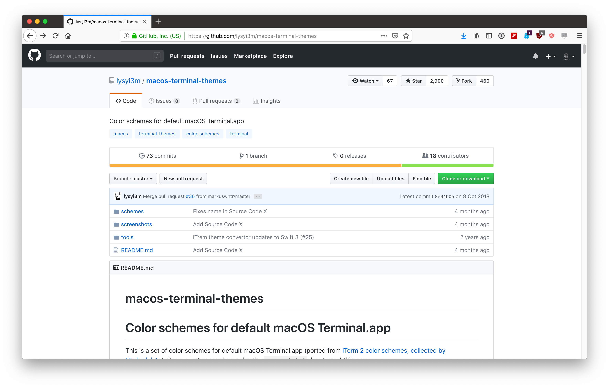

There is a huge number of great themes to choose from. One I like is Dracula (https://github.com/lysyi3m/macos-terminal-themes/blob/master/schemes/Dracula.terminal)  Just click the "Raw" button and save it as `Dracula.terminal`.

Right-click it and click "Open", as it's not a signed binary (otherwise macOS prevents it from running). That's it! The theme is now applied and available in the configuration:

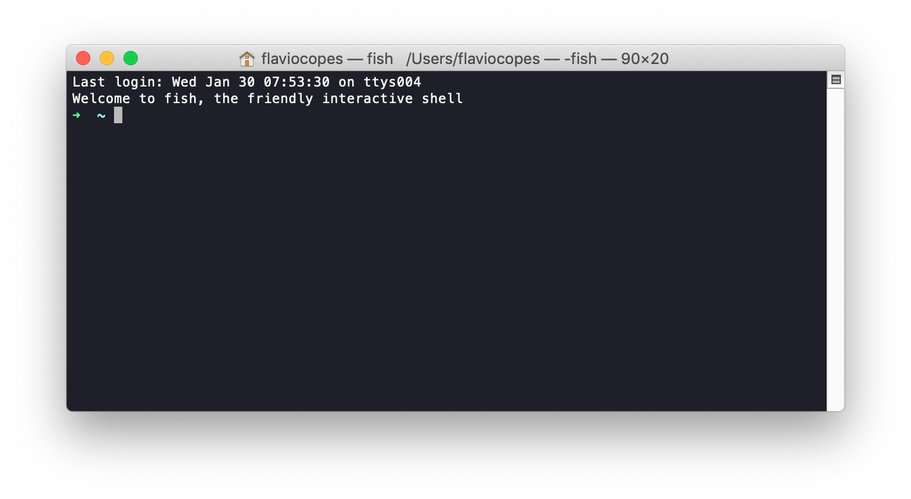

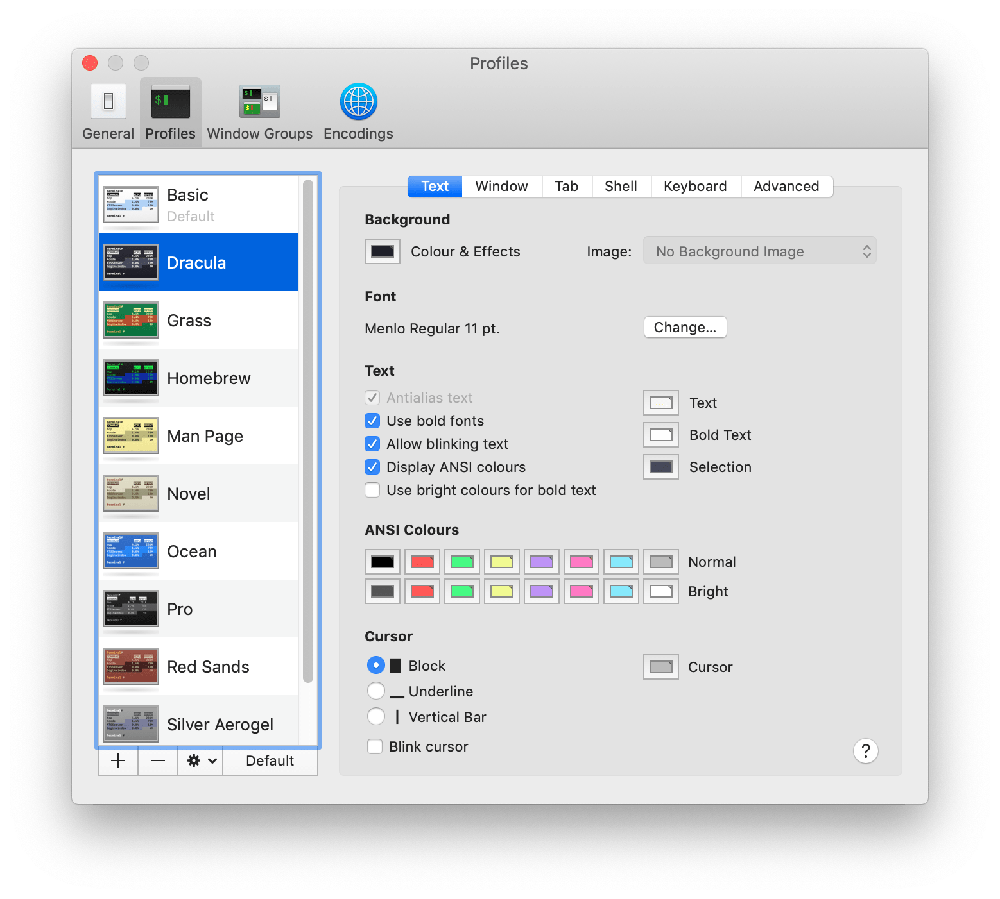

Next thing, the font. I like to use Fira Code, a free programmers friendly font with ligatures (the nice things with arrows).  Download it from https://github.com/tonsky/FiraCode, open its `ttf` folder, select all files, right-click and press `Open` to install it.

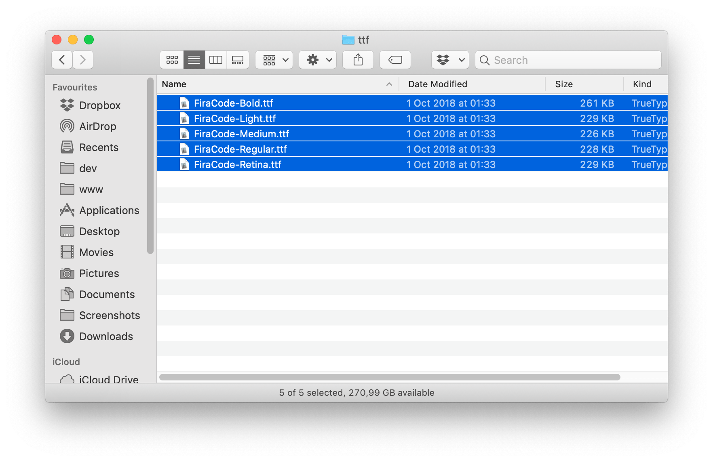

Go back to the terminal configuration, and set it as your theme font. Open a new window, and it should be working fine:

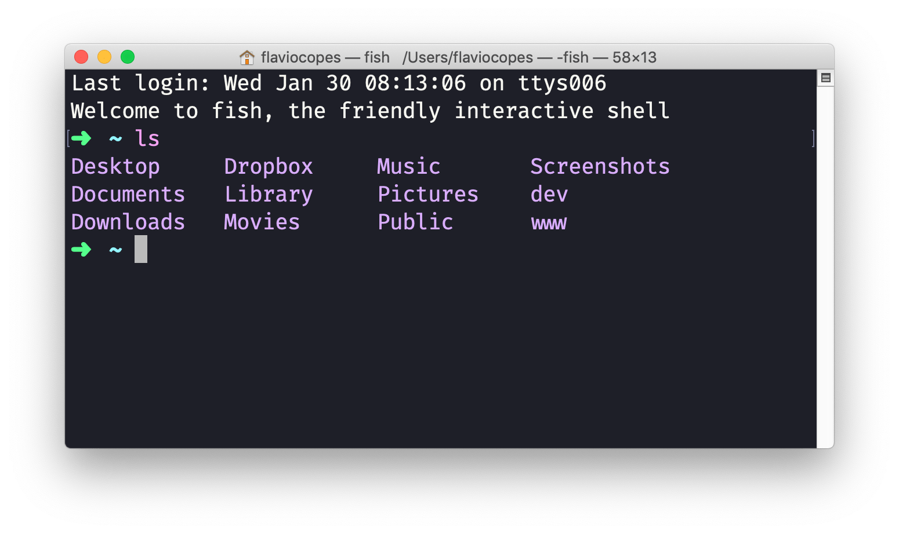

That's it!
