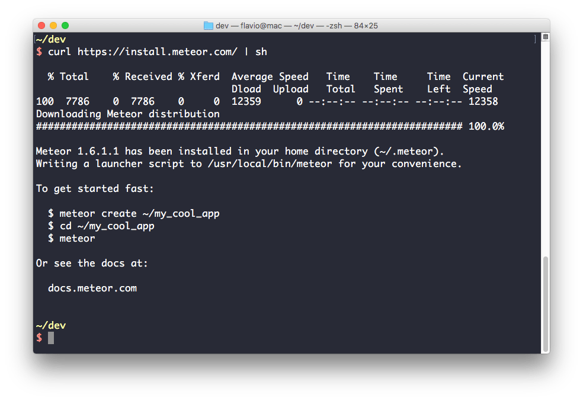
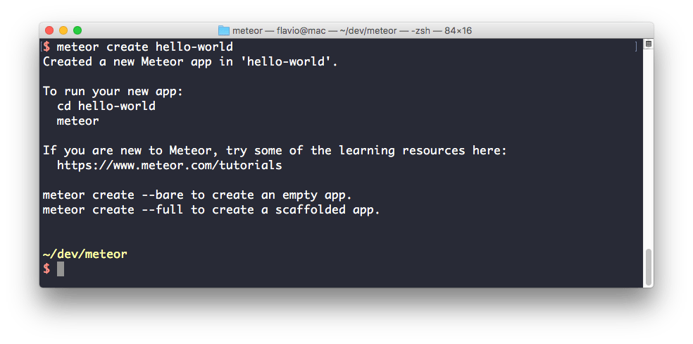
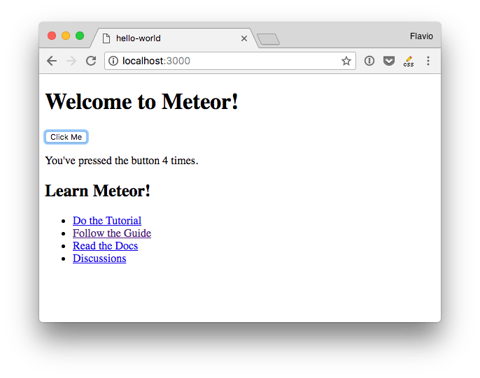

Meteor is an awesome web application platform.

Modern web applications can be **extremely complicated** to write. Especially for beginners.

Meteor is a great tool for both beginners and experts, it makes it **super easy to start**, and provides a huge ecosystem of libraries you can leverage.

<!-- TOC -->

  - [JavaScript](#javascript)
  - [Real-time](#real-time)
  - [Feels fast](#feels-fast)
  - [Open Source](#open-source)
  - [It's simple](#its-simple)
  - [A great package system](#a-great-package-system)
- [How Meteor can improve your life](#how-meteor-can-improve-your-life)
- [When Meteor might not be the best fit for you](#when-meteor-might-not-be-the-best-fit-for-you)
- [The 7 Meteor Principles](#the-7-meteor-principles)
  - [Data on the Wire](#data-on-the-wire)
  - [One Language](#one-language)
  - [Database Everywhere](#database-everywhere)
  - [Latency Compensation](#latency-compensation)
  - [Full Stack Reactivity](#full-stack-reactivity)
  - [Embrace the Ecosystem](#embrace-the-ecosystem)
  - [Simplicity Equals Productivity](#simplicity-equals-productivity)
- [Installation procedure](#installation-procedure)
- [First steps with Meteor](#first-steps-with-meteor)
- [Code walk-through](#code-walk-through)
  - [client/main.html](#clientmainhtml)
  - [client/main.js](#clientmainjs)
- [The Meteor CLI](#the-meteor-cli)
  - [meteor](#meteor)
  - [meteor create](#meteor-create)
  - [meteor add](#meteor-add)
  - [meteor remove](#meteor-remove)
- [Isomorphic](#isomorphic)
  - [Meteor.isServer, Meteor.isClient](#meteorisserver-meteorisclient)
  - [Special directories](#special-directories)
- [Session variables and template helpers](#session-variables-and-template-helpers)
- [Reactive programming](#reactive-programming)
  - [What is reactive programming](#what-is-reactive-programming)
  - [Reactive sources](#reactive-sources)
  - [Reactive computations](#reactive-computations)
  - [Defining your own reactive computations](#defining-your-own-reactive-computations)
- [Meteor Publications](#meteor-publications)
  - [Server publication](#server-publication)
  - [Client subscription](#client-subscription)
  - [Autopublish](#autopublish)
- [Minimongo](#minimongo)
  - [MongoDB: The Meteor Database](#mongodb-the-meteor-database)
  - [MongoDB in two words](#mongodb-in-two-words)
  - [Meteor and MongoDB](#meteor-and-mongodb)
  - [Minimongo](#minimongo-1)
  - [Minimongo is a MongoDB client-side clone](#minimongo-is-a-mongodb-client-side-clone)
  - [Client-side storage facility](#client-side-storage-facility)
- [Latency Compensation](#latency-compensation-1)
  - [What does it mean?](#what-does-it-mean)
- [Meteor Collections](#meteor-collections)
  - [Create your first collection](#create-your-first-collection)
  - [Adding items to a collection](#adding-items-to-a-collection)
  - [Showing the collection in the template](#showing-the-collection-in-the-template)

<!-- /TOC -->

### JavaScript

Meteor was one of the first popular approaches to just use JavaScript both on the client, and on the server, seamlessly.

Coupled with [**MongoDB**](/mongodb/), which is a Database which stores [JSON](/json/) objects, and uses Javascript as a query language, it makes JavaScript ubiquitous.

Meteor also ships with **Minimongo** in the frontend, which is a frontend database compatible with the MongoDB APIs, entirely written in JavaScript.

### Real-time

Meteor is known for its real-time features, but what exactly is real-time? Suppose you want to create a chat app. Meteor offers you features that are perfect for that.

Want to create an internal communication app? Perfect too. A project management app? Basically, any app in which users could be notified or things should be updated based on other users actions, or third part things such as API change the information displayed, the user viewing the app can be notified of those changes immediately, in a rather easy way compared to other solutions.

### Feels fast

A thing named **Latency Compensation** offers you a trick that enables the interface to feel dead fast even if it still need to communicate with a remote server. And best of all, it's free for you in terms of implementation, meaning it's backed in Meteor and you don't have to do anything to enable it.

### Open Source

Of course Meteor is entirely Open Source.

### It's simple

Things seem very simple in Meteor, because they _are_ simple.

Complicated things lead to weird bugs or hard problems later. Meteor offers us a **clean, beautiful API** and functionality to build upon.

### A great package system

The cool thing about Meteor is that since it can power both the frontend and the backend, and it's deeply integrated with the database, **both frontend and backend code can be put in a single package**, and work seamlessly for us on both sides. That's why we can add full user management with a single line of code.

## How Meteor can improve your life

Meteor gives you a **Full-Stack platform**, by providing **both the client-side framework, and the server-side framework**. What's more, Meteor even provides you the communication channel between those. It's called **DDP**, and we'll talk about it later.

You no longer need to glue together different framework, languages, tooling and codebases. This is huge for the independent developer, small startups or even bigger organizations that don't want to lose time and resources making things harder than they should be.

## When Meteor might not be the best fit for you

**Static content websites** have other better platforms to build upon. If you need to just output some HTML without a lot of interactivity, use a static site generator.

Meteor as of writing does not support **SQL Databases**, which can be a good thing in many cases, but they can be needed in other cases. Of course you can write your own procedures that use SQL Data.

## The 7 Meteor Principles

Meteor is built upon the following seven principles. They're listed in the project documentation and they're fundamental principles so we'll report them here.

Principles always matter when they're respected in the everyday life.

### Data on the Wire
Meteor doesn't send HTML over the network. The server sends data and lets the client render it.

### One Language
Meteor lets you write both the client and the server parts of your application in [JavaScript](/javascript/).

### Database Everywhere
You can use the same methods to access your database from the client or the server.

### Latency Compensation
On the client, Meteor prefetches data and simulates models to make it look like server method calls return instantly.

### Full Stack Reactivity
In Meteor, real-time is the default. All layers, from database to template, update themselves automatically when necessary.

### Embrace the Ecosystem
Meteor is open source and integrates with existing open source tools and frameworks.

### Simplicity Equals Productivity
The best way to make something seem simple is to have it actually be simple. Meteor's main functionality has clean, classically beautiful APIs.


## Installation procedure

On OSX and Linux installing Meteor is as simple as typing this in the Operating System terminal:

```bash
curl https://install.meteor.com/ | sh
```



That's it!

Windows has its own official installer, so check it out on the official site.

## First steps with Meteor

Let's create the first Meteor app.

Open the Operating System terminal, go into the directory where you'll host the project and type

```bash
meteor create hello-world
```



Meteor will create the new app for you, in the `hello-world` directory.

Now go inside that directory and type

```bash
meteor
```

This will spin up the Meteor web server, and you'll be able to reach your first Meteor app by pointing your browser at `http://localhost:3000`



It was easy, right?

## Code walk-through

Let's walk through the app code to see how that works.

Do not worry if things are not much clear right now, many concepts will be introduced and explained later on.

A few years ago this Meteor sample app would have contained just one JavaScript file, for both the client and server, using `Meteor.isClient` and `Meteor.isServer` to check if the app was running on the client, or on the server.

The sample app moved away from this approach, and how has a `server/main.js` file, and other files in `client/`.

### client/main.html

If you open the `client/main.html` file you can see the source code of the app:

```html
<head>
  <title>hello-world</title>
</head>

<body>
  <h1>Welcome to Meteor!</h1>

  {{> hello}}
  {{> info}}
</body>

<template name="hello">
  <button>Click Me</button>
  <p>You've pressed the button {{counter}} times.</p>
</template>

<template name="info">
  <h2>Learn Meteor!</h2>
  <ul>
    ...
  </ul>
</template>
```

Meteor recognizes the `head` and `body` tags and puts them in the correct place in the page content. This means that by including a `head` tag, all its content will be added to the "real" page `head` tag.

Same thing applies to the `body` tag. They are the two main tags.

All the rest of the application must be put in separate `template` tags.

The special `{{ }}` parentheses you see are defined by **Spacebars**, which is a templating language very similar to **Handlebars** with some unique features that make it perfect to work with Meteor

In the hello-world example,

```js
{{> hello}}
```

includes the `hello` template, and

```js
{{counter}}
```

inside the `hello` template looks for the counter value in the template context.

### client/main.js

This is the content of the `client/main.js` file:

```js
import { Template } from 'meteor/templating';
import { ReactiveVar } from 'meteor/reactive-var';

import './main.html';

Template.hello.onCreated(function helloOnCreated() {
  // counter starts at 0
  this.counter = new ReactiveVar(0);
});

Template.hello.helpers({
  counter() {
    return Template.instance().counter.get();
  },
});

Template.hello.events({
  'click button'(event, instance) {
    // increment the counter when button is clicked
    instance.counter.set(instance.counter.get() + 1);
  },
});
```

The code sets up a ReactiveVar, a **reactive variable**. A reactive variable exposes a setter and a getter. By using the setter, all functions that are retrieving the value using get() will be alerted when its value changes.

The value of the reactive variable is displayed in the HTML using the `{{counter}}` snippet, which calls the `counter()` template helper we defined here.

It first initializes that variable to zero, and it sets its value to be incremented when the button is clicked in the `hello` template.

To handle clicks, you act on the events of the `hello` template. In this case, we intercept the click on a `button` HTML element. When this happens, you increment the Session.counter value.

In the Meteor server code, in `server/main.js`, there's a `Meteor.startup` call, which just calls the passed function when Meteor is ready. Now there's nothing in it, but we'll see how this can be useful later.

## The Meteor CLI

When installing Meteor, you get the CLI (command line utility) called `meteor`.

It's a super useful tool, you already used it to create the first app, and to start with we just need to know a small fraction of what it can do.

Let's introduce the four most useful commands you'll use when starting with Meteor.

### meteor

If inside an empty directory you type

    meteor

you'll get an error because Meteor was not initialized in that directory.

If you instead type `meteor` in a folder that has a Meteor project already created (see `meteor create` here below), Meteor will start up and create the server, initialize the database and you'll be able to open the Meteor website.

### meteor create

If inside a directory you type

    meteor create my_app_name

Meteor will initialize a new Meteor project in a subfolder named `my_app_name`.

### meteor add

Inside your Meteor project already initialized, calling

    meteor add package_name

will lookup the `package_name` package and will install it in the current project.

You can run this command in a separate terminal window while the Meteor app is running, and you'll get the package functionality without the need to restart the Meteor server.

### meteor remove

Inside your Meteor project already initialized, calling

    meteor remove package_name

will remove the package with that name from your project.

## Isomorphic

The term _isomorphic_ identifies a framework where client-side code and server-side code are written in the same language.
This implies that any piece of code could run **both on the server and on the client**, unless it's tied to a context-specific action.

In the past 10 years Web Applications have been built by clearly separating the server and the client code. Server code run PHP, Ruby, Python code. That code could never work on the frontend-side, because the browser does not support those languages.

Browsers are only capable of executing code written in [JavaScript](/javascript/).

With the _meteoric_ rise of [Node.js](/nodejs/) in the last few years, and what was built on top, now we have the chance to build an entire application in the same language: JavaScript.

Meteor takes the isomorphic concept even further, by transparently running every file in your project, unless you don't want it to do it, on both sides of the platform, **doing different things** based on the context, clearly explained by the Meteor documentation.

This is an amazing opportunity and advantage that Meteor enables by building a "super-platform" on top of Node.js and the Browser platforms, enabling you to **build applications faster and better than ever**.

Isomorphic refers to JavaScript code that runs with little to no modifications on the client and on the server. It's code that takes care of both what runs inside the browser, and the what runs on the server.

Meteor is an isomorphic framework. This is great because we can write concise applications that now even share some pieces of code between client and server code.

It enables you to become a full-stack developer, because you no longer need to deeply know two separate stacks to work on both sides of the application.

The classical example is the one of an HTTP request. On the browser you'd do an AJAX call. On the server you'd use your stack-specific code.

Using Meteor, you can use the same function `HTTP.get()` provided by the `http` package, on both sides, just like when you install the [Axios library](/axios/).

### Meteor.isServer, Meteor.isClient

Meteor exposes two boolean variables to determine where the code is running:

- `Meteor.isServer`
- `Meteor.isClient`

<br>
Put them inside an `if` statement to run some code part just on one side of the platform.

For example:

```js
if (Meteor.isClient) {
  alert('Hello dear user!')
} else if (Meteor.isServer) {
  //running server-side
}
```

### Special directories

Putting lots of `Meteor.isServer` and `Meteor.isClient` checks in the application is not ideal of course.

First, the code can quickly grow complicated and not nice to read.
Second, even the server code is sent to the client. This is bad because you'd better keep server-side code private, and also because you send unnecessary code which slows down loading times.

That's why Meteor has two special folders that automatically take care of the distinction for us: `client` and `server`

Whatever you put in the `client` directory is not loaded on the server side.

Whatever you put in the `server` directory is not sent to the client.

Another advantage of keeping this distinction is that assets put in the client folders are never taken into consideration during the build phases.

## Session variables and template helpers

Here's a simple example on combining Session variables and template helpers to achieve a simple case of selecting the current comment selected in a list.

In our `template.html` file:

```html
<template name="main">
  {{#each comments}}
    {{> comment}}
  {{/each}}
</template>

<template name="comment">
  <div class="{{#if selected}}selected{{/if}}">
    <p>{{this.comment}}</p>
  </div>
</template>
```

In `template.js`:

```js
Session.set('selectedComment', null)

Template.main.helpers({
  comments: function() {
    return Comments.find()
  }
})

Template.comment.helpers({
  selected: function() {
    return Session.equals('selectedComment', this._id)
  }
})

Template.comment.events({
  'click div' : function(e, t) {
    Session.set('selectedComment', this._id)
  }
})
```

In this case any time I click a comment, that comment becomes the selected comment, and we can show it full-size, fetch the other comments made by the user or do some other fancy stuff.

## Reactive programming

First, a clarification: Meteor's reactivity has nothing to do with [React](/react/), the other very popular [JavaScript](/javascript/) framework.

What is reactive programming, you say? Reactive programming is a programming paradigm.

Reactive programming is nothing new, nor something that Meteor introduced. But, what Meteor did was making reactive programming easy to use.

Actually, you're most probably already using reactive programming without even knowing about it.

### What is reactive programming

Reactive programming allows you to write code that automatically refreshes and re-calculates functions and values when something that you depend on changed.

For example, data in the database changed? You need to re-display it in the client.

That variable that counts the number of comments changed because you added a comment? Everything that depends on it, or shows it, must _react_ to that change and re-compute the values.

That works by having Reactive Sources. The database for example is a reactive source. When something changes inside it, it notifies the JavaScript variables that depend on those changes. Those variables are invalidated and must be recalculated according to the new data available.

### Reactive sources

Meteor has a list of things that are reactive, and those drive the entire application. Not everything is reactive, just those things listed here:

- Reactive variables, defined using `new ReactiveVar()`

- The data coming from the database is a reactive data source, because by subscribing to a publication you get a cursor, and that cursor is reactive. Any change to the collection represented by the cursor will trigger a recomputation of anything that uses it.

- Talking about subscriptions, when a subscription is available on the client its `.ready()` method is called. That is a reactive data source.

- Session variables are a reactive data source. When one changes a session variable by using `.set()`, everything that depends on those will be recalculate or re-rendered.

- The user methods `Meteor.user()` and `Meteor.userId()` are a reactive data source.

- `Meteor.status()`, which is a client-side method that returns the current client-server connection status, is a reactive data source.

- `Meteor.loggingIn()`, which returns true if the user is currently doing a login, is a reactive data source.

### Reactive computations

Whatever changes upon a reactive source change is a reactive computation. It's some piece of code, a function, that needs to run again when a reactive source it depends on changes.

An example of reactive computation is the template helpers: every time a reactive data source that involves a template helper changes, the template re-renders it.

### Defining your own reactive computations

You can define your own reactive computations, and react when something changes upstream, by using `Tracker.autorun()`.

We'll soon talk more in depth about it, in the meanwhile just know that this function

```js
Tracker.autorun(function () {
  var currentPage = Session.get('currentPage')
  alert("The current page is " + currentPage)
})
```

Will trigger an alert whenever you call `Session.set('currentPage', 'whatever')` without you needing to add callbacks or other observers.

## Meteor Publications

One of the key features of Meteor is provided by the data layer.

Since Meteor manages both the server and the client, I can explain the concept in this way:

- The server creates a publication
- The client subscribes to that publication
- Meteor keeps everything in sync

The server can precisely determine what each client will see. Each publication can be tailored upon parameters and user permissions.

Let's do a simple Pub/Sub introduction on standard MongoDB collections.

### Server publication

Here's an example of a server code creating a publication for comments that have been approved:

```js
//server-side code
Meteor.publish('comments', () => {
  return Comments.find({ approved: true })
})
```

Or we want to create a publication for comments made on a specific article:

```js
Meteor.publish('comments', (articleId) => {
  return Comments.find({ articleId: articleId })
})
```

The publish function is called every time a client subscribes.

### Client subscription

On the client the code is very easy. For example, let's subscribe to all comments:

```js
Meteor.subscribe('comments')
```

Let's instead subscribe to comments made on the current article:

```js
const articleId = 23
Meteor.subscribe('comments', articleId)
```

Once the subscribe method has been called, Meteor fills the client-side Minimongo (the MongoDB instance running on the client) with the data you chose to sent it.

Typically the client-side database only gets some records, the minimum amount needed to initialize and work. You don't replicate the whole server-side Mongo collection content of course, but you request data as needed.

### Autopublish

Meteor makes it very easy for us to start diving into a project without worrying at all about publications and subscriptions.

It does this by including the `autopublish` package in every new project. That that packages does is, it automatically creates a pub/sub for each collection we have defined, syncing all the data available from server to client.

When you'll reach the phase when you need more control on the data available to each user or view, you'll just remove the `autopublish` package and you'll manually define what you need.

## Minimongo

Minimongo is your best friend when developing in Meteor. Ok, if you feel you have lots of best friends when using Meteor, I feel the same. Everything in Meteor is provided to ease your life.

Minimongo, in particular, is a frontend implementation of MongoDB. You might say.. what? Why do I need another database?

### MongoDB: The Meteor Database

As of writing, Meteor has just one officially supported database: MongoDB.

You may wonder why. First, let me clarify: you can actually use any database you want, but to enjoy at 100% the marvels of Meteor you need to use Mongo. There are currently community projects that are working towards adding support for many other databases.

### MongoDB in two words

MongoDB is a document-based database. It features high performance, high availability, easy scalability.
It stores its documents in database collections.
A document is a set of key-value pairs (JSON), and it has a dynamic schema. This means that each document does not need to have the same set of fields, but you have a great freedom in managing data.

### Meteor and MongoDB

As said, a MongoDB document is a JSON object. Meteor Collections are directly related to MongoDB collections, and the Meteor internals make sure that when data changes in a MongoDB Collection tracked by Meteor, the Meteor Collection is updated too.

### Minimongo

In short, in Meteor you typically create a collection, and that collection is available on _both_ client and server code. When you do some database query or database processing, you don't "think" whether you should do that operation on the client-side database, or the server-side database: to a certain extent, they're mostly the same thing. And **they talk to each other transparently**.

This means that when the server-side database (MongoDB) is updated by someone else or something happens in the app you're using, or even you add something in a second browser window.. everything that's stored in the database that interests your current session is pushed by the server MongoDB to the Minimongo running inside your browser.

The same happens for the opposite: you push a post to the Posts collection? Minimongo is updated immediately, while Meteor pushes the update to the MongoDB database server side.

This has the nice effect of making your changes, your pages and interactions feel immediate to the user.

### Minimongo is a MongoDB client-side clone

Minimongo tries to perfectly emulate a subset of MongoDB. You can insert data, remove data, search, sort, update.. with the same exact MongoDB APIs.

This means you can also easily port some parts of your code from the server to the client-side very easily when it makes sense.

### Client-side storage facility

With Minimongo you have a fantastic client-side storage that you can query using the MongoDB Query functionalities.

You can of course create instances of a Minimongo collection just client-side, when you don't have the need to sync a collection to the server.

Not only, you can observe for database changes, and your interface can react to those changes easily.

## Latency Compensation

Latency Compensation is part of the Meteor Principles. There, it's described in this way: _on the client, Meteor prefetches data and simulates models to make it look like server method calls return instantly_.

### What does it mean?

On a typical Web Application, when you do some kind of action, the action is passed to the server to be processed, and then you need to wait until the server responds, and then changes are applied to the page you're interacting with.

More modern applications rely on AJAX to provide a better turnaround and avoid refreshing a page on every action, but still many apps rely on the server response prior to taking any action. Better apps introduce some sort of latency compensation, but it's a manual process.

Meteor introduces the concept of Latency Compensation deep into his philosophy and it's **enabled by default**, without you needing to do anything special to work with it.

For example when you add an item to a collection, meanwhile the item will be sent to the server, it's already added to the collection view on your page.

It feels better, because **the app feels immediately responsive** (it is).

If there is an error you'll be notified later and you have the opportunity to handle things in the best way for each situation.

## Meteor Collections

An application typically needs to display data of some sort.

Be it messages, comments, posts, books, addresses, pictures.. everything is a collection of something.

Meteor being deeply integrated with MongoDB takes the Mongo database collection concept and takes it to the application level.

In both the client and server contexts, you'll typically interact with data by interacting with data collections.

How does it work?

### Create your first collection

```js
Messages = new Mongo.Collection('messages')
```

This defines a `global variable` messages, which will be visible across the entire App on client and server.

This code needs to run on both the client and the server, so you'll put it for example under `collections/messages.js`.

While the code running in the two environments is the same, _what it does_ is different:

- on the **server** it creates a Mongo collection if it's not already existing, and then it will load the cursor in the `Messages` variable
- on the **client** it will instantiate a _Minimongo_ local collection. The app once instantiated will link that to the server-side collection, and will automatically keep them in sync.


### Adding items to a collection

You'll be able to insert items into a collection using the `.insert()` method on the collection cursor:

```js
Messages.insert({message: "Hi"})
```

### Showing the collection in the template

In a template you can use the `{{#each}}` Spacebars helper to navigate the collection and print all values stored in it:

```html
<template name="messages">
  {{#each messages}}
    {{message}}
  {{/each}}
</template>
```