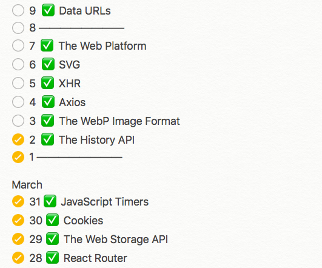
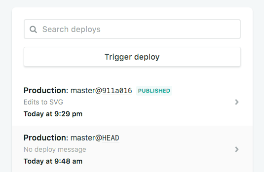
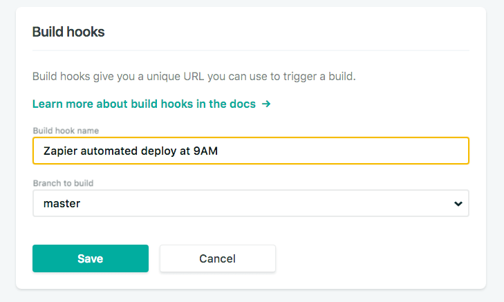
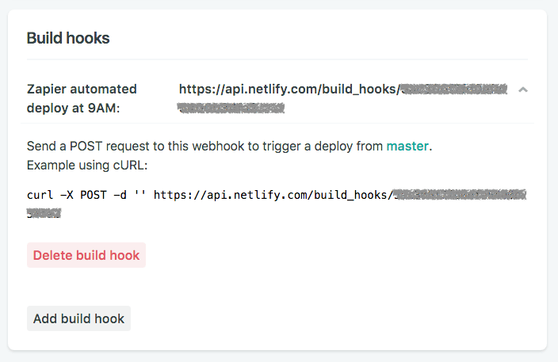
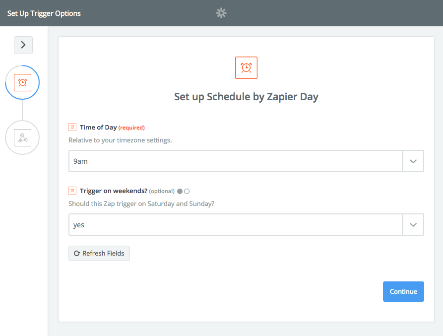
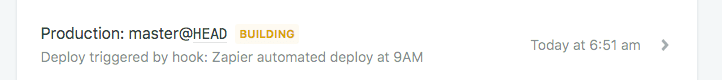

I have a list of scheduled posts that I want to publish every week on my blog, and I try to stay a few days ahead of that queue to have room for when I'm unable to write, or if I want to take a break.

I find consistency is very important to keep the momentum going for my work. Since two months I post every day from Monday to Saturday, and I want to do so in the future as well, as I really like doing it.

I use the [Hugo Static Site Generator](https://gohugo.io/), hosted on [Netlify](/netlify/).

It's an amazing combination of tools, and I'm very happy with the blog setup.

Today I was out hiking on a mountain when I realized I got past my usual posting time, and I didn't publish the blog post I already scheduled.

With Hugo I can set a post date in the future, and when the site is rebuilt using the `hugo` CLI command, that post is not included in the resulting HTML, as it's a future post.

Netlify has this nice concept of building the Hugo site on their servers, so what I need to do is just trigger a new deploy. Usually deploys happen when I push something to GitHub - Netlify is alerted automatically and deploys in a minute or less.

In this case I needed to manually trigger a deploy on Netlify so I logged in using my iPhone, and clicked "Trigger deploy".

This action rebuilt the static site using Hugo, on the server side, and I just put my phone back in the pocket.

The blog post launched 🎉 and I just tweeted about it.

As I was walking, I realized I can automate all this stuff.

I just need to trigger a deploy automatically every day at 9AM, somehow. So I looked on the Netlify interface if they had any kind of automated timer for recurring deploys. There is no such feature, however they have a WebHook endpoint.

So I looked for something that I can configure to POST to the WebHook every day. Enter [Zapier](https://zapier.com).

Zapier is a tool that's all about automation.

Googling around I found a [Zap to send a WebHook POST request on a daily schedule](https://zapier.com/apps/schedule/integrations/webhook/2845/send-a-webhook-post-request-on-a-daily-schedule), and that's exactly what I needed.

Now, on Netlify I just created a WebHook URL

which gave me a custom URL to call:

I just pasted the URL on Zapier, and set it up to make an empty POST request to my Netlify hook:

and the testing manually-triggered Zap deploy worked:

I'm happy now! I just have to create content, push it to GitHub with the scheduled date, and don't worry about deploying any more! 🌈 🎉 👨🏼‍💻
