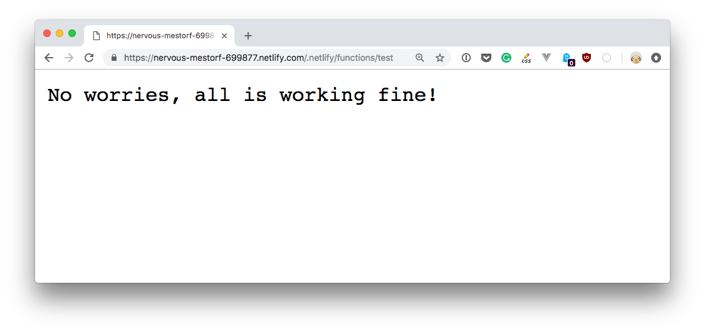

I wrote about Netlify previously on my [Netlify tutorial](/netlify/). I use it to host this blog, and it's great.

I also use it to run other sites, and all run on Hugo - which makes my stack 100% [JAMstack](/jamstack/).

The cool thing about JAM is that it's not all limited to static and "dumb" sites - you can do a LOT of things that are as dynamic as you want.

Most of that power comes in the form of **lambda functions**.

You can have JavaScript on your site (or plan HTML forms) invoke a URL endpoint, which when called executes some predetermined code. Different providers offer support for various languages. Netlify currently supports Node.js and Go.

In this tutorial we focus on lambda functions written in Node.js.

Netlify gives us have a generous free tier limit, with up to 125.000 function invocations and a total of 100 hours of run time every month. Functions have 128MB of memory and each can execute for up to 10 seconds. For normal needs, this is more than enough.

Internally, Netlify runs this function on **AWS Lambda**, abstracting away all the complexity of AWS for you.

How do we create a function? We upload a JavaScript file in the `functions` folder of the site.

In this file we must follow a method named `handler`:

```js
exports.handler = (event, context, callback) => {
  //functionality
}
```

If you are familiar with AWS Lambda, the function code will be familiar to you. If you've never used it, no worries - here's a brief overview of the parameters our handler receives:

- `event` is an object that contains data on the request
- `context` contains the user information when using Identity for user authentication
- `callback` is a function we can use to create a response

The simplest thing we can do is return a positive response. To do so, we use the `callback()` method:

```js
exports.handler = (event, context, callback) => {
  callback(null, {
    statusCode: 200,
    body: 'No worries, all is working fine!'
  })
}
```

Save this to a `functions/test.js` file.

The only thing you need to do to make it work is to configure the folder for the funcitons in the `netlify.toml` file:

```
[build]
functions = "./functions"
```

Try this. Create the file in an empty folder, push it to a GitHub repository and create a new Netlify site from that repo.

Once you do so, in the `Settings -> Functions` menu in Netlify a new menu will show up which shows the details of our functions usage:


The function, which was stored in the `functions/test.js` file, is accessible at <https://YOURSITENAME.netlify.com/.netlify/functions/test>.



To access the request parameters, use the `event` object:

- `event.path` the request path
- `event.httpMethod` the request HTTP method
- `event.headers` the request headers
- `event.queryStringParameters` the request query parameters
- `event.body` the request body in JSON format

Before we used

```js
callback(null, {
  statusCode: 200,
  body: 'No worries, all is working fine!'
})
```

to craft a response. You can also add a `headers` object which contains an associative array (object) with the header values.

This repository by Netlify <https://github.com/netlify/netlify-functions-example> contains a lot of samples for Netlify Lambda Functions.