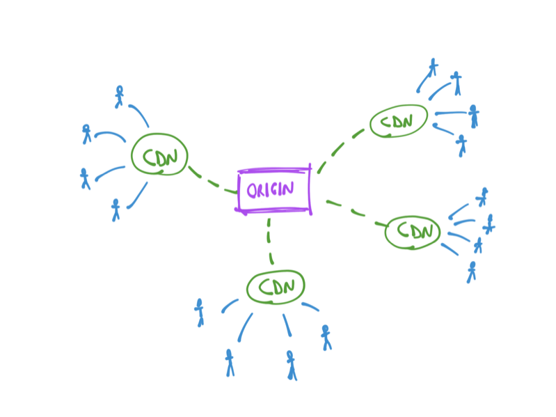

A **CDN** stands for **Content Delivery Network**.

It's a series of servers distributed all around the globe, all linked together.

In the context of helping speed up a website, their job is to distribute assets (like images, JavaScript files, CSS, also HTML) so that they are reasonably near - physically -  to every user that might want to access your website, in order to **improve the speed of the connection** and reduce the latency.

CDNs are the ultimate cache, and the cheapest way to serve content all around the world.

Visitors will never access the actual web server that hosts your files, but instead they will hit those CDN servers, helping to reduce the load.

A CDN provides

- **Speed**, being closer to a user's network improves speed and reduces latency
- **Redundancy**, if a node of the CDN fails, other nodes can handle the traffic
- **Reduced costs** in bandwidth and server power compared to serving all the traffic from a centralized location that might not be optimized for serving lots of traffic
- **Security** by adding additional levels of protection at the CDN node level. Not all CDNs do this, but most do and also introduce DDoS attack protection mitigations

A CDN gets the original resource from an origin server, and as long as the origin does not change, it will continue serving its local copy of an asset:

Each CDN server is located in different continents, and depending on how the CDN is built, in different parts of a continent as well.

Every major company uses CDNs for serving assets, and you can too, by leveraging the services of companies like [Cloudflare](https://www.cloudflare.com), [Amazon CloudFront](https://aws.amazon.com/cloudfront/), [Google Cloud CDN](https://cloud.google.com/cdn/), [Azure CDN](https://azure.microsoft.com/en-us/services/cdn/) or others.

CDNs might be integrated directly by your web hosting as well. I use Netlify for example, and they integrate an automatic CDN, which makes my site fast in every location of the world.