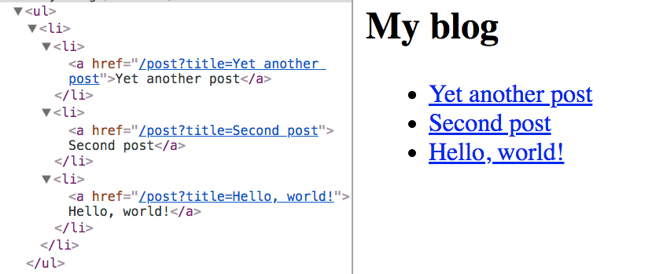
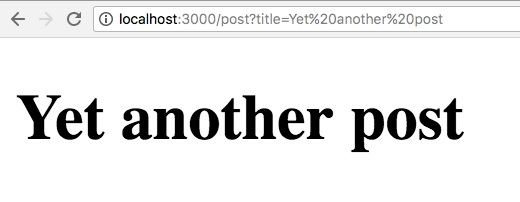

<!-- TOC -->

- [Introduction](#introduction)
- [Main features](#main-features)
- [Installation](#installation)
- [Getting started](#getting-started)
- [Create a page](#create-a-page)
- [Server-side rendering](#server-side-rendering)
- [Add a second page](#add-a-second-page)
- [Hot reloading](#hot-reloading)
- [Client rendering](#client-rendering)
- [Dynamic pages](#dynamic-pages)
- [CSS-in-JS](#css-in-js)
- [Exporting a static site](#exporting-a-static-site)
- [Deploying](#deploying)
- [Now](#now)
- [Zones](#zones)
- [Plugins](#plugins)
- [Starter kit on Glitch](#starter-kit-on-glitch)
- [Read more on Next.js](#read-more-on-nextjs)

<!-- /TOC -->

## Introduction

Working on a modern [JavaScript](/javascript/) application powered by [React](/react/) is awesome until you realize that there are a couple problems related to rendering all the content on the client-side.

First, the page takes longer to the become visible to the user, because before the content loads, all the JavaScript must load, and your application needs to run to determine what to show on the page.

Second, if you are building a publicly available website, you have a content SEO issue. Search engines are getting better at running and indexing JavaScript apps, but it's much better if we can send them content instead of letting them figure it out.

The solution to both of those problems is **server rendering**, also called **static pre-rendering**.

Next.js is one React framework to do all of this in a very simple way, but it's not limited to this. It's advertised by its creators as a **zero-configuration, single-command toolchain for React apps**.

It provides a common structure that allows you to easily build a frontend React application, and transparently handle server-side rendering for you.

## Main features

Here is a non-exhaustive list of the main Next.js features:

- **Hot Code Reloading**: Next.js reloads the page when it detects any change saved to disk.
- **Automatic Routing**: any URL is mapped to the filesystem, to files put in the `pages` folder, and you don't need any configuration (you have customization options of course).
- **Single File Components**: using [styled-jsx](https://github.com/zeit/styled-jsx), completely integrated as built by the same team, it's trivial to add styles scoped to the component.
- **Server Rendering**: you can (optionally) render React components on the server side, before sending the HTML to the client.
- **Ecosystem Compatibility**: Next.js plays well with the rest of the JavaScript, Node and React ecosystem.
- **Automatic Code Splitting**: pages are rendered with just the libraries and JavaScript that they need, no more.
- **Prefetching**: the `Link` component, used to link together different pages, supports a `prefetch` prop which automatically prefetches page resources (including code missing due to code splitting) in the background.
- **Dynamic Components**: you can import JavaScript modules and React Components dynamically (<https://github.com/zeit/next.js#dynamic-import>).
- **Static Exports**: using the `next export` command, Next.js allows you to export a fully static site from your app.

## Installation

Next.js supports all the major platforms: Linux, macOS, Windows.

A Next.js project is started easily with [npm](https://flaviocopes.com/npm/):

```bash
npm install next react react-dom
```

or with [Yarn](https://flaviocopes.com/yarn/):

```bash
yarn add next react react-dom
```

## Getting started

Create a `package.json` file with this content:

```json
{
  "scripts": {
    "dev": "next"
  }
}
```

If you run this command now:

```bash
npm run dev
```

the script will raise an error complaining about not finding the `pages` folder. This is the only thing that Next.js requires to run.

Create an empty `pages` folder, and run the command again, and Next.js will start up a server on `localhost:3000`.

If you go to that URL now, you'll be greeted by a friendly 404 page, with a nice clean design.


Next.js handles other error types as well, like 500 errors for example.

## Create a page

In the `pages` folder create an `index.js` file with a simple React functional component:

```js
export default () => (
  <div>
    <p>Hello World!</p>
  </div>
)
```

If you visit `localhost:3000`, this component will automatically be rendered.

Why is this so simple?

Next.js uses a declarative pages structure, which is based on the filesystem structure.

Pages are inside a `pages` folder, and the page URL is determined by the page file name. The filesystem is the pages API.

## Server-side rendering

Open the page source, `View -> Developer -> View Source` with Chrome.

As you can see, the HTML generated by the component is sent directly in the page source. It's not rendered client-side, but instead it's rendered on the server.

The Next.js team wanted to create a developer experience for server rendered pages similar to the one you get when creating a basic PHP project, where you drop PHP files and you call them, and they show up as pages. Internally of course it's all very different, but the apparent ease of use is clear.

## Add a second page

Let's create another page, in `pages/contact.js`

```js
export default () => (
  <div>
    <p>
      <a href="mailto:my@email.com">Contact us!</a>
    </p>
  </div>
)
```

If you point your browser to `localhost:3000/contact` this page will be rendered. As you can see, also this page is server rendered.

## Hot reloading

Note how you did not have to restart the `npm` process to load the second page. Next.js does this for you under the hood.

## Client rendering

Server rendering is very convenient in your first page load, for all the reasons we saw above, but when it comes to navigating inside the website, client-side rendering is key to speeding up the page load and improving the user experience.

Next.js provides a `Link` component you can use to build links. Try linking the two pages above.

Change `index.js` to this code:

```js
import Link from 'next/link'

export default () => (
  <div>
    <p>Hello World!</p>
    <Link href="/contact">
      <a>Contact me!</a>
    </Link>
  </div>
)
```

Now go back to the browser and try this link. As you can see, the Contact page loads immediately, without a page refresh.

This is client-side navigation working correctly, with complete support for the [**History API**](https://flaviocopes.com/history-api/), which means your users back button won't break.

If you now `cmd-click` the link, the same Contact page will open in a new tab, now server rendered.

## Dynamic pages

A good use case for Next.js is a blog, as it's something that all developers know how it works, and it's a good fit for a simple example of how to handle dynamic pages.

A dynamic page is a page that has no fixed content, but instead display some data based on some parameters.

Change `index.js` to

```js
import Link from 'next/link'

const Post = props => (
  <li>
    <Link href={`/post?title=${props.title}`}>
      <a>{props.title}</a>
    </Link>
  </li>
)

export default () => (
  <div>
    <h2>My blog</h2>
    <ul>
      <li>
        <Post title="Yet another post" />
        <Post title="Second post" />
        <Post title="Hello, world!" />
      </li>
    </ul>
  </div>
)
```

This will create a series of posts and will fill the title query parameter with the post title:



Now create a `post.js` file in the `pages` folder, and add:

```js
export default props => <h1>{props.url.query.title}</h1>
```

Now clicking a single post will render the post title in a `h1` tag:



You can use clean URLs without query parameters. The Next.js Link component helps us by accepting an `as` attribute, which you can use to pass a slug:

```js
import Link from 'next/link'

const Post = props => (
  <li>
    <Link as={`/${props.slug}`} href={`/post?title=${props.title}`}>
      <a>{props.title}</a>
    </Link>
  </li>
)

export default () => (
  <div>
    <h2>My blog</h2>
    <ul>
      <li>
        <Post slug="yet-another-post" title="Yet another post" />
        <Post slug="second-post" title="Second post" />
        <Post slug="hello-world" title="Hello, world!" />
      </li>
    </ul>
  </div>
)
```

## CSS-in-JS

Next.js by default provides support for [styled-jsx](https://github.com/zeit/styled-jsx), which is a CSS-in-JS solution provided by the same development team, but you can use whatever library you prefer, like [Styled Components](https://flaviocopes.com/styled-components/).

Example:

```js
export default () => (
  <div>
    <p>
      <a href="mailto:my@email.com">Contact us!</a>
    </p>
    <style jsx>{`
      p {
        font-family: 'Courier New';
      }
      a {
        text-decoration: none;
        color: black;
      }
      a:hover {
        opacity: 0.8;
      }
    `}</style>
  </div>
)
```

Styles are scoped to the component, but you can also edit global styles adding `global` to the `style` element:

```js
export default () => (
  <div>
    <p>
      <a href="mailto:my@email.com">Contact us!</a>
    </p>
    <style jsx global>{`
      body {
        font-family: 'Benton Sans', 'Helvetica Neue';
        margin: 2em;
      }
      h2 {
        font-style: italic;
        color: #373fff;
      }
    `}</style>
  </div>
)
```

## Exporting a static site

A Next.js application can be easily exported as a static site, which can be deployed on one of the super fast static site hosts, like [Netlify](https://flaviocopes.com/netlify/) or [Firebase Hosting](https://flaviocopes.com/firebase-hosting/), without the need to set up a Node environment.

The process requires you to declare the URLs that compose the site, but it's [a straightforward process](https://github.com/zeit/next.js/#static-html-export).

## Deploying

Creating a production-ready copy of the application, without source maps or other development tooling that aren't needed in the final build, is easy.

At the beginning of this tutorial you created a `package.json` file with this content:

```json
{
  "scripts": {
    "dev": "next"
  }
}
```

which was the way to start up a development server using `npm run dev`.

Now just add the following content to `package.json` instead:

```json
{
  "scripts": {
    "dev": "next",
    "build": "next build",
    "start": "next start"
  }
}
```

and prepare your app by running `npm run build` and `npm run start`.

## Now

The company behind Next.js provides an awesome hosting service for Node.js applications, called [**Now**](https://zeit.co/now).

Of course they integrate both their products so you can deploy Next.js apps seamlessly, [once you have Now installed](https://zeit.co/download), by running the `now` command in the application folder.

Behind the scenes Now sets up a server for you, and you don't need to worry about anything, just wait for your application URL to be ready.

## Zones

You can set up multiple Next.js instances to listen to different URLs, yet the application to an outside user will look like it's being powered by a single server: <https://github.com/zeit/next.js/#multi-zones>

## Plugins

Next.js has a list of plugins at <https://github.com/zeit/next-plugins>

## Starter kit on Glitch

If you're looking to experiment, I recommend Glitch. Check out my [Next.js Glitch Starter Kit](https://glitch.com/edit/#!/flavio-starter-nextjs).

<!-- Copy and Paste Me -->
<div class="glitch-embed-wrap" style="height: 764px; width: 100%;">
  <iframe src="https://glitch.com/embed/#!/embed/flavio-starter-nextjs?path=pages/index.jsx&previewFirst=true" alt="flavio-starter-nextjs on glitch" style="height: 100%; width: 100%; border: 0;"></iframe>
</div>

## Read more on Next.js

I can't possibly describe every feature of this great framework, and the main place to read more about Next.js is [the project readme on GitHub](https://github.com/zeit/next.js/blob/canary/readme.md).
