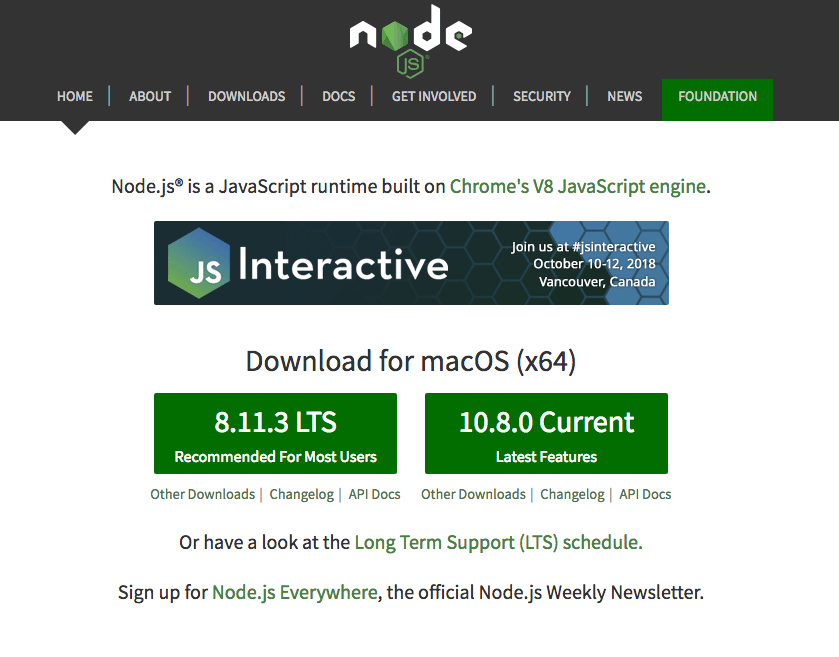

Node.js can be installed in multiple ways on a system, and the upgrade instructions depend on how you first installed it.

## If you installed Node using the official package

The easiest way to install Node is to download the official package from the [Node.js website](https://nodejs.org/).



The official package contains an installer that will detect the existing version of Node.js and it will overwrite it with the new one.

## If you installed Node using Homebres (on macOS)

Homebrew is a very popular way to install Node.js on a Mac.

If you did use Homebrew, upgrading Node is as simple as running

```bash
brew update #makes sure Homebrew is up to date
brew upgrade node
```

Homebrew might ask you to upgrade your xCode version to compile the package.

## If you use `nvm`

`nvm` is a popular way to run Node. It allows you to easily switch the Node version, and install new versions to try and easily rollback if something breaks, for example.

It is also very useful to test your code with old Node versions.

When you use `nvm`, you can check the current version you are running by typing `nvm current`, which will give you the same result as `node -v`.

To list all the installed versions, run `nvm ls`.

You can install a new Node release (or any old Node release, too) using `nvm install <VERSION>`, for example:

```bash
nvm install 10.8.3
```

Once installed, you can set that Node.js version to be the one to use by typing

```bash
nvm use 10.8.3
```

This will set 10.8.3 to the default Node version, system-wide.