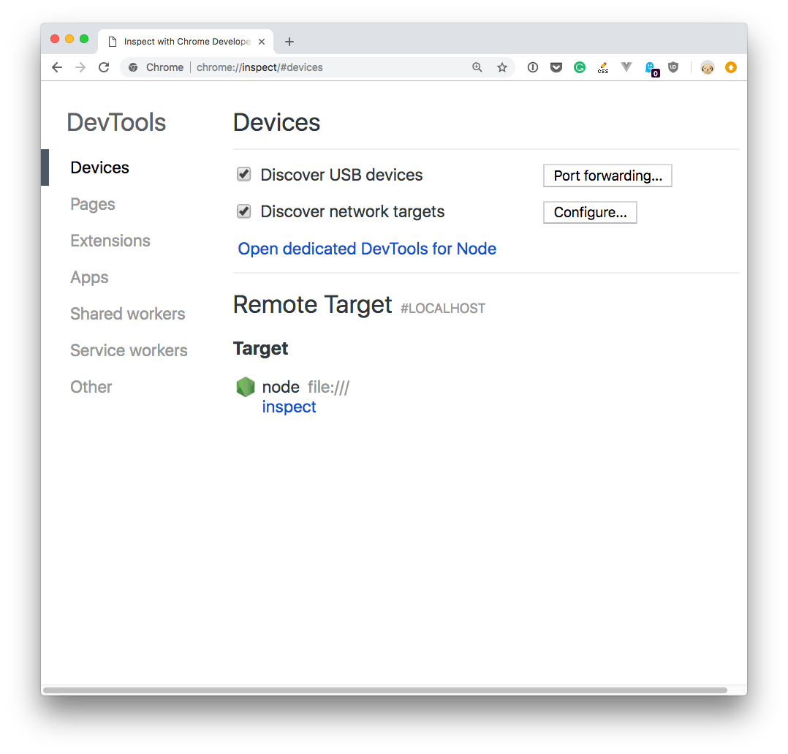
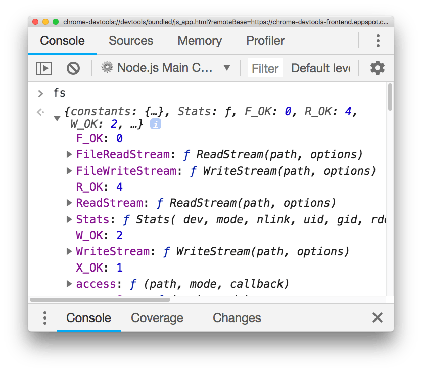

With client-side code it's easy to start debugging some piece of code - just open the [Chrome DevTools](/browser-dev-tools/) on any page, and start writing client-side JavaScript.

How can we do the same with Node.js code, and debug Node modules with access to the filesystem and other Node.js capabilities? It's very simple, actually.

Open your [terminal](/macos-terminal/) and run

```bash
node --inspect
```


Then in Chrome type this URL: `about://inspect`.



Click the `Open dedicated DevTools for Node` link next to the Node target, and you'll have access to Node.js in the browser DevTools:



Make sure you click that, and not the `inspect` link down below, as it tool auto-reconnects to the Node.js instance when we restart it - pretty handy!

If the question is _why_ we want to do that, it's pretty simple: there's no better way to debug any JavaScript code than using the DevTools and their tools. We have access to the profiler, all the stack visualization information, the code navigation facilities, a very cool debugger and much more!
