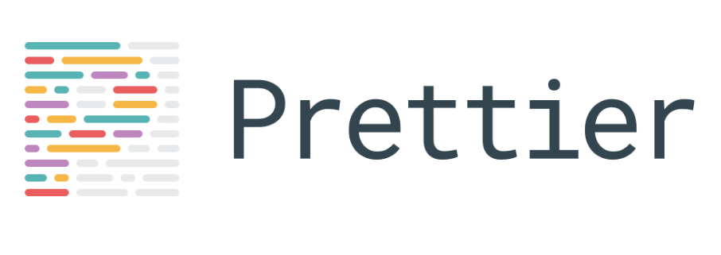

<!-- TOC -->

- [Introduction to Prettier](#introduction-to-prettier)
- [Less options](#less-options)
- [Difference with ESLint](#difference-with-eslint)
- [Installation](#installation)
- [Prettier for beginners](#prettier-for-beginners)

<!-- /TOC -->

## Introduction to Prettier

Prettier is an opinionated code formatter.

It supports a lot of different syntax out of the box, including:

- JavaScript
- Flow, [TypeScript](/typescript/)
- CSS, SCSS, Less
- [JSX](/jsx/)
- [GraphQL](/graphql/)
- JSON
- Markdown

and with [plugins](https://prettier.io/docs/en/plugins.html) you can use it for Python, PHP, Swift, Ruby, Java and more.

It integrates with the most popular code editors, including VS Code, Sublime Text, Atom and more.

Prettier is hugely popular, as in February 2018 it has been downloaded over 3.5 million times.

The most important links you need to know more about Prettier are

- <https://prettier.io/>
- <https://github.com/prettier/prettier>
- <https://www.npmjs.com/package/prettier>

## Less options

I learned Go recently and one of the best things about Go is **gofmt**, an official tool that automatically formats your code according to common standards.

95% (made up stat) of the Go code around looks exactly the same, because this tool can be easily enforced and since the style is defined for you by the Go maintainers, you are much more likely to adapt to that standard instead of insisting on your own style. Like tabs vs spaces, or where to put an opening bracket.

This might sound like a limitation, but it's actually very powerful. All Go code looks the same.

**Prettier is the `gofmt` for the rest of the world**.

It has very few options, and **most of the decisions are already taken for you** so you can stop arguing about style and little things, and focus on your code.

## Difference with ESLint

[ESLint](https://flaviocopes.com/eslint/) is a linter, it does not just format, but it also highlights some errors thanks to its static analysis of the code.

It is an invaluable tool and it can be used alongside Prettier.

ESLint also highlights formatting issues, but since it's a lot more configurable, everyone could have a different set of formatting rules. Prettier provides a common ground for all.

Now, there are a few things you can customize, like:

- the tab width
- the use of single quotes vs double quotes
- the line columns number
- the use of trailing commas

and some others, but Prettier tries to keep the number of those customizations under control, to avoid becoming too customizable.

## Installation

Prettier can run from the command line, and you can install it using [Yarn](https://flaviocopes.com/yarn/) or [npm](https://flaviocopes.com/npm/).

Another great use case for Prettier is to run it on PRs for your [Git](https://flaviocopes.com/git/) repositories, for example on [GitHub](https://flaviocopes.com/github/).

If you use a supported editor the best thing is to use Prettier directly from the editor, and the Prettier formatting will be run every time you save.

For example here is the Prettier extension for VS Code: <https://marketplace.visualstudio.com/items?itemName=esbenp.prettier-vscode>

## Prettier for beginners

If you think Prettier is just for teams, or for pro users, you are missing a good value proposition of this tool.

A good style enforces good habits.

Formatting is a topic that's mostly overlooked by beginners, but having clean and consistent formatting is key to your success as a new developer.

Also, even if you started using [JavaScript](https://flaviocopes.com/javascript/) 2 weeks ago, with Prettier your code - style wise - will look just like code written from a JavaScript Guru writing JS since 1998.
