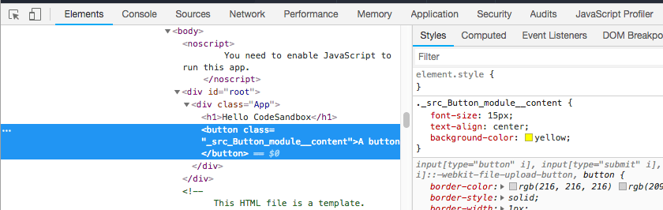

Using React you have various ways to add styling to your components.

## Using classes and CSS

The first and most simple is to use classes, and use a normal CSS file to target those classes:

```js
const Button = () => {
  return <button className="button">A button</button>
}
```

```css
.button {
  background-color: yellow;
}
```

You can import the stylesheet using an import statement, like this:

```js
import './style.css'
```

and [Webpack](https://flaviocopes.com/webpack/) will take care of adding the CSS property to the bundle.

## Using the style attribute

A second method is to use the `style` attribute attached to a JSX element. Using this approach you don't need a separate CSS file.

```js
const Button = () => {
  return <button style={{ backgroundColor: 'yellow' }}>A button</button>
}
```

CSS is defined in a slightly different way now. First, notice the double curly brackets: it's because `style` accepts an object. We pass in a JavaScript object, which is defined in curly braces. We could also do this:

```js
const buttonStyle = { backgroundColor: 'yellow' }
const Button = () => {
  return <button style={buttonStyle}>A button</button>
}
```

When using `create-react-app`, those styles are autoprefixed by default thanks to its use of [Autoprefixer](https://github.com/postcss/autoprefixer).

Also, the style now is camelCased instead of using dashes. Every time a CSS property has a dash, remove it and start the next word capitalized.

Styles have the benefit of being local to the component, and they cannot leak to other components in other parts of the app, something that using classes and an external CSS file can't provide.

## Using CSS Modules

**CSS Modules** seem to be a perfect spot in the middle: you use classes, but CSS is scoped to the component, which means that any styling you add cannot be applied to other components without your permission. And yet your styles are defined in a separate CSS file, which is easier to maintain than CSS in JavaScript (and you can use your good old CSS property names).

Start by creating a CSS file that ends with `.module.css`, for example `Button.module.css`. A great choice is to give it the same name as the component you are going to style

Add your CSS here, then import it inside the component file you want to style:

```js
import style from './Button.module.css'
```

now you can use it in your JSX:

```js
const Button = () => {
  return <button className={style.content}>A button</button>
}
```

That's it! In the resulting markup, React will generate a specific, unique class for each rendered component, and assign the CSS to that class, so that the CSS is not affecting other markup.


