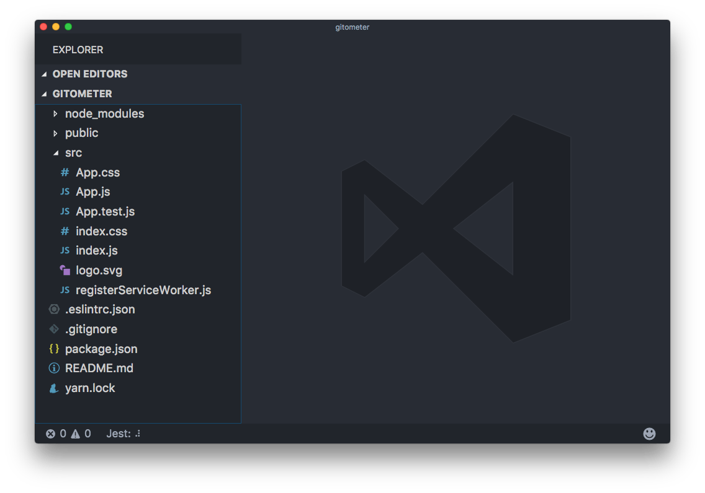
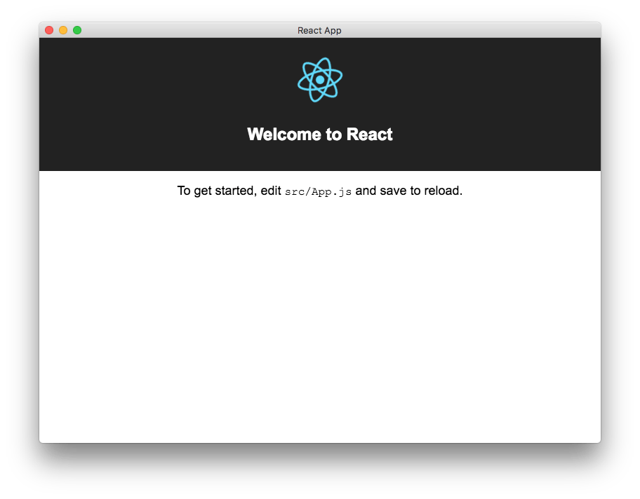

<!-- TOC -->

- [Install `npm` if you haven't already](#install-npm-if-you-havent-already)
- [Move to your development folder](#move-to-your-development-folder)
- [Create react app](#create-react-app)
- [Add electron](#add-electron)
- [Install `foreman` to allow executing the app from command line](#install-foreman-to-allow-executing-the-app-from-command-line)
- [Install the create-react-app dependencies](#install-the-create-react-app-dependencies)
- [Configure eslint (your mileage might vary)](#configure-eslint-your-mileage-might-vary)
- [Enough with the setup!](#enough-with-the-setup)
- [Start up](#start-up)
- [Thanks to](#thanks-to)

<!-- /TOC -->

When I first used [Electron](/electron/) in 2015 it was not yet clear that it would be so pervasive in modern apps, and I was kind of shocked by the resulting app size.

But, Electron is clearly here to stay and it's not mandatory that your app should feel slow and consume tons of memory, like VS Code demonstrates every day to me (on a not blazing fast machine).

So, here's a quick start for a [React](/react/) app with `create-react-app`, ready to roll with [ESlint](/eslint/) integration.

## Install `npm` if you haven't already

On OSX:

```
brew install npm
```

## Move to your development folder

```
cd ~/dev
```

## Create react app

```
npx create-react-app app
cd app
```

## Add electron

```bash
npm install electron
npm install --save-dev electron-builder
```

## Install `foreman` to allow executing the app from command line

```bash
npm install foreman -g
```

## Install the create-react-app dependencies

```bash
npm install
```

## Configure eslint (your mileage might vary)

> .eslintrc.json

```js
{
  "env": {
    "browser": true,
    "commonjs": true,
    "es6": true,
    "jest": true
  },
  "parserOptions": {
    "ecmaFeatures": {
      "jsx": true
    },
    "sourceType": "module"
  },
  "rules": {
    "no-const-assign": "warn",
    "no-this-before-super": "warn",
    "no-undef": "warn",
    "no-continue": "off",
    "no-unreachable": "warn",
    "no-unused-vars": "warn",
    "constructor-super": "warn",
    "valid-typeof": "warn",
    "quotes": [
      2,
      "single"
    ],
    "semi": [
      "error",
      "never"
    ]
  },
  "parser": "babel-eslint",
  "extends": "airbnb",
  "plugins": [
    "react",
    "jsx-a11y",
    "import"
  ]
}
```

Now add [ESLint](/eslint/) and some of its helpers

```bash
npm install eslint eslint-config-airbnb eslint-plugin-jsx-a11y eslint-plugin-import eslint-plugin-react eslint-plugin-import
```

This is what you should have right now:



Now tweak the `package.json` file to add some electron helpers.

Right now its content is something like

```js
{
  "name": "gitometer",
  "version": "0.1.0",
  "private": true,
  "dependencies": {
    "electron": "^1.7.5",
    "eslint": "^4.5.0",
    "eslint-config-airbnb": "^15.1.0",
    "eslint-plugin-import": "^2.7.0",
    "eslint-plugin-jsx-a11y": "^6.0.2",
    "eslint-plugin-react": "^7.3.0",
    "react": "^15.6.1",
    "react-dom": "^15.6.1",
    "react-scripts": "1.0.11"
  },
  "scripts": {
    "start": "react-scripts start",
    "build": "react-scripts build",
    "test": "react-scripts test --env=jsdom",
    "eject": "react-scripts eject"
  },
  "devDependencies": {
    "electron-builder": "^19.24.1"
  }
}
```

(don't mind versions, outdated as soon as I publish this)

Remove the scripts property and change it with

```js
"scripts": {
  "start": "nf start -p 3000",
  "build": "react-scripts build",
  "test": "react-scripts test --env=jsdom",
  "eject": "react-scripts eject",
  "electron": "electron .",
  "electron-start": "node src/start-react",
  "react-start": "BROWSER=none react-scripts start",
  "pack": "build --dir",
  "dist": "npm run build && build",
  "postinstall": "install-app-deps"
},
```

> On Windows you might need to have a `.env` file with `BROWSER=none` in it as environemnt variables do not work like in Linux/macOS

As you can see, `start` was moved to `react-start`, but the rest is unchanged, and some electron utils were added.

> `BROWSER=none` in `react-start` tells React not to load in a browser tab, so we only get the app in the Electron window.

Also add

```js
"homepage": "./",
"main": "src/start.js",
```

and

```js
"build": {
  "appId": "com.electron.electron-with-create-react-app",
  "win": {
    "iconUrl": "https://cdn2.iconfinder.com/data/icons/designer-skills/128/react-256.png"
  },
  "directories": {
    "buildResources": "public"
  }
}
```

The end result should be:

```js
{
  "name": "gitometer",
  "version": "0.1.0",
  "private": true,
  "dependencies": {
    "electron": "^1.7.5",
    "eslint": "^4.5.0",
    "eslint-config-airbnb": "^15.1.0",
    "eslint-plugin-import": "^2.7.0",
    "eslint-plugin-jsx-a11y": "^6.0.2",
    "eslint-plugin-react": "^7.3.0",
    "react": "^15.6.1",
    "react-dom": "^15.6.1",
    "react-scripts": "1.0.11"
  },
  "devDependencies": {
    "electron-builder": "^19.24.1"
  },
  "homepage": "./",
  "main": "src/start.js",
  "scripts": {
    "start": "nf start -p 3000",
    "build": "react-scripts build",
    "test": "react-scripts test --env=jsdom",
    "eject": "react-scripts eject",
    "electron": "electron .",
    "electron-start": "node src/start-react",
    "react-start": "BROWSER=none react-scripts start",
    "pack": "build --dir",
    "dist": "npm run build && build",
    "postinstall": "install-app-deps"
  },
  "build": {
    "appId": "com.electron.electron-with-create-react-app",
    "win": {
      "iconUrl": "https://cdn2.iconfinder.com/data/icons/designer-skills/128/react-256.png"
    },
    "directories": {
      "buildResources": "public"
    }
  }
}
```

Now create a file named `Procfile` in the project root folder, with this content:

```Procfile
react: npm run react-start
electron: npm run electron-start
```

## Enough with the setup!

Let's now start writing some code.

> src/start.js

```js
const electron = require('electron')
const app = electron.app
const BrowserWindow = electron.BrowserWindow

const path = require('path')
const url = require('url')

let mainWindow

function createWindow() {
  mainWindow = new BrowserWindow({ width: 800, height: 600 })

  mainWindow.loadURL(
    process.env.ELECTRON_START_URL ||
      url.format({
        pathname: path.join(__dirname, '/../public/index.html'),
        protocol: 'file:',
        slashes: true
      })
  )

  mainWindow.on('closed', () => {
    mainWindow = null
  })
}

app.on('ready', createWindow)

app.on('window-all-closed', () => {
  if (process.platform !== 'darwin') {
    app.quit()
  }
})

app.on('activate', () => {
  if (mainWindow === null) {
    createWindow()
  }
})
```

> src/start-react.js

```js
const net = require('net')
const childProcess = require('child_process')

const port = process.env.PORT ? process.env.PORT - 100 : 3000

process.env.ELECTRON_START_URL = `http://localhost:${port}`

const client = new net.Socket()

let startedElectron = false
const tryConnection = () => {
  client.connect(
    { port },
    () => {
      client.end()
      if (!startedElectron) {
        console.log('starting electron')
        startedElectron = true
        const exec = childProcess.exec
        exec('npm run electron')
      }
    }
  )
}

tryConnection()

client.on('error', () => {
  setTimeout(tryConnection, 1000)
})
```

## Start up

That's it!

Run

```
npm start
```

and you should see the React sample app coming up in a native app:



## Thanks to

This post was heavily inspired by <https://gist.github.com/matthewjberger/6f42452cb1a2253667942d333ff53404>
