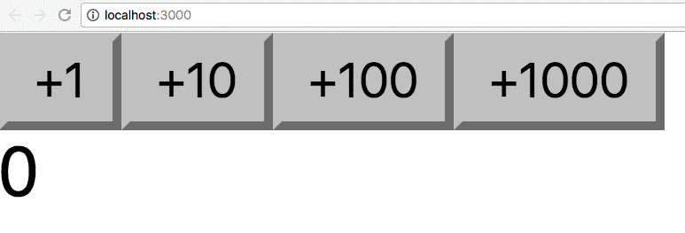

In this short tutorial we'll build a very simple example of a counter in React, applying many of the concepts and theory outlined before.

Let's use Codepen for this. We start by forking the [React template pen](https://codepen.io/flaviocopes/pen/VqeaxB).

> In Codepen we don't need to import React and ReactDOM as they are already added in the scope.

We show the count in a div, and we add a few buttons to increment this count:

```js
const Button = ({ increment }) => {
  return <button>+{increment}</button>
}

const App = () => {
  let count = 0

  return (
    <div>
      <Button increment={1} />
      <Button increment={10} />
      <Button increment={100} />
      <Button increment={1000} />
      <span>{count}</span>
    </div>
  )
}

ReactDOM.render(<App />, document.getElementById('app'))
```

Let's add the functionality that lets us change the count by clicking the buttons, by adding a `onClickFunction` prop:

```js
const Button = ({ increment, onClickFunction }) => {
  const handleClick = () => {
    onClickFunction(increment)
  }
  return <button onClick={handleClick}>+{increment}</button>
}

const App = () => {
  let count = 0

  const incrementCount = increment => {
    //TODO
  }

  return (
    <div>
      <Button increment={1} onClickFunction={incrementCount} />
      <Button increment={10} onClickFunction={incrementCount} />
      <Button increment={100} onClickFunction={incrementCount} />
      <Button increment={1000} onClickFunction={incrementCount} />
      <span>{count}</span>
    </div>
  )
}

ReactDOM.render(<App />, document.getElementById('app'))
```

Here, every Button element has 2 props: `increment` and `onClickFunction`. We create 4 different buttons, with 4 increment values: 1, 10 100, 1000.

When the button in the Button component is clicked, the `incrementCount` function is called.

This function must increment the local count. How can we do so? We can use hooks:

```js
const { useState } = React

const Button = ({ increment, onClickFunction }) => {
  const handleClick = () => {
    onClickFunction(increment)
  }
  return <button onClick={handleClick}>+{increment}</button>
}

const App = () => {
  const [count, setCount] = useState(0)

  const incrementCount = increment => {
    setCount(count + increment)
  }

  return (
    <div>
      <Button increment={1} onClickFunction={incrementCount} />
      <Button increment={10} onClickFunction={incrementCount} />
      <Button increment={100} onClickFunction={incrementCount} />
      <Button increment={1000} onClickFunction={incrementCount} />
      <span>{count}</span>
    </div>
  )
}

ReactDOM.render(<App />, document.getElementById('app'))
```

`useState()` initializes the count variable at 0 and provides us the `setCount()` method to update its value.

We use both in the `incrementCount()` method implementation, which calls `setCount()` updating the value to the existing value of `count`, plus the increment passed by each Button component.



The complete example code can be seen at <https://codepen.io/flaviocopes/pen/QzEQPR>
