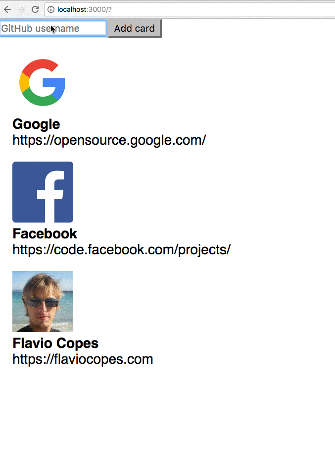

Very simple example of a form that accepts a GitHub username and once it receives a `submit` event, it asks the GitHub API for the user information, and prints them.

This code creates a reusable **Card** component. When you enter a name in the `input` field managed by the **Form** component, this name is _bound to its state_.

When _Add card_ is pressed, the input form is cleared by clearing the `userName` state of the **Form** component.

The example uses, in addition to React, the Axios library. It's a nice useful and lightweight library to handle network requests. Add it to the Pen settings in Codepen, or install it locally using `npm install axios`.

## Output



## Code

We start by creating the `Card` component, the one that will display our image and details as gathered from GitHub. It gets its data via props, using

- `props.avatar_url` the user avatar
- `props.name` the user name
- `props.blog` the user website URL

```js
const Card = props => {
  return (
    <div style={{ margin: '1em' }}>
      
      <div>
        <div style={{ fontWeight: 'bold' }}>{props.name}</div>
        <div>{props.blog}</div>
      </div>
    </div>
  )
}
```

We create a list of those components, which will be passed by a parent component in the `cards` prop to `CardList`, which iterates on it using `map()` and outputs a list of cards:

```js
const CardList = props => (
  <div>
    {props.cards.map(card => (
      <Card {...card} />
    ))}
  </div>
)
```

The parent component is App, which stores the `cards` array in its own state, managed using the `useState()` Hook:

```js
const App = () => {
  const [cards, setCards] = useState([])

  return (
    <div>
      <CardList cards={cards} />
    </div>
  )
}
```

Cool! We must have a way now to ask GitHub for the details of a single username. We'll do so using a `Form` component, where we manage our own state (`username`), and we ask GitHub for information about a user using their public APIs, via [Axios](https://flaviocopes.com/axios/):

```js
const Form = props => {
  const [username, setUsername] = useState('')

  handleSubmit = event => {
    event.preventDefault()

    axios.get(`https://api.github.com/users/${username}`).then(resp => {
      props.onSubmit(resp.data)
      setUsername('')
    })
  }

  return (
    <form onSubmit={handleSubmit}>
      <input
        type="text"
        value={username}
        onChange={event => setUsername(event.target.value)}
        placeholder="GitHub username"
        required
      />
      <button type="submit">Add card</button>
    </form>
  )
}
```

When the form is submitted we call the `handleSubmit` event, and after the network call we call `props.onSubmit` passing the parent (`App`) the data we got from GitHub.

We add it to `App`, passing a method to add a new card to the list of cards, `addNewCard`, as its `onSubmit` prop:

```js
const App = () => {
  const [cards, setCards] = useState([])

  addNewCard = cardInfo => {
    setCards(cards.concat(cardInfo))
  }

  return (
    <div>
      <Form onSubmit={addNewCard} />
      <CardList cards={cards} />
    </div>
  )
}
```

Finally we render the app:

```js
ReactDOM.render(<App />, document.getElementById('app'))
```

Here is the full source code of our little React app:

```js
const { useState } = React

const Card = props => {
  return (
    <div style={{ margin: '1em' }}>
      
      <div>
        <div style={{ fontWeight: 'bold' }}>{props.name}</div>
        <div>{props.blog}</div>
      </div>
    </div>
  )
}

const CardList = props => <div>{props.cards.map(card => <Card {...card} />)}</div>

const Form = props => {
  const [username, setUsername] = useState('')

  handleSubmit = event => {
    event.preventDefault()

    axios
      .get(`https://api.github.com/users/${username}`)
      .then(resp => {
        props.onSubmit(resp.data)
        setUsername('')
      })
  }

  return (
    <form onSubmit={handleSubmit}>
      <input
        type="text"
        value={username}
        onChange={event => setUsername(event.target.value)}
        placeholder="GitHub username"
        required
      />
      <button type="submit">Add card</button>
    </form>
  )
}

const App = () => {
  const [cards, setCards] = useState([])

  addNewCard = cardInfo => {
    setCards(cards.concat(cardInfo))
  }

  return (
    <div>
      <Form onSubmit={addNewCard} />
      <CardList cards={cards} />
    </div>
  )
}

ReactDOM.render(<App />, document.getElementById('app'))
```

Check it out on Codepen at <https://codepen.io/flaviocopes/pen/oJLyeY>
