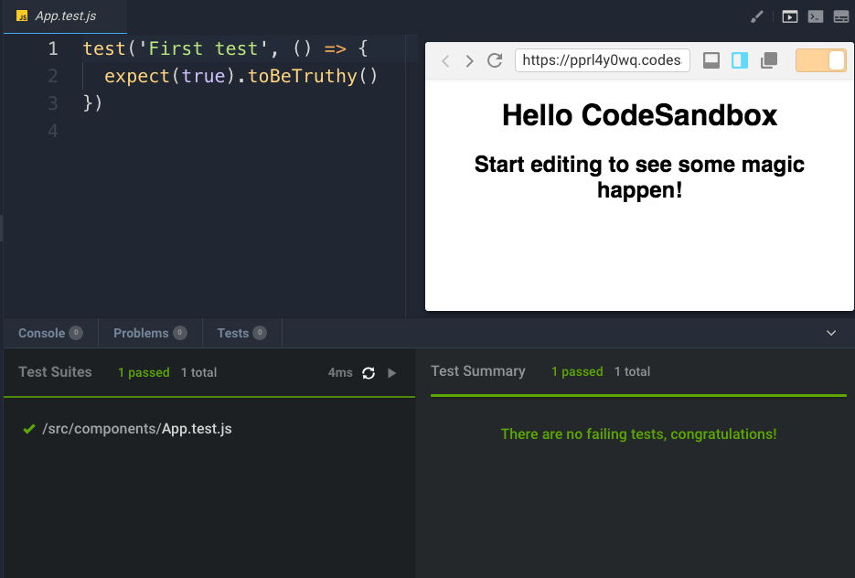
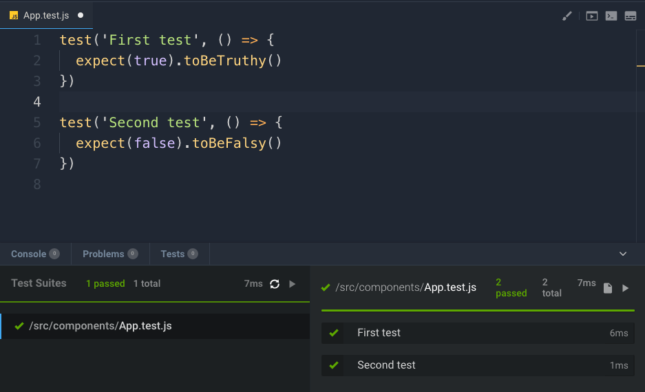

The easiest way to start with testing React components is doing snapshot testing, a testing technique that lets you test components in isolation.

If you are familiar with testing software, it's just like unit testing you do for classes: you test each component functionality.

I assume you created a React app with `create-react-app`, which already comes with **Jest** installed, the testing package we'll need.

Let's start with a simple test. CodeSandbox is a great environment to try this out. Start with a React sandbox, and create an `App.js` component in a `components` folder, and add an `App.test.js` file.

```js
import React from 'react'

export default function App() {
  return (
    <div className="App">
      <h1>Hello CodeSandbox</h1>
      <h2>Start editing to see some magic happen!</h2>
    </div>
  )
}
```

Our first test is dumb:

```js
test('First test', () => {
  expect(true).toBeTruthy()
})
```

When CodeSandbox detects test files, it automatically runs them for you, and you can click the Tests button in the bottom of the view to show your test results:



A test file can contain multiple tests:



Let's do something a bit more useful now, to actually test a React component. We only have App now, which is not doing anything really useful, so let's first set up the environment with a little application with more functionality: the counter app we built previously. If you skipped it, you can go back and read how we built it, but for easier reference I add it here again.

It's just 2 components: App and Button. Create the `App.js` file:

```js
import React, { useState } from 'react'
import Button from './Button'

const App = () => {
  const [count, setCount] = useState(0)

  const incrementCount = increment => {
    setCount(count + increment)
  }

  return (
    <div>
      <Button increment={1} onClickFunction={incrementCount} />
      <Button increment={10} onClickFunction={incrementCount} />
      <Button increment={100} onClickFunction={incrementCount} />
      <Button increment={1000} onClickFunction={incrementCount} />
      <span>{count}</span>
    </div>
  )
}

export default App
```

and the `Button.js` file:

```js
import React from 'react'

const Button = ({ increment, onClickFunction }) => {
  const handleClick = () => {
    onClickFunction(increment)
  }
  return <button onClick={handleClick}>+{increment}</button>
}

export default Button
```

We are going to use the `react-testing-library`, which is a great help as it allows us to inspect the output of every component and to apply events on them. You can read more about it on <https://github.com/kentcdodds/react-testing-library> or by watching [this video](https://www.youtube.com/watch?v=JKOwJUM4_RM).

Let's test the Button component first.

We start by importing `render` and `fireEvent` from `react-testing-library`, two helpers. The first lets us render JSX. The second lets us emit events on a component.

Create a `Button.test.js` and put it in the same folder as `Button.js`.

```js
import React from 'react'
import { render, fireEvent } from 'react-testing-library'
import Button from './Button'
```

Buttons are used in the app to accept a click event and then they call a function passed to the `onClickFunction` prop. We add a `count` variable and we create a function that increments it:

```js
let count

const incrementCount = increment => {
  count += increment
}
```

Now off to the actual tests. We first initialize count to 0, and we render a `+1` `Button` component passing a `1` to `increment` and our `incrementCount` function to `onClickFunction`.

Then we get the content of the first child of the component, and we check it outputs `+1`.

We then proceed to clicking the button, and we check that the count got from 0 to 1:

```js
test('+1 Button works', () => {
  count = 0
  const { container } = render(
    <Button increment={1} onClickFunction={incrementCount} />
  )
  const button = container.firstChild
  expect(button.textContent).toBe('+1')
  expect(count).toBe(0)
  fireEvent.click(button)
  expect(count).toBe(1)
})
```

Similarly we test a +100 button, this time checking the output is `+100` and the button click increments the count of 100.

```js
test('+100 Button works', () => {
  count = 0
  const { container } = render(
    <Button increment={100} onClickFunction={incrementCount} />
  )
  const button = container.firstChild
  expect(button.textContent).toBe('+100')
  expect(count).toBe(0)
  fireEvent.click(button)
  expect(count).toBe(100)
})
```

Let's test the App component now. It shows 4 buttons and the result in the page. We can inspect each button and see if the result increases when we click them, clicking multiple times as well:

```js
import React from 'react'
import { render, fireEvent } from 'react-testing-library'
import App from './App'

test('App works', () => {
  const { container } = render(<App />)
  console.log(container)
  const buttons = container.querySelectorAll('button')

  expect(buttons[0].textContent).toBe('+1')
  expect(buttons[1].textContent).toBe('+10')
  expect(buttons[2].textContent).toBe('+100')
  expect(buttons[3].textContent).toBe('+1000')

  const result = container.querySelector('span')
  expect(result.textContent).toBe('0')
  fireEvent.click(buttons[0])
  expect(result.textContent).toBe('1')
  fireEvent.click(buttons[1])
  expect(result.textContent).toBe('11')
  fireEvent.click(buttons[2])
  expect(result.textContent).toBe('111')
  fireEvent.click(buttons[3])
  expect(result.textContent).toBe('1111')
  fireEvent.click(buttons[2])
  expect(result.textContent).toBe('1211')
  fireEvent.click(buttons[1])
  expect(result.textContent).toBe('1221')
  fireEvent.click(buttons[0])
  expect(result.textContent).toBe('1222')
})
```

Check the code working on this CodeSandbox: <https://codesandbox.io/s/pprl4y0wq>
