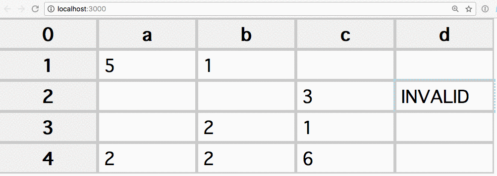
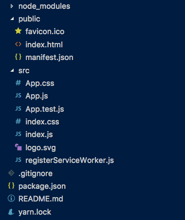
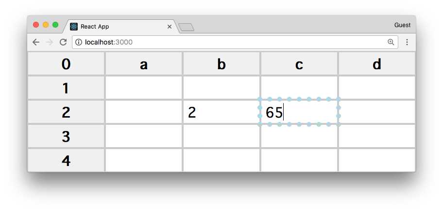

<!-- TOC -->

- [Related content](#related-content)
- [First steps](#first-steps)
- [Build a simple spreadsheet](#build-a-simple-spreadsheet)
- [Introducing formulas](#introducing-formulas)
- [Improve performance](#improve-performance)
- [Saving the content of the table](#saving-the-content-of-the-table)
- [Wrapping up](#wrapping-up)

<!-- /TOC -->

Creating a stripped down version of a spreadsheet like Google Sheets is really a good example of showing many of the capabilities of React.

At the end of this tutorial you'll have a working, configurable, reusable spreadsheet React Component to power all your calculations 🙂

## Related content

This tutorial covers the following topics for which I wrote dedicated guides:

- [React](/react/)
- [JSX](/jsx/)
- [ES6](/es6/)

You might want to check them out to get an introduction to these topics if you're new to them.

## First steps

> The code of this tutorial is available on GitHub at <https://github.com/flaviocopes/react-spreadsheet-component>

First thing, we're going to detail what we're going to build. We'll create a Table component that will have a fixed number of rows. Each row has the same number of columns, and into each column we'll load a Cell component.

We'll be able to select any cell, and type any value into it. In addition, we'll be able to execute **formulas** on those cells, effectively creating a working spreadsheet that won't miss anything from Excel or Google Sheets 😏 `</sarcasm>`.

Here's a little demo gif:



The tutorial first dives into the basic building blocks of the spreadsheet, and then goes into adding more advanced functionality such as:

- adding the ability to calculate formulas
- optimizing performance
- saving the content to local storage

## Build a simple spreadsheet

If you don't have `create-react-app` installed already, this is a good time to do that:

```
npm install -g create-react-app
```

Then let's start with

```
npx create-react-app spreadsheet
cd spreadsheet
npm start
```

and the React app will launch on `localhost:3000`:


This procedure creates a number of files in the `spreadsheet` folder:



The one we should focus now is App.js. This file out of the box contains the following code:

```js
import React, { Component } from 'react';
import logo from './logo.svg';
import './App.css';

class App extends Component {
  render() {
    return (
      <div className="App">
        <header className="App-header">
          
          <h1 className="App-title">Welcome to React</h1>
        </header>
        <p className="App-intro">
          To get started, edit <code>src/App.js</code> and
          save to reload.
        </p>
      </div>
    );
  }
}

export default App;
```

Let's wipe out the bulk of this code and just replace it with a simple render of the Table component. We pass it 2 properties: `x` the number of columns and `y` the number of rows.

```js
import React from 'react'
import Table from './components/Table'

const App = () =>
  (<div style={{ width: 'max-content' }}>
    <Table x={4} y={4} />
  </div>)

export default App
```

Here's the Table component, which we store in `components/Table.js`:

```js
import React from 'react'
import PropTypes from 'prop-types'
import Row from './Row'

export default class Table extends React.Component {
  constructor(props) {
    super(props)

    this.state = {
      data: {},
    }
  }

  handleChangedCell = ({ x, y }, value) => {
    const modifiedData = Object.assign({}, this.state.data)
    if (!modifiedData[y]) modifiedData[y] = {}
    modifiedData[y][x] = value
    this.setState({ data: modifiedData })
  }

  updateCells = () => {
    this.forceUpdate()
  }

  render() {
    const rows = []

    for (let y = 0; y < this.props.y + 1; y += 1) {
      const rowData = this.state.data[y] || {}
      rows.push(
        <Row
          handleChangedCell={this.handleChangedCell}
          updateCells={this.updateCells}
          key={y}
          y={y}
          x={this.props.x + 1}
          rowData={rowData}
        />,
      )
    }
    return (
      <div>
        {rows}
      </div>
    )
  }
}

Table.propTypes = {
  x: PropTypes.number.isRequired,
  y: PropTypes.number.isRequired,
}
```

The `Table` component manages its own state. Its `render()` method creates a list of `Row` components, and passes to each one the part of state that bothers them: the row data. The Row component will in turn pass this data down to multiple `Cell` components, which we'll introduce in a minute.

We use the `y` row number as the key property, which is mandatory to distinguish multiple rows.

We pass to each `Row` component the `handleChangedCell` method as a prop. When a row calls this method, it passes an `(x, y)` tuple indicating the row, and the new value that's been inserted into it, and we update the state accordingly.

Let's examine the `Row` component, stored in `components/Row.js`:

```js
import React from 'react'
import PropTypes from 'prop-types'
import Cell from './Cell'

const Row = (props) => {
  const cells = []
  const y = props.y
  for (let x = 0; x < props.x; x += 1) {
    cells.push(
      <Cell
        key={`${x}-${y}`}
        y={y}
        x={x}
        onChangedValue={props.handleChangedCell}
        updateCells={props.updateCells}
        value={props.rowData[x] || ''}
      />,
    )
  }
  return (
    <div>
      {cells}
    </div>
  )
}

Row.propTypes = {
  handleChangedCell: PropTypes.func.isRequired,
  updateCells: PropTypes.func.isRequired,
  x: PropTypes.number.isRequired,
  y: PropTypes.number.isRequired,
  rowData: PropTypes.shape({
    string: PropTypes.string,
  }).isRequired,
}

export default Row
```

Same as the `Table` component, here we're building an array of `Cell` components and we put it in the `cells` variable, which the component renders.

We pass the x, y coordinates combination as the key, and we pass down as a prop the current state of that cell value using `value={props.rowData[x] || ''}`, defaulting the state to an empty string if not set.

Let's now dive into the Cell, the core (and last) component of our spreadsheet!

```js
import React from 'react'
import PropTypes from 'prop-types'

/**
 * Cell represents the atomic element of a table
 */
export default class Cell extends React.Component {
  constructor(props) {
    super(props)
    this.state = {
      editing: false,
      value: props.value,
    }
    this.display = this.determineDisplay(
      { x: props.x, y: props.y },
      props.value
    )
    this.timer = 0
    this.delay = 200
    this.prevent = false
  }

  /**
   * Add listener to the `unselectAll` event used to broadcast the
   * unselect all event
   */
  componentDidMount() {
    window.document.addEventListener('unselectAll',
      this.handleUnselectAll)
  }

  /**
   * Before updating, execute the formula on the Cell value to
   * calculate the `display` value. Especially useful when a
   * redraw is pushed upon this cell when editing another cell
   * that this might depend upon
   */
  componentWillUpdate() {
    this.display = this.determineDisplay(
      { x: this.props.x, y: this.props.y }, this.state.value)
  }

  /**
   * Remove the `unselectAll` event listener added in
   * `componentDidMount()`
   */
  componentWillUnmount() {
    window.document.removeEventListener('unselectAll',
      this.handleUnselectAll)
  }

  /**
   * When a Cell value changes, re-determine the display value
   * by calling the formula calculation
   */
  onChange = (e) => {
    this.setState({ value: e.target.value })
    this.display = this.determineDisplay(
      { x: this.props.x, y: this.props.y }, e.target.value)
  }

  /**
   * Handle pressing a key when the Cell is an input element
   */
  onKeyPressOnInput = (e) => {
    if (e.key === 'Enter') {
      this.hasNewValue(e.target.value)
    }
  }

  /**
   * Handle pressing a key when the Cell is a span element,
   * not yet in editing mode
   */
  onKeyPressOnSpan = () => {
    if (!this.state.editing) {
      this.setState({ editing: true })
    }
  }

  /**
   * Handle moving away from a cell, stores the new value
   */
  onBlur = (e) => {
    this.hasNewValue(e.target.value)
  }

  /**
   * Used by `componentDid(Un)Mount`, handles the `unselectAll`
   * event response
   */
  handleUnselectAll = () => {
    if (this.state.selected || this.state.editing) {
      this.setState({ selected: false, editing: false })
    }
  }

  /**
   * Called by the `onBlur` or `onKeyPressOnInput` event handlers,
   * it escalates the value changed event, and restore the editing
   * state to `false`.
   */
  hasNewValue = (value) => {
    this.props.onChangedValue(
      {
        x: this.props.x,
        y: this.props.y,
      },
      value,
    )
    this.setState({ editing: false })
  }

  /**
   * Emits the `unselectAll` event, used to tell all the other
   * cells to unselect
   */
  emitUnselectAllEvent = () => {
    const unselectAllEvent = new Event('unselectAll')
    window.document.dispatchEvent(unselectAllEvent)
  }

  /**
   * Handle clicking a Cell.
   */
  clicked = () => {
    // Prevent click and double click to conflict
    this.timer = setTimeout(() => {
      if (!this.prevent) {
        // Unselect all the other cells and set the current
        // Cell state to `selected`
        this.emitUnselectAllEvent()
        this.setState({ selected: true })
      }
      this.prevent = false
    }, this.delay)
  }

  /**
   * Handle doubleclicking a Cell.
   */
  doubleClicked = () => {
    // Prevent click and double click to conflict
    clearTimeout(this.timer)
    this.prevent = true

    // Unselect all the other cells and set the current
    // Cell state to `selected` & `editing`
    this.emitUnselectAllEvent()
    this.setState({ editing: true, selected: true })
  }

  determineDisplay = ({ x, y }, value) => {
    return value
  }

  /**
   * Calculates a cell's CSS values
   */
  calculateCss = () => {
    const css = {
      width: '80px',
      padding: '4px',
      margin: '0',
      height: '25px',
      boxSizing: 'border-box',
      position: 'relative',
      display: 'inline-block',
      color: 'black',
      border: '1px solid #cacaca',
      textAlign: 'left',
      verticalAlign: 'top',
      fontSize: '14px',
      lineHeight: '15px',
      overflow: 'hidden',
      fontFamily: 'Calibri, \'Segoe UI\', Thonburi,
        Arial, Verdana, sans-serif',
    }

    if (this.props.x === 0 || this.props.y === 0) {
      css.textAlign = 'center'
      css.backgroundColor = '#f0f0f0'
      css.fontWeight = 'bold'
    }

    return css
  }

  render() {
    const css = this.calculateCss()

    // column 0
    if (this.props.x === 0) {
      return (
        <span style={css}>
          {this.props.y}
        </span>
      )
    }

    // row 0
    if (this.props.y === 0) {
      const alpha = ' abcdefghijklmnopqrstuvwxyz'.split('')
      return (
        <span
          onKeyPress={this.onKeyPressOnSpan}
          style={css}
          role="presentation">
          {alpha[this.props.x]}
        </span>
      )
    }

    if (this.state.selected) {
      css.outlineColor = 'lightblue'
      css.outlineStyle = 'dotted'
    }

    if (this.state.editing) {
      return (
        <input
          style={css}
          type="text"
          onBlur={this.onBlur}
          onKeyPress={this.onKeyPressOnInput}
          value={this.state.value}
          onChange={this.onChange}
          autoFocus
        />
      )
    }
    return (
      <span
        onClick={e => this.clicked(e)}
        onDoubleClick={e => this.doubleClicked(e)}
        style={css}
        role="presentation"
      >
        {this.display}
      </span>
    )
  }
}

Cell.propTypes = {
  onChangedValue: PropTypes.func.isRequired,
  x: PropTypes.number.isRequired,
  y: PropTypes.number.isRequired,
  value: PropTypes.string.isRequired,
}
```

Quite a bit to discuss here! But first, you should be able to finally see something in your browser, and this something seems already working quite good:



It's not much, but we can already edit the cells content.

Let's examine the code.

In the constructor we set some internal state properties that we'll need later, and we also initialize the `this.display` property based upon `props.value`, which is used in the render() method. Why we do this? Because later when we'll add the option to store th table data in local storage, we'll be able to initialize a cell with a value instead of an empty value.

At the moment, `props.value` will always have an empty value, so all the cells are initialized empty.

When a `Cell` value changes, I escalate the `updateCells` event to `Table` which forces an update of the whole component.

When a `Cell` is selected, I trigger the `selected` state which I use to add some CSS attributes (outline). This could have been left to a CSS job, but I decided to factor it in as a state property so I could optionally later control multiple cells selection.

When a `Cell` is selected, it emits a `unselectAll` plain JS event, which allows sibling cells to communicate. It is also instrumental to clear selection across multiple table instances on the page, which I considered a good behaviour and a natural UX feat.

A `Cell` can be clicked or double-clicked, and I introduced a timer to prevent conflicts between these 2 events. Clicking a cell select it, while double-clicking allows editing by switching the `span` normally used to render the table into an `input` field, and you can enter any value.

So wrapping up a `Table` renders a list of `y` `Row` components, which in turn render `x` `Cell` components each.

In the  current implementation `Row` is not much more than a proxy; it is responsible for the creation of the `Cell`s that compose a row, but aside from this it just passes events up the hierarchy to the `Table` via `props`.

## Introducing formulas

The spreadsheet at this point is nice and all, but the real power comes from being able to execute formulas: sum values, reference other cells, and so on.

I decided to use this pretty nice library that handles Excel formulas: <https://github.com/handsontable/formula-parser> so we can get full compatibility with the most popular formulas for free, without having to code them ourselves.

The library seems quite actively developed, and has a good test suite so we can run the test ourselves to check if something goes wrong.

We can run `npm install hot-formula-parser` and then restart our app with `npm start`.

We did the first app dissection from top to bottom, let's now start from the bottom.

In the Cell component, when determining the value of an item we run the `determineDisplay()` method:

```js
determineDisplay = ({ x, y }, value) => {
  return value
}
```

It's very simple, because it is missing the bulk of the functionality. Determining the value is simple if it's just a value, but it's more complicated if we need to calculate the value based on a formula. A formula (in our little spreadsheet) always starts with the equal sign `=`, so whenever we find it as the first char of a value, we run the formula computation on it, by calling the `executeFormula()` method passed as one of the props of Cell:

```js
export default class Cell extends React.Component {
  //...

  determineDisplay = ({ x, y }, value) => {
    if (value.slice(0, 1) === '=') {
      const res = this.props.executeFormula({ x, y },
        value.slice(1))
      if (res.error !== null) {
        return 'INVALID'
      }
      return res.result
    }
    return value
  }

  //...
}

Cell.propTypes = {
  //...
  executeFormula: PropTypes.func.isRequired,
  //...
}
```

We get `executeFormula()` from our parent component, so let's see it in Row:

```js
const Row = (props) => {
  //...
    cells.push(
      <Cell
        key={`${x}-${y}`}
        y={y}
        x={x}
        onChangedValue={props.handleChangedCell}
        updateCells={props.updateCells}
        value={props.rowData[x] || ''}
        executeFormula={props.executeFormula}
      />,
    )
  //...
}

Row.propTypes = {
  //...
  executeFormula: PropTypes.func.isRequired,
  //...
}
```

We're passing it down from the component props to its children. Nothing complicated here. The meat of the functionality is all moved up to Table then! This is because to do anything, we must know all the state of the table, we can't just run a formula on a cell or on a row: any formula might reference any other cell. So here is how we'll edit Table to fit formulas:

```js
//...
import { Parser as FormulaParser } from 'hot-formula-parser'
//...

export default class Table extends React.Component {
  constructor(props) {
    //...
    this.parser = new FormulaParser()

    // When a formula contains a cell value, this event lets us
    // hook and return an error value if necessary
    this.parser.on('callCellValue', (cellCoord, done) => {
      const x = cellCoord.column.index + 1
      const y = cellCoord.row.index + 1

      // Check if I have that coordinates tuple in the table range
      if (x > this.props.x || y > this.props.y) {
        throw this.parser.Error(this.parser.ERROR_NOT_AVAILABLE)
      }

      // Check that the cell is not self referencing
      if (this.parser.cell.x === x && this.parser.cell.y === y) {
        throw this.parser.Error(this.parser.ERROR_REF)
      }

      if (!this.state.data[y] || !this.state.data[y][x]) {
        return done('')
      }

      // All fine
      return done(this.state.data[y][x])
    })

    // When a formula contains a range value, this event lets us
    // hook and return an error value if necessary
    this.parser.on('callRangeValue',
      (startCellCoord, endCellCoord, done) => {
      const sx = startCellCoord.column.index + 1
      const sy = startCellCoord.row.index + 1
      const ex = endCellCoord.column.index + 1
      const ey = endCellCoord.row.index + 1
      const fragment = []

      for (let y = sy; y <= ey; y += 1) {
        const row = this.state.data[y]
        if (!row) {
          continue
        }

        const colFragment = []

        for (let x = sx; x <= ex; x += 1) {
          let value = row[x]
          if (!value) {
            value = ''
          }

          if (value.slice(0, 1) === '=') {
            const res = this.executeFormula({ x, y },
              value.slice(1))
            if (res.error) {
              throw this.parser.Error(res.error)
            }
            value = res.result
          }

          colFragment.push(value)
        }
        fragment.push(colFragment)
      }

      if (fragment) {
        done(fragment)
      }
    })
  }

  //...

  /**
   * Executes the formula on the `value` usign the
   * FormulaParser object
   */
  executeFormula = (cell, value) => {
    this.parser.cell = cell
    let res = this.parser.parse(value)
    if (res.error != null) {
      return res // tip: returning `res.error` shows more details
    }
    if (res.result.toString() === '') {
      return res
    }
    if (res.result.toString().slice(0, 1) === '=') {
      // formula points to formula
      res = this.executeFormula(cell, res.result.slice(1))
    }

    return res
  }

  render() {
    //...
        <Row
          handleChangedCell={this.handleChangedCell}
          executeFormula={this.executeFormula}
          updateCells={this.updateCells}
          key={y}
          y={y}
          x={this.props.x + 1}
          rowData={rowData}
        />,
    //...
  }
}
```

In the constructor we initialize the formula parser. We pass the `executeFormula()` method down to each Row, and when called we call our parser. The parser emits 2 events that we use to hook our table state to determine the value of specific cells (`callCellValue`) and the values of a range of cells (`callRangeValue`), e.g.  `=SUM(A1:A5)`.

The `Table.executeFormula()` method is building a recursive call around the parser, because if a cell has an identity function pointing to another identity function, it will resolve the functions until it gets a plain value. In this way every cell of the table can be linked to each other, but will generate an INVALID value when a circular reference is determined, because the library has a `callCellValue` event that allows me to hook into the Table state and raise an error if
1) the formula reference a value out of the table
2) the cell is self-referencing

The inner working of each event responder is a bit tricky to get, but don't worry about the details, focus on how it works overall.

## Improve performance

The `updateCells` prop passed down from Table to Cell is responsible for rerendering all the cells in the table, and it's triggered when a Cell changes its content.

This is because another Cell might reference ours in a formula, and multiple Cells could need to be updated because of a change in another Cell.

At the moment we're blindly updating *all* cells, which is a lot of rerendering. Imagine a big table, and the amount of computation needed to rerender could be bad enough to cause some problems.

We need to do something: implement the `shouldComponentUpdate()` in Cell.

The `Cell.shouldComponentUpdate()` is key to avoiding performance penalties in re-rendering the whole table:

```js
//...

  /**
   * Performance lifesaver as the cell not touched by a change can
   * decide to avoid a rerender
   */
  shouldComponentUpdate(nextProps, nextState) {
    // Has a formula value? could be affected by any change. Update
    if (this.state.value !== '' &&
        this.state.value.slice(0, 1) === '=') {
      return true
    }

    // Its own state values changed? Update
    // Its own value prop changed? Update
    if (nextState.value !== this.state.value ||
        nextState.editing !== this.state.editing ||
        nextState.selected !== this.state.selected ||
        nextProps.value !== this.props.value) {
      return true
    }

    return false
  }

//...
```

What this method does is: if there is a value, and this value is a formula, yes we need to update as our formula might depend on some other cell value.

Then, we check if we're editing this cell, in which case - yes, we need to update the component.

In all other cases, no we can leave this component as-is and not rerender it.

In short, **we only update formula cells, and the cell being modified**.

We could improve this by keeping a graph of formula dependencies that can trigger ad-hoc re-rendering of dependent cells of the one modified, which is an optimization that with large amounts of data can be a lifesaver, but it might even be causing delays itself, so I ended up with this basic implementation.

## Saving the content of the table

The last thing I want to introduce in this tutorial is how to **save the data we have in the table to localStorage**, so that when we reload the page, the data is still there. We can close the browser, reopen it next week, and the data will still be there.

How do we do that?

We need to hook into the `handleChangedCell()` method of Table, and change it from:

```js
handleChangedCell = ({ x, y }, value) => {
  const modifiedData = Object.assign({}, this.state.data)
  if (!modifiedData[y]) modifiedData[y] = {}
  modifiedData[y][x] = value
  this.setState({ data: modifiedData })
}
```

to:

```js
handleChangedCell = ({ x, y }, value) => {
  const modifiedData = Object.assign({}, this.state.data)
  if (!modifiedData[y]) modifiedData[y] = {}
  modifiedData[y][x] = value
  this.setState({ data: modifiedData })

  if (window && window.localStorage) {
    window.localStorage.setItem(this.tableIdentifier,
      JSON.stringify(modifiedData))
  }
}
```

so that whenever a cell is changed, we store the state into localStorage.

We set `tableIdentifier` in the constructor, using

```js
this.tableIdentifier = `tableData-${props.id}`
```

We use an `id` prop so that we can use multiple Table components in the same app, and they will all save on their own storage, by rendering them this way:

```js
<Table x={4} y={4} id={'1'} />
<Table x={4} y={4} id={'2'} />
```

We now just need to load this state when the Table component is initialized, by adding a `componentWillMount()` method to `Table`:

```js
componentWillMount() {
  if (this.props.saveToLocalStorage &&
      window &&
      window.localStorage) {
    const data = window.localStorage.getItem(this.tableIdentifier)
    if (data) {
      this.setState({ data: JSON.parse(data) })
    }
  }
}
```

## Wrapping up

That's it for this tutorial!

Don't miss the in-depth coverage of the topics we talked about:

- [React](/react/)
- [JSX](/jsx/)
- [ES6](/es6/)