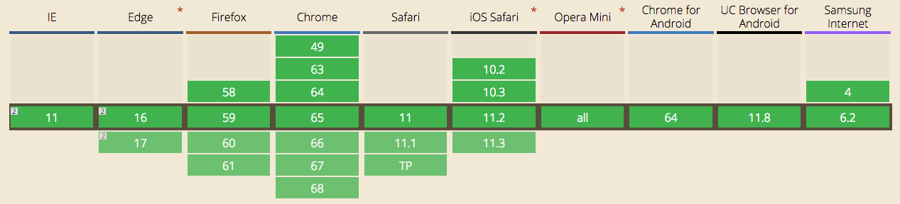
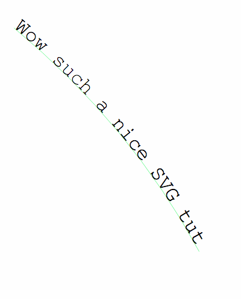

<!-- TOC -->

- [Introduction](#introduction)
- [The advantages of SVG](#the-advantages-of-svg)
- [Your first SVG image](#your-first-svg-image)
- [Using SVG](#using-svg)
- [SVG Elements](#svg-elements)
  - [`text`](#text)
  - [`circle`](#circle)
  - [`rect`](#rect)
  - [`line`](#line)
  - [`path`](#path)
  - [`textPath`](#textpath)
  - [`polygon`](#polygon)
  - [`g`](#g)
- [SVG viewport and viewBox](#svg-viewport-and-viewbox)
- [Inserting SVG in Web Pages](#inserting-svg-in-web-pages)
  - [With an `img` tag](#with-an-img-tag)
  - [With the CSS `background-image` property](#with-the-css-background-image-property)
  - [Inline in the HTML](#inline-in-the-html)
  - [With an `object`, `iframe` or `embed` tag](#with-an-object-iframe-or-embed-tag)
- [Inline SVG using a Data URL](#inline-svg-using-a-data-url)
- [Styling elements](#styling-elements)
- [Interacting with a SVG with CSS or JavaScript](#interacting-with-a-svg-with-css-or-javascript)
  - [CSS inside SVG](#css-inside-svg)
  - [JavaScript inside SVG](#javascript-inside-svg)
  - [JavaScript outside the SVG](#javascript-outside-the-svg)
  - [CSS outside the SVG](#css-outside-the-svg)
- [SVG vs Canvas API](#svg-vs-canvas-api)
- [SVG Symbols](#svg-symbols)
- [Validate an SVG](#validate-an-svg)
- [Should I include the `xmlns` attribute?](#should-i-include-the-xmlns-attribute)
- [Should I worry about browser support?](#should-i-worry-about-browser-support)

<!-- /TOC -->

## Introduction

Despite being standardized in the early 2000s, SVG (a shorthand for _Scalable Vector Graphics_) is a hot topic these days.

SVG has been penalized for quite a few years by the poor browser support (most notably IE).

I found this quote from a 2011 book: "at the time of writing, direct embedding of SVG into HTML works only in the very newest browsers". 7 years ago, this is now a thing of the past, and we can use SVG images safely.

Today we can use SVG images safely, unless you have a lot of users with IE8 and below, or with older Android devices. In this case, fallbacks exist.



Some part of the success of SVG is due to the variety of screen displays we must support, at different resolutions and sizes. A perfect task for SVG.

Also, the rapid decline of Flash in the last few years led to a renewed interest in SVG, which is great for a lot of things that Flash did in the past.

SVG is a **vector** image file format. This makes them very different than image format such as PNG, GIF or JPG, which are raster image file formats.

## The advantages of SVG

SVG images, thanks to being vector images, can **infinitely scale** and not have any issue in image quality degradation.
How so? Because SVG images are built using **XML markup**, and the browser prints them by plotting each point and line, rather than filling some space with pre-defined pixels. This ensures SVG images can adapt to different screen sizes and resolutions, even ones that have yet to be invented.

Thanks to being defined in XML, SVG images are much more **flexible** than JPG or PNG images, and** we can use CSS and JavaScript to interact with them**. SVG images can even _contain_ CSS and JavaScript.

SVG images can render vector-style images a lot smaller than other formats, and are mainly used on logos and illustrations. Another huge use case is icons. Once domain of Icon Fonts like FontAwesome, now designers prefer using SVG images because they are smaller and they allow to have multi-color icons.

SVG is easy to animate, which is a very cool topic.

SVG provides some image editing effects, like masking and clipping, applying filters, and more.

SVG are just text, and as such it can be efficiently compressed using GZip.

## Your first SVG image

SVG images are defined using XML. This means that SVG will look very familiar if you are proficient in HTML, except rather than having tags that are suited for document construction (like `p`, `article`, `footer`, `aside`) in SVG we have the building blocks of vector images: `path`, `rect`, `line` and so on.

This is an example SVG image:

```html
<svg width="10" height="10">
  <rect x="0" y="0" width="10" height="10" fill="blue" />
</svg>
```

Notice how it's very easy to read and understand how the image will look like: it's a simple blue rectangle of 10x10 pixels (the default unit).

Most of the times you won't have to edit the SVG code, but you will use tools like Sketch or Figma or any other vector graphics tool to create the image, and export it as SVG.

The current version of SVG is 1.1, and SVG 2.0 is under development.

## Using SVG

SVG images can be displayed by the browser by including them in a `img` tag:

```html

```

just like you would do for other pixel-based image formats:

```html


```

In addition, pretty uniquely, SVG they can be directly included in the HTML page:

```html
<!DOCTYPE html>
<html>
  <head>
    <title>A page</title>
  </head>
  <body>
    <svg width="10" height="10">
      <rect x="0" y="0" width="10" height="10" fill="blue" />
    </svg>
  </body>
</html>
```

> Please note that HTML5 and XHTML require a different syntax for inline SVG images. Luckily XHTML is a thing of the past, as it was more complex than necessary, but it's worth knowing in case you still need to work on XHTML pages.

The **ability to inline SVG in HTML** makes this format a **unicorn** in the scene, as other images can't do this, and must be fetched by opening a separate request for each one.

## SVG Elements

In the example above you saw the usage of the `rect` element. SVG has a lot of different elements.

The most used ones are

- `text`: creates a text element
- `circle`: creates a circle
- `rect`: creates a rectangle
- `line`: creates a line
- `path`: create a path between two points
- `textPath`: create a path between two points, and a linked text element
- `polygon`: allows to create any kind of polygon
- `g`: groups separate elements

> Coordinates start at 0,0 at the top-left of the drawing area, and extend _from left to right_ for `x`, _from top to bottom_ for `y`.

> The images you see reflect the code shown above. Using the [Browser DevTools](/browser-dev-tools/) you can inspect and change them.

### `text`

The `text` element adds text. The text can be selected using the mouse. `x` and `y` define the starting point of the text

```html
<svg>
  <text x="5" y="30">A nice rectangle</text>
</svg>
```


### `circle`

Define a circle. `cx` and `cy` are the center coordinates, and `r` is the radius. `fill` is a common attribute and represents the figure color.

```html
<svg>
  <circle cx="50" cy="50" r="50" fill="#529fca" />
</svg>
```


### `rect`

Defines a rectangle. `x`, `y` are the starting coordinates, `width` and `height` are self-explanatory.

```html
<svg>
  <rect x="0" y="0" width="100" height="100" fill="#529fca" />
</svg>
```


### `line`

`x1` and `y1` define the starting coordinates. `x2` and `y2` define the ending coordinates. `stroke` is a common attribute and represents the line color.

```html
<svg>
  <line x1="0" y1="0" x2="100" y2="100" stroke="#529fca" />
</svg>
```


### `path`

A path is a sequence of lines and curves. It's the most powerful tool to draw using SVG, and as such it's the most complex.

`d` contains the directions commands. These commands start with the command name, and a set of coordinates:

- `M` means Move, it accepts a set of coordinates x, y
- `L` means Line, it accepts a set of coordinates x, y to draw the line to
- `H` is an Horizontal Line, it only accept an x coordinate
- `V` is a Vertical Line, it only accept an y coordinate
- `Z` means Close Path, puts a line back to the start
- `A` means Arch, it needs a whole tutorial on its own
- `Q` is a quadratic Bezier curve, again it needs a whole tutorial on its own

```html
<svg height="300" width="300">
  <path d="M 100 100 L 200 200 H 10 V 40 H 70"
        fill="#59fa81" stroke="#d85b49" stroke-width="3" />
</svg>
```


### `textPath`

Adds a text along the shape of a path element.

```html
<svg viewBox="0 0 1000 600"
     xmlns="http://www.w3.org/2000/svg"
     xmlns:xlink="http://www.w3.org/1999/xlink">
  <defs>
    <path id="MyPath" d="M 20 40 Q 260 240 400 500" />
  </defs>
  <use xlink:href="#MyPath" fill="none" stroke="#59fa81" />
  <text font-family="Courier New" font-size="42.5">
    <textPath xlink:href="#MyPath">
    Wow such a nice SVG tut
    </textPath>
  </text>
</svg>
```




### `polygon`

Draw any random polygon with `polygon`. `points represents a set of x, y coordinates the polygon should link:

```html
<svg>
  <polygon points="9.9, 1.1, 3.3, 21.78, 19.8, 8.58, 0, 8.58, 16.5, 21.78" />
</svg>
```


### `g`

Using the `g` element you can group multiple elements:

```html
<svg width="200" height="200">
  <rect x="0" y="0" width="100" height="100" fill="#529fca" />
  <g id="my-group">
    <rect x="0" y="100" width="100" height="100" fill="#59fa81" />
    <rect x="100" y="0" width="100" height="100" fill="#ad4a3d" />
  </g>
</svg>
```


## SVG viewport and viewBox

The size of an SVG relative to its container is set by the `width` and `height` attributes of the `svg` element. Those units default to pixels, but you can use any other usual unit like `%` or `em`. This is the **viewport**.

> Generally "container" means the browser window, but a `svg` element can contain other `svg` elements, in that case the container is the parent `svg`.

An important attribute is `viewBox`. It lets you define a new coordinates system inside the SVG canvas.

Say you have a simple circle, in a 200x200px SVG:

```html
<svg width="200" height="200">
  <circle cx="100" cy="100" r="100" fill="#529fca" />
</svg>
```


By specifying a **viewBox** you can choose to **only show a portion** of this SVG. For example you can start at point 0, 0 and only show a 100x100px canvas:

```html
<svg width="200" height="200" viewBox="0 0 100 100">
  <circle cx="100" cy="100" r="100" fill="#529fca" />
</svg>
```


starting at 100, 100 you will see another portion, the bottom right half of the circle:

```html
<svg width="200" height="200" viewBox="100 100 100 100">
  <circle cx="100" cy="100" r="100" fill="#529fca" />
</svg>
```


A great way to visualize this is to imagine Google Maps being a gigantic SVG image, and your browser is a viewBox as big as the window size. When you move around, the viewBox changes its starting point (x, y) coordinates, and when you resize the window, you change the width and height of the viewBox.

## Inserting SVG in Web Pages

There are various ways to add SVG to a webpage.

The most common ones are:

- with an `img` tag
- with the CSS `background-image` property
- inline in the HTML
- with an `object`, `iframe` or `embed` tag

See all these examples live on Glitch: <https://flavio-svg-loading-ways.glitch.me/>

### With an `img` tag

```html

```

### With the CSS `background-image` property

```html
<style>
.svg-background {
  background-image: url(flag.svg);
  height: 200px;
  width: 300px;
}
</style>
<div class="svg-background"></div>
```

### Inline in the HTML

```html
<svg width="300" height="200" viewBox="0 0 300 200"
    version="1.1" xmlns="http://www.w3.org/2000/svg"
    xmlns:xlink="http://www.w3.org/1999/xlink">
  <title>Italian Flag</title>
  <desc>By Flavio Copes https://flaviocopes.com</desc>
  <g id="flag">
      <rect fill="green" x="0" y="0" width="100" height="200"></rect>
      <rect fill="white" x="100" y="0" width="100" height="200"></rect>
      <rect fill="red" x="200" y="0" width="100" height="200"></rect>
  </g>
</svg>
```

### With an `object`, `iframe` or `embed` tag

```html
<object data="flag.svg" type="image/svg+xml"></object>

<iframe src="flag.svg" frameborder="0"></iframe>

<embed src="flag.svg" type="" />
```

Using `embed` you have the option to get the SVG document from the parent document using

```js
document.getElementById('my-svg-embed').getSVGDocument()
```

and from inside the SVG you can reference the parent document with:

```js
window.parent.document
```

## Inline SVG using a Data URL

You can use any of the above examples combined with [Data URLs](/data-urls/) to inline the SVG in the HTML:

```html
" alt="Flag" />

<object data="data:image/svg+xml;<DATA>" type="image/svg+xml"></object>

<iframe data="data:image/svg+xml;<DATA>" frameborder="0"></iframe>
```

and in CSS too:

```css
.svg-background {
  background-image: url('data:image/svg+xml;<DATA>');
}
```

Just change `<DATA>` with the appropriate [Data URL](https://developer.mozilla.org/en-US/docs/Web/HTTP/Basics_of_HTTP/Data_URIs).

## Styling elements

Any SVG element can accept a `style` attribute, just like HTML tags.
Not all CSS properties work as you would expect, due to the SVG nature. For example to change the color of a text element, use `fill` instead of `color`.

```html
<svg>
  <text x="5" y="30" style="fill: green">A nice text</text>
</svg>

<svg>
  <text x="5" y="70" style="fill: green; font-family: Courier New">
    A nice text
  </text>
</svg>
```

You can use `fill` as an element attribute as well, as you saw before:

```html
<svg>
  <text x="5" y="70" fill="green">A nice text</text>
</svg>
```

Other common properties are

- `fill-opacity`, background color opacity
- `stroke`, defines the border color
- `stroke-width`, sets the width of the border

CSS can target SVG elements like you would target HTML tags:

```css
rect {
  fill: red;
}
circle {
  fill: blue;
}
```

## Interacting with a SVG with CSS or JavaScript

SVG images can be styled using CSS, or scripted with JavaScript, in those cases:

- **when the SVG is inlined in the HTML**
- when the image is loaded through `object`, `embed` or `iframe` tags

but (⚠️ depending on the browser implementation) they must be loaded from the same domain (and protocol), due to the same-origin policy.

`iframe` needs to be explicitly sized, otherwise the content is cropped, while `object` and `embed` resize to fit their content.

If the SVG is loaded using a `img` tag, or through CSS as a background, independently of the origin:

- CSS and JavaScript cannot interact with it
- JavaScript contained in the SVG is disabled
- External resources like images, stylesheets, scripts, fonts cannot be loaded

in detail

---

| Feature                      | Inline SVG | `object`/`embed`/`iframe` | `img` |
| ---------------------------- | ---------- | ------------------------- | ----- |
| Can interact with the user   | ✅         | ✅                        | ✅    |
| Supports animations          | ✅         | ✅                        | ✅    |
| Can run its own JavaScript   | ✅         | ✅                        | 👎🏼    |
| Can be scripted from outside | ✅         | 👎🏼                        | 👎🏼    |

Inline SVG images are definitely the most powerful and flexible, and it's the only way to perform certain operations with SVG.

**If you want to do any interaction with the SVG with your scripts, it must be loaded inline in the HTML**.

Loading an SVG in an `img`, `object` or `embed` works if you don't need to interact with it, just show it in the page, and it's especially convenient if you reuse SVG images in different pages, or the SVG size is quite big.

### CSS inside SVG

Add the CSS in a CDATA:

```html
<svg>
  <style>
    <![CDATA[
      #my-rect { fill: blue; }
    ]]>
  </style>
  <rect id="my-rect" x="0" y="0" width="10" height="10" />
</svg>
```

An SVG file can also include an external style sheet:

```html
<?xml version="1.0" standalone="no"?>
<?xml-stylesheet type="text/css" href="style.css"?>
<svg xmlns="http://www.w3.org/2000/svg" version="1.1"
     width=".." height=".." viewBox="..">
  <rect id="my-rect" x="0" y="0" width="10" height="10" />
</svg>
```

### JavaScript inside SVG

You can put the JavaScript first, and wrap in in a `load` event to execute it when the page is fully loaded and the SVG is inserted in the DOM:

```html
<svg>
  <script>
    <![CDATA[
      window.addEventListener("load", () => {
        //...
      }, false)
    ]]>
  </script>
  <rect x="0" y="0" width="10" height="10" fill="blue" />
</svg>
```

or you can avoid adding an event listener if you put the JS at the end of the other SVG code, to make sure the JavaScript runs when the SVG is present in the page:

```html
<svg>
  <rect x="0" y="0" width="10" height="10" fill="blue" />
  <script>
    <![CDATA[
      //...
    ]]>
  </script>
</svg>
```

SVG elements, just like html tags, can have `id` and `class` attributes, so we can use the [Selectors API](/selectors-api/) to reference them:

```html
<svg>
  <rect x="0" y="0" width="10" height="10" fill="blue"
        id="my-rect" class="a-rect" />
  <script>
    <![CDATA[
      console.log(document.getElementsByTagName('rect'))
      console.log(document.getElementById('my-rect'))
      console.log(document.querySelector('.a-rect'))
      console.log(document.querySelectorAll('.a-rect'))
    ]]>
  </script>
</svg>
```

Check out this Glitch <https://flaviocopes-svg-script.glitch.me/> for an example of this functionality.

### JavaScript outside the SVG

If you can interact with the SVG (the SVG is inline in the HTML), you can change any SVG attribute using JavaScript, for example:

```js
document.getElementById('my-svg-rect').setAttribute('fill', 'black')
```

or really do any other [DOM](/dom/) manipulation you want.

### CSS outside the SVG

You can change any styling of the SVG image using CSS.

SVG attributes can be easily overwritten in CSS, and they have a lower priority over CSS. They do not behave like inline CSS, which has higher priority.

```html
<style>
  #my-rect {
    fill: red
  }
</style>
<svg>
  <rect x="0" y="0" width="10" height="10" fill="blue"
        id="my-rect" />
</svg>
```

## SVG vs Canvas API

The Canvas API is a great addition to the Web Platform, and it has similar browser support as SVG. The main (and big) difference with SVG is that Canvas is not vector based, but rather pixel based, so

- it has the same scaling issues as pixel-based PNG, JPG and GIF image formats
- it makes it impossible to edit a Canvas image using CSS or JavaScript like you can do with SVG

## SVG Symbols

Symbols let you define an SVG image once, and reuse it in multiple places. This is a great help if you need to reuse an image, and maybe just change a bit some of its properties.

You do so by adding a `symbol` element and assigning an `id` attribute:

```html
<svg class="hidden">
  <symbol id="rectangle" viewBox="0 0 20 20">
    <rect x="0" y="0" width="300" height="300" fill="rgb(255,159,0)" />
  </symbol>
</svg>
```

```html
<svg>
  <use xlink:href="#rectangle" href="#rectangle" />
</svg>

<svg>
  <use xlink:href="#rectangle" href="#rectangle" />
</svg>
```

(`xlink:href` is for Safari support, even if it's a deprecated attribute)

This starts to give an idea of the power of SVG.

If you want to style those 2 rectangles differently, for example using a different color for each? You can use [CSS Variables](/css-variables/).

```html
<svg class="hidden">
  <symbol id="rectangle" viewBox="0 0 20 20">
    <rect x="0" y="0" width="300" height="300" fill="var(--color)" />
  </symbol>
</svg>
```

```html
<svg class="blue">
  <use xlink:href="#rectangle" href="#rectangle" />
</svg>

<svg class="red">
  <use xlink:href="#rectangle" href="#rectangle" />
</svg>

<style>
svg.red {
  --color: red;
}
svg.blue {
  --color: blue;
}
</style>
```

See [my Glitch playground](https://flavio-svg-symbols.glitch.me/) on SVG symbols.

## Validate an SVG

An SVG file, being XML, can be written in an invalid format, and some services or apps might not accept an invalid SVG file.

SVG can be validated using the [W3C Validator](https://validator.w3.org).

## Should I include the `xmlns` attribute?

Sometimes an svg is defined as

```html
<svg>
  ...
</svg>
```

sometimes as

```html
<svg version="1.1" xmlns="http://www.w3.org/2000/svg">
  ...
</svg>
```

This second form is XHTML. It can also be used with HTML5 (documents with [`<!DOCTYPE html>`](/doctype/)) but in this case the first form is simpler.

## Should I worry about browser support?

In 2018 SVG is supported by the vast majority of user's browsers.

You can still check for missing support using libraries like [Modernizr](https://modernizr.com/), and provide a fallback:

```js
if (!Modernizr.svg) {
  $('.my-svg').attr('src', 'images/logo.png')
}
```
