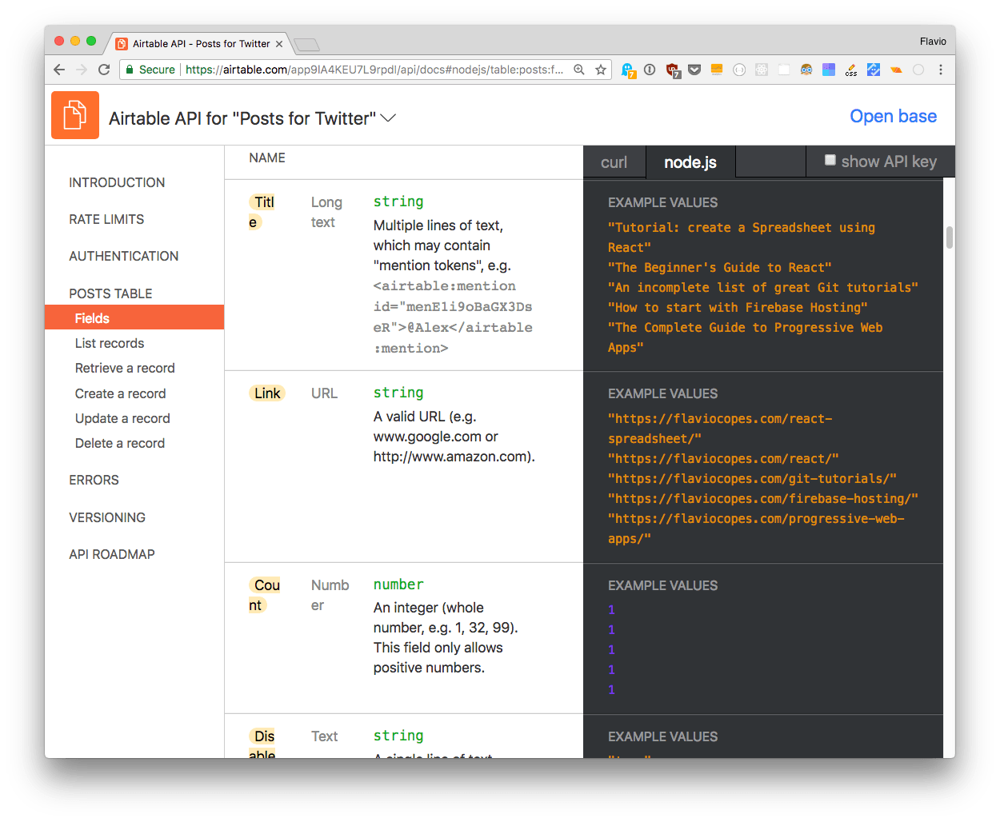
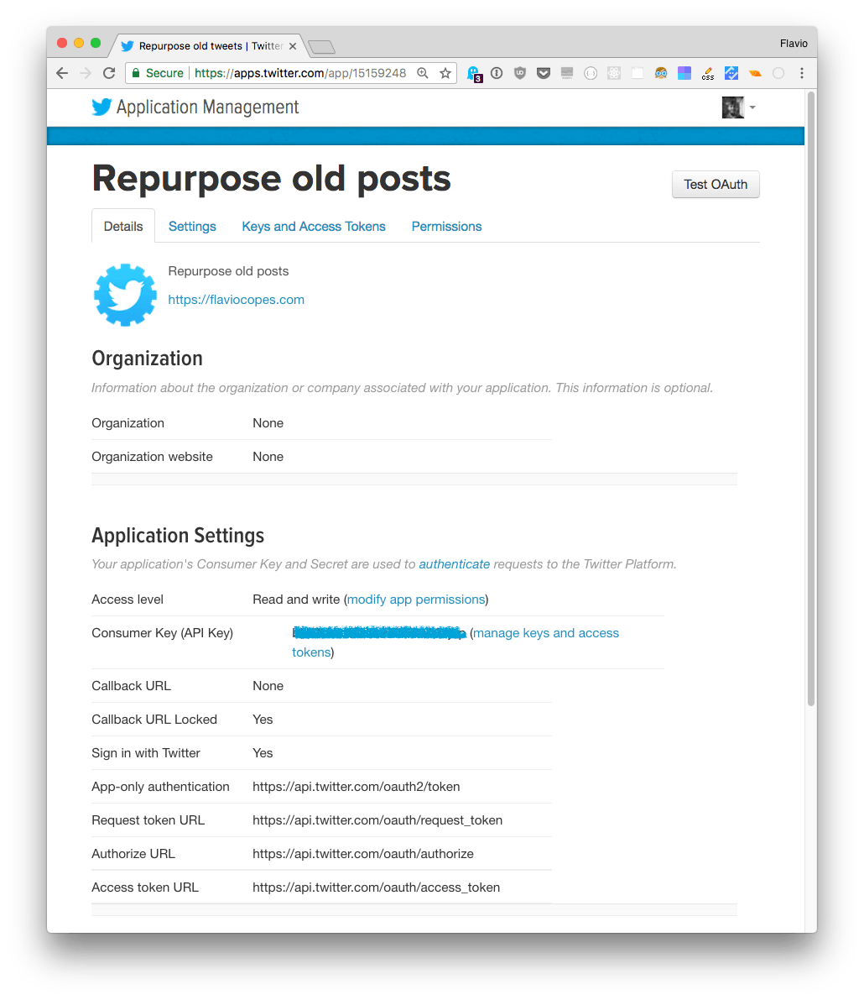
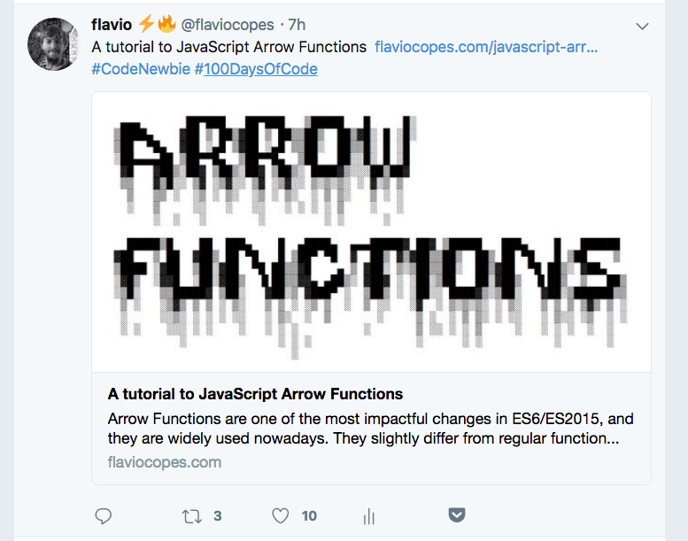
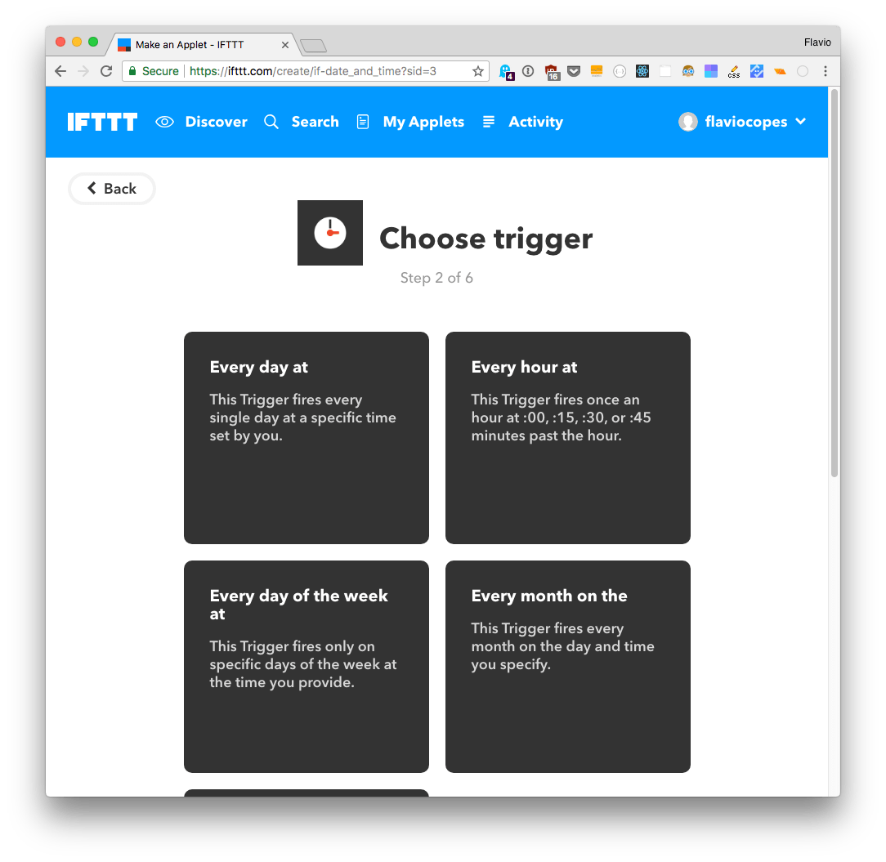
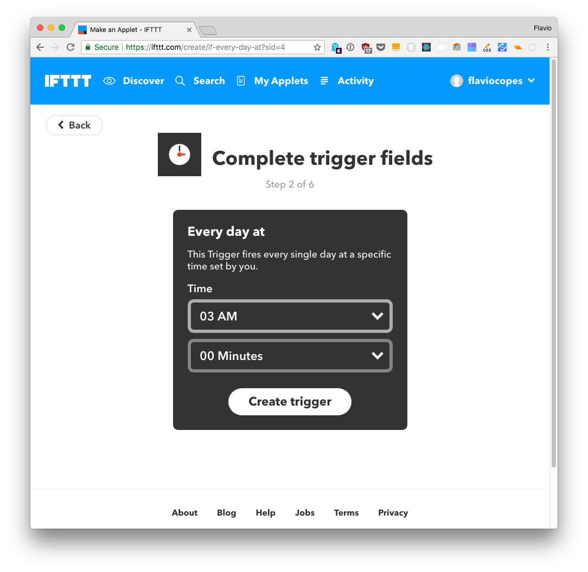
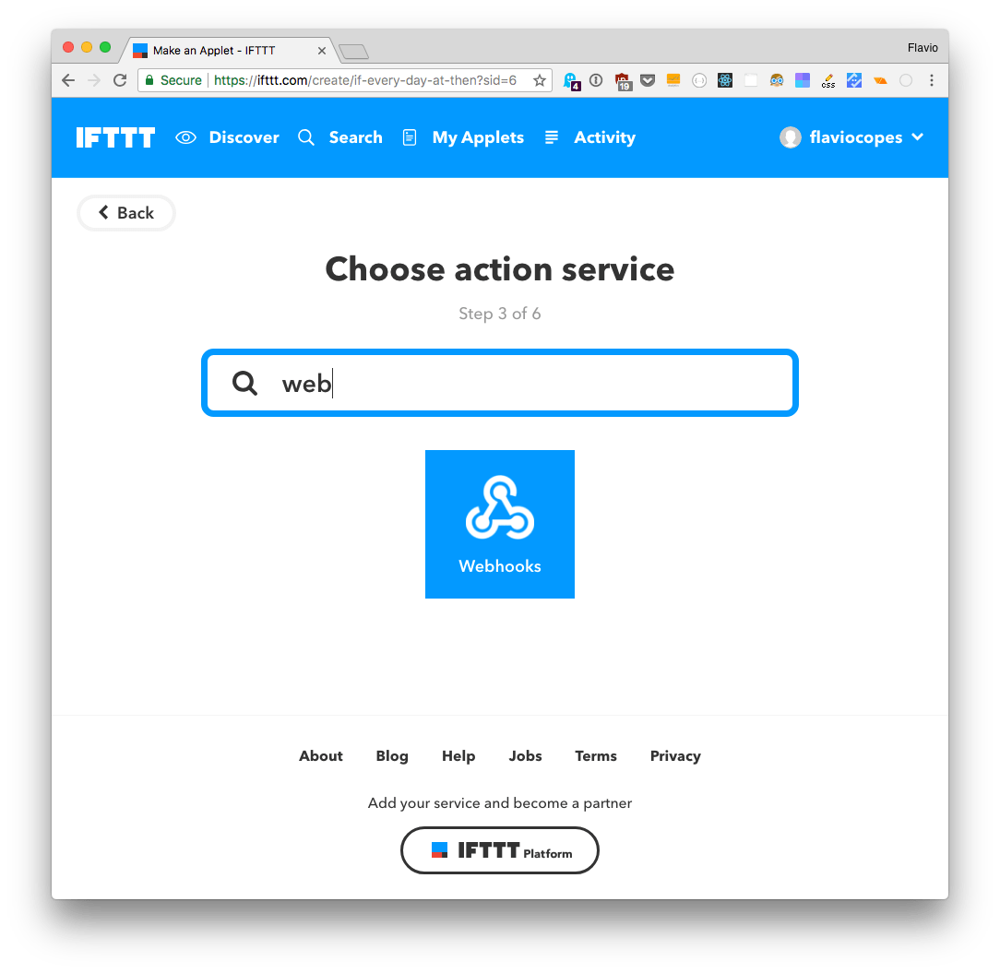
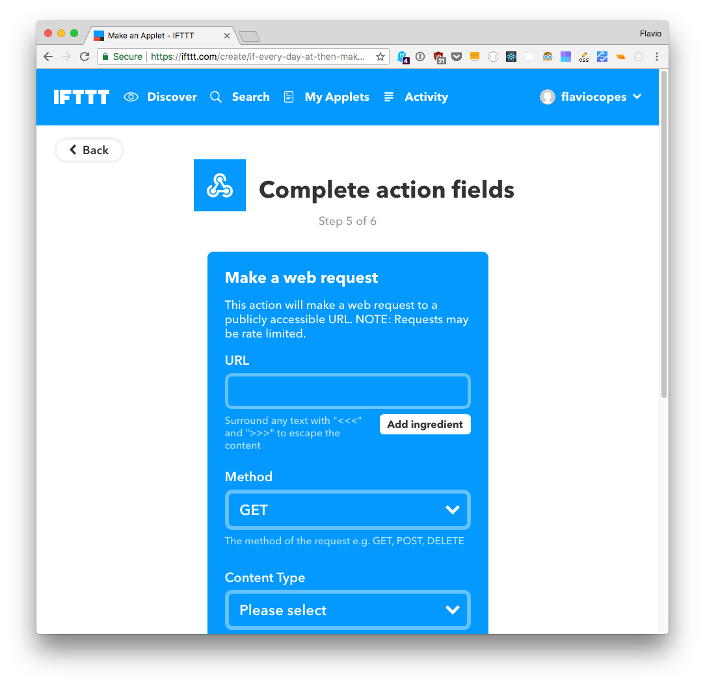

I regularly post evergreen content on my blog. Evergreen means that it's not about news or recent events, it's content that's valid today, but will also be valid 1 year from now, and maybe even 5 years from now, if I put in the time to keep it up to date in case the information gets obsolete.

Every time I write a new blog post, I share it on Twitter, and if one of my few amazing followers (👋) does not see it there, they will probably never see it again, and I think that's a disservice to me (as I put a lot of time in writing that blog post) and also a disservice to people that might learn something new with that post.

I sometimes share an old post once in a while, but it's a manual process. I must remember to do so, and also I have to keep track of which content I already shared, to avoid reposting the same thing.

So I want to create a little automation around this problem, to **post 2 old posts every day while I'm sleeping**.

I know there are services that let you do this, but - hey - we're developers, and developers build their own tools 😄

<!-- TOC -->

- [The stack](#the-stack)
- [Host the data on Airtable](#host-the-data-on-airtable)
- [Create the Node.js app on Glitch](#create-the-nodejs-app-on-glitch)
- [Dependencies](#dependencies)
- [Initialize Airtable](#initialize-airtable)
- [Paginate the records of the table](#paginate-the-records-of-the-table)
- [Process all the posts](#process-all-the-posts)
- [Enter Express](#enter-express)
- [It's all Working!](#its-all-working)
- [Automate publishing using IFTTT](#automate-publishing-using-ifttt)

<!-- /TOC -->

## The stack

I want to make an app that looks up the posts I want to repurpose from a list, and when I call a particular URL, it shares a random post, always picking one that was not recently shared.

The application will be based on Node.js, hosted on [Glitch](https://glitch.com). I use Glitch regularly for my code snippets in tutorials, and it's pretty great!

You don't just create small demos, but a full-fledged Node.js app, which is perfectly fine for my needs, and even though the app is shut down after a few hours of inactivity, an HTTP request wakes it up.

The only piece of the puzzle left is deciding where to host the data. I want a service that's easy to access, does not require a complicated permission and authorization setup, so I opted for Airtable.

## Host the data on Airtable

Airtable is a sort of mix between a spreadsheet and a database. You can add data very easily, and also export it very easily through the API.

I made a [simple base](https://airtable.com/shrEW5Rcbs4byb3Pi) that hosts the posts table:

<iframe class="airtable-embed" src="https://airtable.com/embed/shrEW5Rcbs4byb3Pi?backgroundColor=orange" frameborder="0" onmousewheel="" width="100%" height="533" style="background: transparent; border: 1px solid #ccc;"></iframe>

<br>

It has these columns:

- **Title**: the post title
- **Link**: the post link
- **Shared**: if the post has recently been shared already
- **Disabled**: if checked, the post will not be shared. Useful to "pause" content
- **Description**: an optional text that will be shared on Twitter after the title, before the link

I filled the table with some posts. You can

I'll use this table as the data source, and access it using the Node.js API.  [Airtable.js](https://github.com/airtable/airtable.js) is the official JavaScript library.

One very cool thing about Airtable is that the API documentation is dynamic, and is personalized with the keys and IDs of your tables, so you can directly put the code in the app.
It also goes one step further and provides the exact fields you use, with live content:



This is kind of amazing on its own, I wish more services did this nice thing in their API docs.

Now, off to Glitch!

## Create the Node.js app on Glitch

The Node.js app I'll build on Glitch has to communicate with Airtable and Twitter.

This is the full app:

<!-- Copy and Paste Me -->
<div class="glitch-embed-wrap" style="height: 753px; width: 100%;">
  <iframe src="https://glitch.com/embed/#!/embed/flavio-repurpose-old-posts-twitter?path=server.js&previewSize=0&previewFirst=true" alt="flavio-repurpose-old-posts-twitter on glitch" style="height: 100%; width: 100%; border: 0;"></iframe>
</div>

<br>

You can remix (fork) it on <https://glitch.com/edit/#!/flavio-repurpose-old-posts-twitter>

Glitch provides a nice feature, allowing you to keep keys and parameters secret while sharing the project to the public by putting them in a `.env` file.

I set those keys for Airtable access:

- AIRTABLE_API_KEY
- AIRTABLE_BASE_ID
- AIRTABLE_BASE_NAME
- AIRTABLE_VIEW_NAME

and those for Twitter:

- TWITTER_CONSUMER_KEY
- TWITTER_CONSUMER_SECRET
- TWITTER_ACCESS_TOKEN
- TWITTER_ACCESS_TOKEN_SECRET

Those Twitter parameters are provided by the [Twitter Apps](https://apps.twitter.com/) panel. Create one app to get the consumer key and secret, and generate one personal access token with a click.



This is the base upon which the app is built. In the Node.js code, those `.env` values are accessed through `process.env`.

## Dependencies

The app uses

- [Express.js](http://expressjs.com/)
- [Airtable.js](https://github.com/airtable/airtable.js)
- [Twit](https://github.com/ttezel/twit)

I added them to Glitch using the convenient _Add Package_ functionality that is available after opening the `package.json` file.

## Initialize Airtable

Let's get our base:

```js
const base = require('airtable').base(process.env.AIRTABLE_BASE_ID)
```

By calling the `select()` method on a base, Airtable returns a query object.

The query object can be used to fetch the records. It returns the contents in chunks of 100 rows at a time.

We need to paginate through those and store all the posts, in case our list will grow over 100 items.

## Paginate the records of the table

We do so by using the `eachPage` method, which accepts two functions. One that is executed on every iteration, and one that's executed when the content fetching has been completed, and we have all the records:

```js
const repurposeOldPost = () => {
  posts = []
  base(process.env.AIRTABLE_BASE_NAME).select({
    view: process.env.AIRTABLE_VIEW_NAME
  }).eachPage(processPage, processPosts)
}
```

`processPage()` processes a single "page" of results, which are up to 100 records. It first filters the list to exclude items without a value in the Title (to skip empty rows) and items with the Disabled column set to `true`.

Then it maps the values to a new array, which contains just the properties we need (_id_, _title_, _link_, _shared_, _description_) and assigns the result to `partialPosts`.

It merges the array with the current content of the `posts` variable, which holds all the items, and calls `fetchNextPage()` to get the next 100 items to process.

```js
const processPage = (records, fetchNextPage) => {
  const partialPosts = records.filter(record => {
    if (record.get('Title') && record.get('Disabled') !== true) return true
  }).map(record => {
    return {
      'id': record.id,
      'title': record.get('Title'),
      'link': record.get('Link'),
      'shared': record.get('Shared') || false,
      'description': record.get('Description'),
    }
  })

  posts = [...posts, ...partialPosts]

  fetchNextPage()
}
```

When this process is done, `eachPage()` calls `processPosts()`.

## Process all the posts

This is where the full list of posts is analyzed, and the tweet is processed:

```js
const processPosts = (err) => {
  if (err) {
    console.error(err)
    return
  }

  let post
  const notShared = posts.filter(post => post.shared === false)

  if (notShared.length === 0) {
    //all posts shared already, clear them and just get the first
    post = posts[0]
    clearSharedStateForAllPosts(posts)
  } else {
    post = notShared[0]
  }

  if (canTweet(lastTweetTimestamp)) {
    updateLastTweetTimestamp()
    tweet(post)
    setAsSharedOnAirtable(post)
  } else {
    console.error('Tweeting too much')
  }
}
```

First, I find the list of posts that have _not_ been shared recently. I want to pick from this list, so that **before one post is shared again, all the other posts must be shared**. This is important, because I want to do a proper rotation of the material.

I pick the first in this list. If all posts have been shared already, I clear the Shared column, and I just pick the first post in the list of all the posts.

Once I have a post, I check if I can actually tweet - I set a 60 minutes check between tweets in the `canTweet()` function, to prevent an accidental flood of tweets in case you call the URL multiple times without realizing.

```js
let lastTweetTimestamp = 0

const canTweet = (lastTweetTimestamp) => {
  if (lastTweetTimestamp === 0) {
    return true
  }

  const currentTimestamp = Math.floor(Date.now() / 1000)
  if (currentTimestamp - lastTweetTimestamp > (60 * 60)) {
    return true
  }

  return false
}
```

If I can tweet, I update the global timestamp value, so the next check is performed against this last tweet time.

I actually tweet with `tweet(post)`, which is very simple thanks to the Twit library:

```js
const Twit = require('twit')

const twitter = new Twit({
  consumer_key:         process.env.TWITTER_CONSUMER_KEY,
  consumer_secret:      process.env.TWITTER_CONSUMER_SECRET,
  access_token:         process.env.TWITTER_ACCESS_TOKEN,
  access_token_secret:  process.env.TWITTER_ACCESS_TOKEN_SECRET,
})

const tweet = (post) => {
  let status = `${post.title} ${post.link}`
  if (post.description) {
    status = `${post.title} ${post.description} ${post.link}`
  }

  twitter.post('statuses/update', { status: status }, (err, data, response) => {
    //console.log(data) //inspect the Twitter response
  })
}
```

The tweet content is `${post.title} ${post.link}` unless there is something in the Description field, in which case it's `${post.title} ${post.description} ${post.link}`.

That field is a multiline field, so I can go funny with emojis and formatting.

## Enter Express

We need a way to expose all this functionality now! Express is perfect for this. I set it to listen for GET requests on `/repurpose-old-post`.

GET is more convenient for testing purposes. To prevent anyone with the URL to be able to send tweets, for example by going to my Glitch (which is public in my case to show it off, but it can be private as well) I set an URL query parameter called `secret`, which is set in the `.env` file, so that's just visible to me:

```
SECRET_URL_PARAMETER=something
```

```js
const express = require('express')
const app = express()

app.get('/repurpose-old-post', (request, response) => {
  if (request.query.secret === process.env.SECRET_URL_PARAMETER) {
    repurposeOldPost()
    response.send('Tweet sent')
  } else {
    console.log('Wrong secret parameter')
  }
})

app.listen(process.env.PORT)
```

## It's all Working!

This is perfectly working! Now you can open your glitch frontend by clicking the Show button, and call your URL with the secret you set up.

If you correctly configured the Twitter and Airtable credentials, and you have put content in the Airtable base, it should tweet for you:



## Automate publishing using IFTTT

[IFTTT](https://ifttt.com/), namely **IF This Than That**, is an amazing tool to help you automate tasks.

I set it up to call my URL at specific times during the day:


Creating one automation is easy, click "New Applet"


Click **this** and the services list appears


Click the **Date & Time** service



Choose "Every day at"



and choose the time of day. Now the first part is completed. Click **that**


and choose an action service. Choose the Webhook service



and fill in the details of the request to your Glitch (or whatever URL you want, really):



That's it! We can now sit back and watch our Twitter go on autopilot 🤖 but don't forget that Twitter is not just for pushing out your "thing".
It's meant for conversations, so make sure you don't fall into the trap of just tweeting your content, but engage and balance tweets with your content if you want to grow your following.