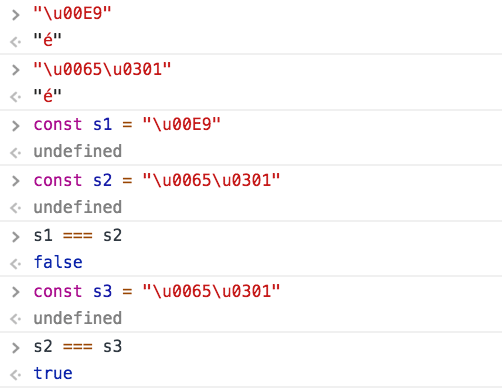

<!-- TOC -->

- [Scripts](#scripts)
- [Planes](#planes)
- [Code units](#code-units)
- [Graphemes](#graphemes)
- [Glyphs](#glyphs)
- [Sequences](#sequences)
- [Normalization](#normalization)
- [Emojis](#emojis)
- [The first 128 characters](#the-first-128-characters)
- [Unicode encodings](#unicode-encodings)
  - [UTF-8](#utf-8)
  - [UTF-16](#utf-16)
  - [UTF-32](#utf-32)

<!-- /TOC -->

Unicode is **an industry standard for consistent encoding of written text**.

There are lots of character sets which are used by computers, but Unicode is the first of its kind to aim to support every single written language on earth (and beyond!).

Its aim is to provide a unique number to identify every character for every language, on any platform.

Unicode maps every character to a specific code, called **code point**. A code point takes the form of `U+<hex-code>`, ranging from `U+0000` to `U+10FFFF`.

An example code point looks like this: `U+004F`. Its meaning depends on the character encoding used.

Unicode defines different **characters encodings**, the most used ones being UTF-8, UTF-16 and UTF-32.

UTF-8 is definitely the most popular encoding in the Unicode family, especially on the Web. This document is written in UTF-8, for example.

Currently there are more than 135.000 different characters implemented, with space for more than 1.1 millions.

## Scripts

All the Unicode supported characters are grouped into sections called **scripts**.

There is a script for every different character set:

- Latin (contains all ASCII + all the other western world characters)
- Korean
- Old Hungarian
- Hebrew
- Greek
- Armenian
- ...and so on!

The full list is defined in the [ISO 15924 standard](https://en.wikipedia.org/wiki/ISO_15924).

See more on scripts: <https://en.wikipedia.org/wiki/Script_(Unicode)>

## Planes

In addition to scripts, there is another way that Unicode organizes its characters: **planes**.

Instead of grouping them by type, it checks the code point value:

| Plane | Range               |
| ----- | ------------------- |
| 0     | U+0000 - U+FFFF     |
| 1     | U+10000 - U+1FFFF   |
| 2     | U+20000 - U+2FFFF   |
| ...   | ...                 |
| 14    | U+E0000 - U+EFFFF   |
| 15    | U+F0000 - U+FFFFF   |
| 16    | U+100000 - U+10FFFF |

There are 17 planes.

The first is special, it's called **Basic Multilingual Plane**, or **BMP**, and contains most of the modern characters and symbols, from the Latin, Cyrillic, Greek scripts.

The other 16 planes are called **astral planes**. Worth noting that planes 3 to 13 are currently empty.

The code points contained in astral planes are called **astral code points**.

Astral code points are all points higher than `U+10000`.

## Code units

Code points are internally stored as **code units**. A code unit is the bit representation of a character, and it's length varies depending on the character encoding

UTF-32 uses a 32-bit code unit.

UTF-8 uses an 8-bit code unit, and UTF-16 uses a 16-bit code unit. If a code point needs a larger size, it will be represented by 2 (or more, in UTF-8) code units.

## Graphemes

A grapheme is a symbol that represents a unit of a writing system. It's basically **your idea** of a character and how it should look like.

## Glyphs

A glyph is a graphic representation of a grapheme: how it is visually displayed on screen, the actual appearance on the display.

## Sequences

Unicode lets you combine different characters to form a grapheme.

For example it's the case of accented characters: the letter `é` can be expressed by using a combination of the letter `e` (`U+0065`) and the unicode character named "COMBINING ACUTE ACCENT" (`U+0301`):

```js
"U+0065U+0301" ➡️ "é"
```

`U+0301` in this case is what is described as a **combining mark**, one character that applies to the previous one to form a different grapheme.

## Normalization

A characters can be sometimes represented using different combinations of code points.

For example it's the case of accented characters: the letter `é` can be expressed both as `U+00E9` and also as combining `e` (`U+0065`) and the unicode character named "COMBINING ACUTE ACCENT" (`U+0301`):

```js
U+00E9       ➡️ "é"
U+0065U+0301 ➡️ "é"
```

The normalization process analyzes a string for those kind of ambiguities, and generates a string with the canonical representation of any character.

Without normalization, perfectly equal strings to the eye will be considered different because their internal representation changes:



## Emojis

Emojis are Unicode astral plane characters, and they provide a way to have images on your screen without actually having real images, just font glyphs.

As an example, the 🐶 symbol is encoded as `U+1F436`.

## The first 128 characters

The first 128 characters of Unicode are the same as the ASCII character set.

The first 32 characters, `U+0000`-`U+001F` (0-31) are called **Control Codes**.

They are an inheritance from the past and most of them are now obsolete. They were used for teletype machines, something that existed before the fax.

Characters from U+0020 (32) to U+007E (126) contain numbers, letters and some symbols:

| Unicode | ASCII code | Glyph   |
| ------- | ---------- | ------- |
| U+0020  | 32         | (space) |
| U+0021  | 33         | !       |
| U+0022  | 34         | "       |
| U+0023  | 35         | #       |
| U+0024  | 36         | $       |
| U+0025  | 37         | %       |
| U+0026  | 38         | &       |
| U+0027  | 39         | '       |
| U+0028  | 40         | (       |
| U+0029  | 41         | )       |
| U+002A  | 42         | \*      |
| U+002B  | 43         | +       |
| U+002C  | 44         | ,       |
| U+002D  | 45         | -       |
| U+002E  | 46         | .       |
| U+002F  | 47         | /       |
| U+0030  | 48         | 0       |
| U+0031  | 49         | 1       |
| U+0032  | 50         | 2       |
| U+0033  | 51         | 3       |
| U+0034  | 52         | 4       |
| U+0035  | 53         | 5       |
| U+0036  | 54         | 6       |
| U+0037  | 55         | 7       |
| U+0038  | 56         | 8       |
| U+0039  | 57         | 9       |
| U+003A  | 58         | :       |
| U+003B  | 59         | ;       |
| U+003C  | 60         | <       |
| U+003D  | 61         | =       |
| U+003E  | 62         | >       |
| U+003F  | 63         | ?       |
| U+0040  | 64         | @       |
| U+0041  | 65         | A       |
| U+0042  | 66         | B       |
| U+0043  | 67         | C       |
| U+0044  | 68         | D       |
| U+0045  | 69         | E       |
| U+0046  | 70         | F       |
| U+0047  | 71         | G       |
| U+0048  | 72         | H       |
| U+0049  | 73         | I       |
| U+004A  | 74         | J       |
| U+004B  | 75         | K       |
| U+004C  | 76         | L       |
| U+004D  | 77         | M       |
| U+004E  | 78         | N       |
| U+004F  | 79         | O       |
| U+0050  | 80         | P       |
| U+0051  | 81         | Q       |
| U+0052  | 82         | R       |
| U+0053  | 83         | S       |
| U+0054  | 84         | T       |
| U+0055  | 85         | U       |
| U+0056  | 86         | V       |
| U+0057  | 87         | W       |
| U+0058  | 88         | X       |
| U+0059  | 89         | Y       |
| U+005A  | 90         | Z       |
| U+005B  | 91         | [       |
| U+005C  | 92         | \       |
| U+005D  | 93         | ]       |
| U+005E  | 94         | ^       |
| U+005F  | 95         | \_      |
| U+0060  | 96         | `       |
| U+0061  | 97         | a       |
| U+0062  | 98         | b       |
| U+0063  | 99         | c       |
| U+0064  | 100        | d       |
| U+0065  | 101        | e       |
| U+0066  | 102        | f       |
| U+0067  | 103        | g       |
| U+0068  | 104        | h       |
| U+0069  | 105        | i       |
| U+006A  | 106        | j       |
| U+006B  | 107        | k       |
| U+006C  | 108        | l       |
| U+006D  | 109        | m       |
| U+006E  | 110        | n       |
| U+006F  | 111        | o       |
| U+0070  | 112        | p       |
| U+0071  | 113        | q       |
| U+0072  | 114        | r       |
| U+0073  | 115        | s       |
| U+0074  | 116        | t       |
| U+0075  | 117        | u       |
| U+0076  | 118        | v       |
| U+0077  | 119        | w       |
| U+0078  | 120        | x       |
| U+0079  | 121        | y       |
| U+007A  | 122        | z       |
| U+007B  | 123        | {       |
| U+007C  | 124        |         |
| U+007D  | 125        | }       |
| U+007E  | 126        | ~       |

- Numbers go from `U+0030` to `U+0039`
- Uppercase letters go from `U+0041` to `U+005A`
- Lowercase letters go from `U+0061` to `U+007A`

U+007F (127) is the delete character.

Everything going forward is outside the realm of ASCII, and is part of Unicode exclusively.

You can find the whole list on Wikipedia: <https://en.wikipedia.org/wiki/List_of_Unicode_characters>

## Unicode encodings

### UTF-8

UTF-8 is a variable width character encoding, and it can encode every character covered by Unicode, using from 1 to 4 8-bit bytes.

It was originally designed by Ken Thompson and Rob Pike in 1992. Those names are familiar to those with any interest in the Go programming language, as they were two of the original creators of that as well.

It's recommended by the W3C as the default encoding in HTML files, and stats indicate that it's used on 91,3% of all web pages, as of April 2018.

At the time of its introduction, ASCII was the most popular character encoding in the western world. In ASCII all letters, digits and symbols were assigned a number, and this number. Being fixed to 8 bits, it could only represent a maximum of 255 characters, and it was enough.

UTF-8 was designed to be backward compatible with ASCII. This was very important for its adoption, as ASCII was much older (1963) and widespread, and moving to UTF-8 came almost transparently.

The first 128 characters of UTF-8 map exactly to ASCII. Why 128? Because ASCII uses 7-bit encoding, which allows up to 128 combinations. Why 7 bits? We now take 8 bits for granted, but back in the day when ASCII was conceived, 7 bit systems were popular as well.

Being 100% compatible with ASCII makes UTF-8 also very efficient, because the most frequently used characters in the western languages are encoded with 1 byte only.

Here is the map of the bytes usage:

| Number of bytes | Start     | End        |
| --------------- | --------- | ---------- |
| 1               | `U+0000`  | `U+007F`   |
| 2               | `U+0080`  | `U+07FF`   |
| 3               | `U+0800`  | `U+FFFF`   |
| 4               | `U+10000` | `U+10FFFF` |

Remember that in ASCII the characters were encoded as numbers? If the letter `A` in ASCII was represented with the number `65`, using UTF-8 it's encoded as `U+0041`.

Why not `U+0065` you ask? Well because unicode uses an hexadecimal base, and instead of `10` you have `U+000A` and so on (basically, you have a set of 16 digits instead of 10)

Take a look at [this video](https://www.youtube.com/watch?v=MijmeoH9LT4), which brilliantly explains this UTF-8 and ASCII compatibility.

### UTF-16

UTF-16 is another very popular Unicode encoding. For example, it's how Java internally represents any character. It's also [one of the 2 encodings JavaScript uses internally](https://mathiasbynens.be/notes/javascript-encoding), along with _UCS-2_. It's used by many other systems as well, like Windows.

UTF-16 is a variable length encoding system, like UTF-8, but uses 2 bytes (16 bits) as the minimum for any character representation. As such, it's backwards incompatible with the ASCII standard.

Code points in the Basic Multilingual Plane (BMP) are stored using 2 bytes. Code points in _astral planes_ are stored using 4 bytes.

### UTF-32

UTF-8 uses a minimum of 1 byte, UTF-16 uses a minimum of 2 bytes.

UTF-32 always uses 4 bytes, without optimizing for space usage, and as such it wastes a lot of bandwidth.

This constrain makes it faster to operate on because you have less to check, as you can assume 4 bytes for all characters.

It's not as popular as UTF-8 and UTF-16, but it has its applications.
