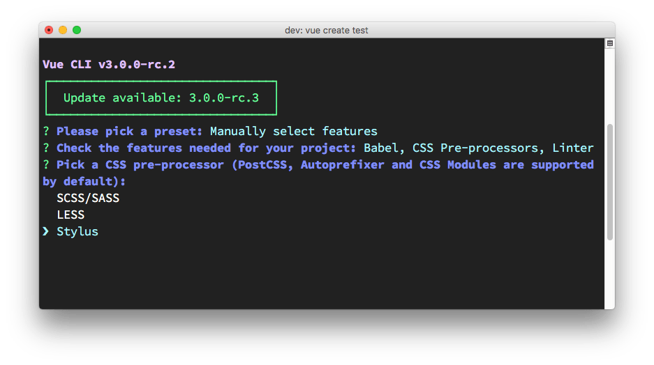

Using the [Vue CLI](/vue-cli/) you can enable "CSS Preprocessors" and you can choose which one to enable:



If you're using a project not based upon Vue CLI, or a project that was initialized using Vue CLI but you didn't add the CSS preprocessor support, you can add it later on using:

```bash
npm install --save-dev node-sass sass-loader
```

Inside your application components then you can use

```html
<style lang="scss">
...
</style>
```

and add your SCSS code in there.

If you want to keep your SCSS code in an external file, you can do that, and just import it in the script part of your component:

```js
<script>
import '../public/style.scss'

//...
</script>
```