Every browser exposes a console that lets you interact with the [Web Platform APIs](/web-platform/) and also gives you an inside look at the code by printing messages that are generated by your [JavaScript](/javascript/) code running in the page.

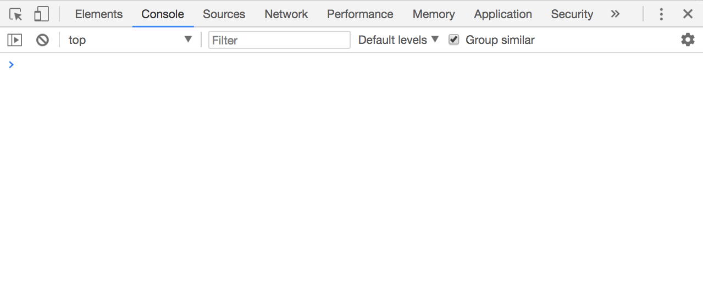

<!-- TOC -->

- [Overview of the console](#overview-of-the-console)
- [Use console.log formatting](#use-consolelog-formatting)
- [Clear the console](#clear-the-console)
- [Counting elements](#counting-elements)
- [Log more complex objects](#log-more-complex-objects)
- [Logging different error levels](#logging-different-error-levels)
- [Preserve logs during navigation](#preserve-logs-during-navigation)
- [Grouping console messages](#grouping-console-messages)
- [Print the stack trace](#print-the-stack-trace)
- [Calculate the time spent](#calculate-the-time-spent)
- [Generate a CPU profile](#generate-a-cpu-profile)

<!-- /TOC -->

## Overview of the console

The console toolbar is simple. There's a button to clear the console messages, something you can also do by clicking `cmd-K` in macOS, or `ctrl-K` on Windows, a second button that activates a filtering sidebar, that lets you filter by text, or by type of message, for example error, warning, info, log, or debug messages.

You can also choose to hide network-generated messages, and just focus on the JavaScript log messages.

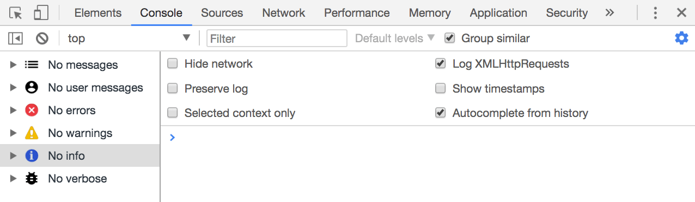

The console is not just a place where you can see messages, but also the best way to interact with JavaScript code, and many times the DOM. Or, just get information from the page.

Let's type our first message. Notice the >, let's click there and type

```js
console.log('test')
```

The console acts as a **REPL**, which means read–eval–print loop. In short, it interprets our JavaScript code and prints something.

## Use console.log formatting

As you see, `console.log('test')` prints 'test' in the Console.

Using `console.log` in your JavaScript code can help you debug for example by printing static strings, but you can also pass it a variable, which can be a JavaScript native type (for example an integer) or an object.

You can pass multiple variables to `console.log`, for example:

```js
console.log('test1', 'test2')
```

We can also format pretty phrases by passing variables and a format specifier.

For example:

```js
console.log('My %s has %d years', 'cat', 2)
```

- `%s` format a variable as a string
- `%d` or `%i` format a variable as an integer
- `%f` format a variable as a floating point number
- `%o` can be used to print a DOM Element
- `%O` used to print an object representation

Example:

```js
console.log('%o, %O', document.body, document.body)
```

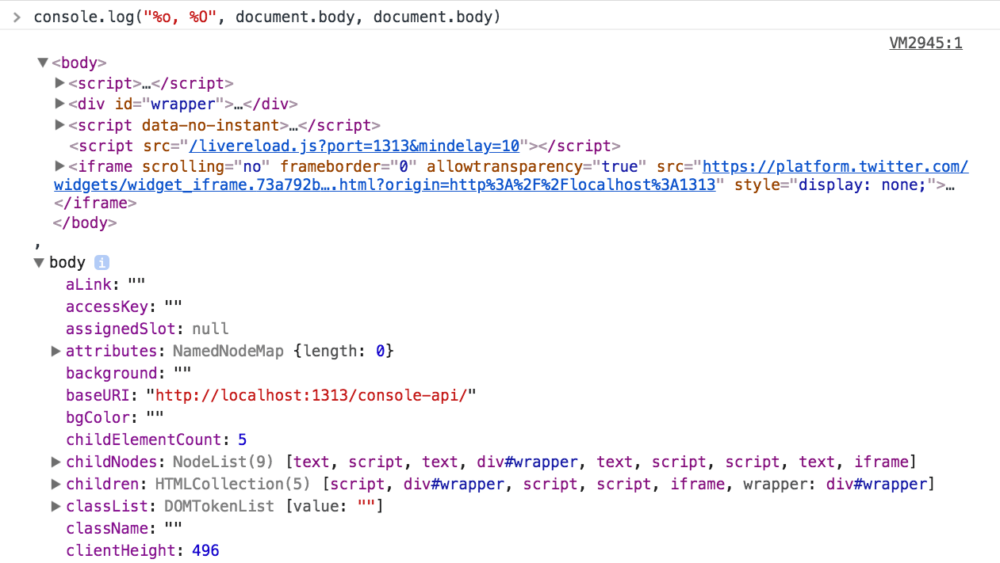

Another useful format specifier is `%c`, which allows to pass CSS to format a string. For example:

```js
console.log(
  '%c My %s has %d years',
  'color: yellow; background:black; font-size: 16pt',
  'cat',
  2
)
```

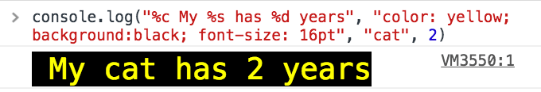

## Clear the console

There are three ways to clear the console while working on it, with various input methods.

The first way is to click the **Clear Console Log** button on the console toolbar.

The second method is to type `console.clear()` inside the console, or in your a [JavaScript function](/javascript-functions/) that runs in your app / site.

You can also just type `clear()`.

The third way is through a keyboard shortcut, and it's `cmd-k` (mac) or `ctrl + l` (Win)

## Counting elements

`console.count()` is a handy method.

Take this code:

```js
const x = 1
const y = 2
const z = 3
console.count(
  'The value of x is ' + x + ' and has been checked .. how many times?'
)
console.count(
  'The value of x is ' + x + ' and has been checked .. how many times?'
)
console.count(
  'The value of y is ' + y + ' and has been checked .. how many times?'
)
```

What happens is that count will count the number of times a string is printed, and print the count next to it:

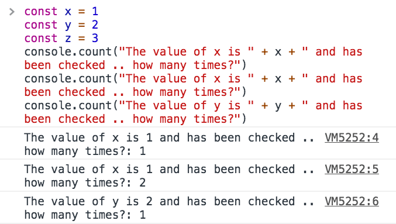

You can just count apples and oranges:

```js
const oranges = ['orange', 'orange']
const apples = ['just one apple']
oranges.forEach(fruit => {
  console.count(fruit)
})
apples.forEach(fruit => {
  console.count(fruit)
})
```

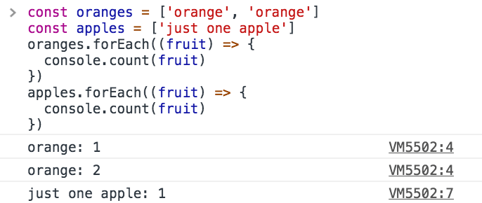

## Log more complex objects

`console.log` is pretty amazing to inspect variables. You can pass it an object too, and it will do its best to print it to you in a readable way. Most of the times this means it prints a string representation of the object.

For example try

```js
console.log([1, 2])
```

Another option to print objects is to use `console.dir`:

```js
console.dir([1, 2])
```

As you can see this method prints the variable in a JSON-like representation, so you can inspect all its properties.

The same thing that console.dir outputs is achievable by doing

```js
console.log('%O', [1, 2])
```

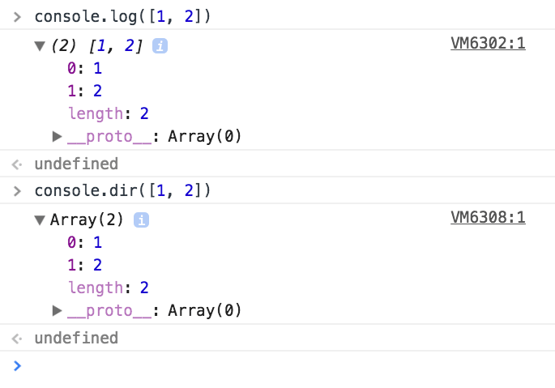

Which one to use depends on what you need to debug of course, and one of the two can do the best job for you.

Another function is `console.table()` which prints a nice table.

We just need to pass it an array of elements, and it will print each array item in a new row.

For example

```js
console.table([[1, 2], ['x', 'y']])
```

or you can also set column names, by passing instead of an array, an Object Literal, so it will use the object property as the column name

```js
console.table([
  { x: 1, y: 2, z: 3 },
  { x: 'First column', y: 'Second column', z: null }
])
```

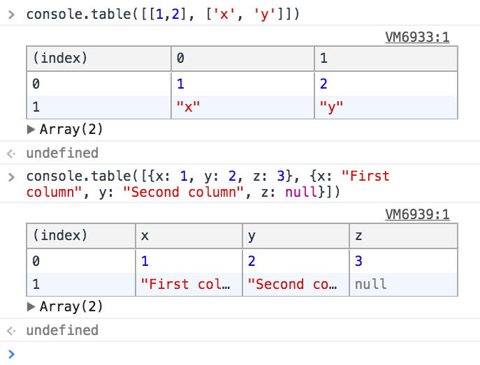

`console.table` can also be more powerful and if you pass it an object literal that in turn contains an object, and you pass an array with the column names, it will print a table with the row indexes taken from the object literal. For example:

```js
const shoppingCart = {}
shoppingCart.firstItem = { color: 'black', size: 'L' }
shoppingCart.secondItem = { color: 'red', size: 'L' }
shoppingCart.thirdItem = { color: 'white', size: 'M' }
console.table(shoppingCart, ['color', 'size'])
```

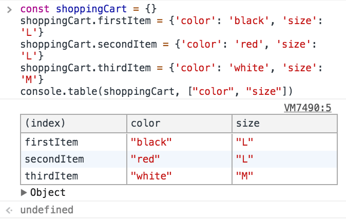

## Logging different error levels

As we saw console.log is great for printing messages in the Console.

We'll now discover three more handy methods that will help us debug, because they implicitly indicate various levels of error.

First, **console.info()**

As you can see a little 'i' is printed beside it, making it clear the log message is just an information.

Second, **console.warn()**

prints a yellow exclamation point.

If you activate the Console filtering toolbar, you can see that the Console allows you to filter messages based on the type, so it's really convenient to differentiate messages because for example if we now click 'Warnings', all the printed messages that are not warnings will be hidden.

The third function is **console.error()**

this is a bit different than the others because in addition to printing a red X which clearly states there's an error, we have the full stack trace of the function that generated the error, so we can go and try to fix it.

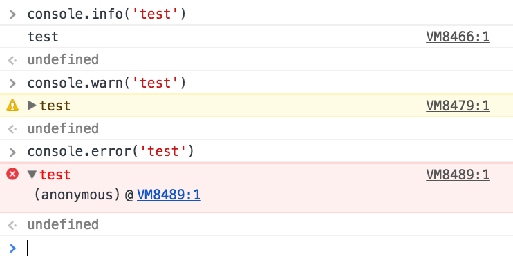

## Preserve logs during navigation

Console messages are cleared on every page navigation, unless you check the **Preserve log** in the console settings:

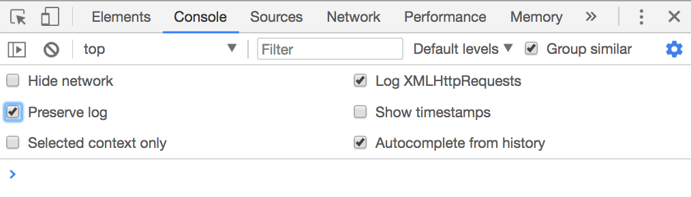

## Grouping console messages

The Console messages can grow in size and the noise when you're trying to debug an error can be overwhelming.

To limit this problem the Console API offers a handy feature: Grouping the Console messages.

Let's do an example first.

```js
console.group('Testing the location')
console.log('Location hash', location.hash)
console.log('Location hostname', location.hostname)
console.log('Location protocol', location.protocol)
console.groupEnd()
```

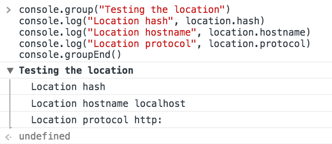

As you can see the Console creates a group, and there we have the Log messages.

You can do the same, but output a collapsed message that you can open on demand, to further limit the noise:

```js
console.groupCollapsed('Testing the location')
console.log('Location hash', location.hash)
console.log('Location hostname', location.hostname)
console.log('Location protocol', location.protocol)
console.groupEnd()
```

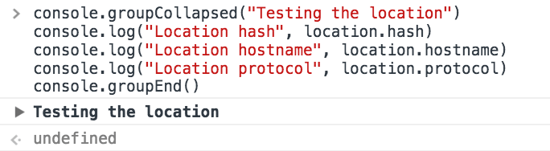

The nice thing is that those groups can be nested, so you can end up doing

```js
console.group('Main')
console.log('Test')
console.group('1')
console.log('1 text')
console.group('1a')
console.log('1a text')
console.groupEnd()
console.groupCollapsed('1b')
console.log('1b text')
console.groupEnd()
console.groupEnd()
```


## Print the stack trace

There might be cases where it's useful to print the call stack trace of a function, maybe to answer the question _how did you reach that part of code?_

You can do so using `console.trace()`:

```js
const function2 = () => console.trace()
const function1 = () => function2()
function1()
```

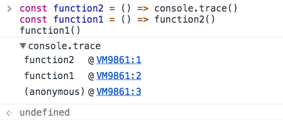

## Calculate the time spent

You can easily calculate how much time a function takes to run, using `time()` and `timeEnd()`

```js
const doSomething = () => console.log('test')
const measureDoingSomething = () => {
  console.time('doSomething()')
  //do something, and measure the time it takes
  doSomething()
  console.timeEnd('doSomething()')
}
measureDoingSomething()
```

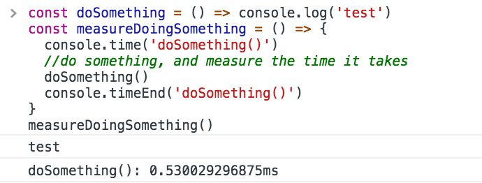

## Generate a CPU profile

The DevTools allow you to analyze the CPU profile performance of any function.

You can start that manually, but the most accurate way to do so is to wrap what you want to monitor between the `profile()` and `profileEnd()` commands. They are similar to `time()` and `timeEnd()`, except they don't just measure time, but create a more detailed report.

```js
const doSomething = () => console.log('test')
const measureDoingSomething = () => {
  console.profile('doSomething()')
  //do something, and measure its performance
  doSomething()
  console.profileEnd()
}
measureDoingSomething()
```

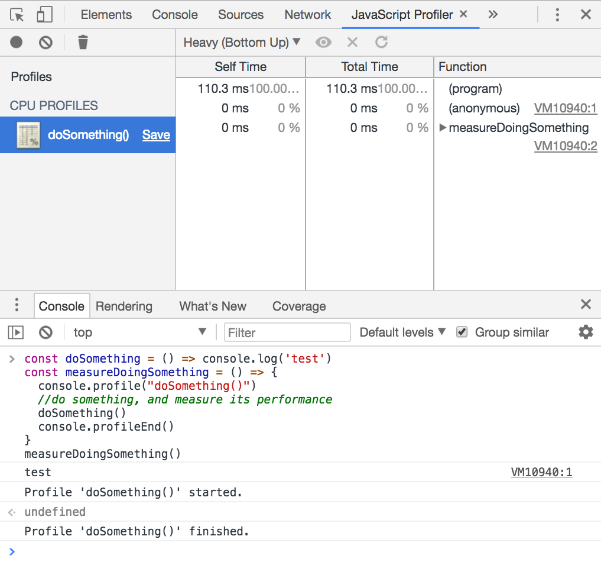
