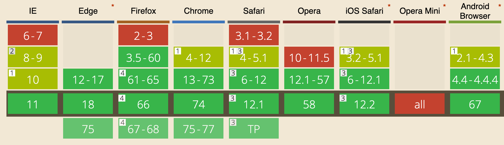
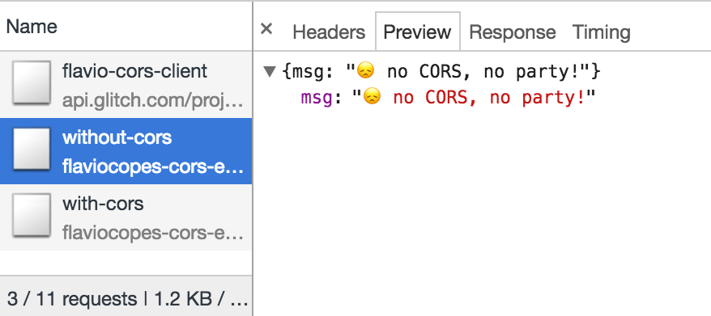

A JavaScript application running in the browser can usually only access HTTP resources on the same domain (origin) that serves it.

Loading images or scripts/styles always works, but [XHR](/xhr/) and [Fetch](/fetch-api/) calls to another server will fail, unless that server implements a way to allow that connection.

This way is called CORS, **Cross-Origin Resource Sharing**.

Also loading Web Fonts using `@font-face` has same-origin policy by default, and other less popular things (like WebGL textures and `drawImage` resources loaded in the Canvas API).

One very important thing that needs CORS is **ES Modules**, recently introduced in modern browsers.

If you don't set up a CORS policy **on the server** that allows to serve 3rd party origins, the request will fail.

Fetch example:


XHR example:


A Cross-Origin resource fails if it's:

- to a different **domain**
- to a different **subdomain**
- to a different **port**
- to a different **protocol**

and it's there for your security, to prevent malicious users to exploit the [Web Platform](/web-platform/).

But if you control both the server and the client, you have all the good reasons to allow them to talk to each other.

How?

It depends on your server-side stack.

## Browser support

Pretty good (basically all except IE<10):



## Example with Express

If you are using Node.js and Express as a framework, use the [CORS middleware package](https://github.com/expressjs/cors).

Here's a simple implementation of an Express [Node.js](/nodejs/) server:

```js
const express = require('express')
const app = express()

app.get('/without-cors', (req, res, next) => {
  res.json({ msg: '😞 no CORS, no party!' })
})

const server = app.listen(3000, () => {
  console.log('Listening on port %s', server.address().port)
})
```

If you hit `/without-cors` with a fetch request from a different origin, it's going to raise the CORS issue.

All you need to do to make things work out is to require the `cors` package linked above, and pass it in as a middleware function to an endpoint request handler:

```js
const express = require('express')
const cors = require('cors')
const app = express()

app.get('/with-cors', cors(), (req, res, next) => {
  res.json({ msg: 'WHOAH with CORS it works! 🔝 🎉' })
})

/* the rest of the app */
```

I made a simple Glitch example. [Here is the client](https://flavio-cors-client.glitch.me/) working, and here's its code: <https://glitch.com/edit/#!/flavio-cors-client>.

<!-- Copy and Paste Me -->
<div class="glitch-embed-wrap" style="height: 703px; width: 100%;">
  <iframe src="https://glitch.com/embed/#!/embed/flavio-cors-client?path=script.js&previewFirst=true" alt="flavio-cors-client on glitch" style="height: 100%; width: 100%; border: 0;"></iframe>
</div>

This is the Node.js Express server: <https://glitch.com/edit/#!/flaviocopes-cors-example-express>

Note how the request that fails because it does not handle the CORS headings correctly is still received, as you can see in the Network panel, where you find the message the server sent:



## Allow only specific origins

This example has a problem however: ANY request will be accepted by the server as cross-origin.

As you can see in the Network panel, the request that passed has a response header `access-control-allow-origin: *`:


You need to configure the server to only allow one origin to serve, and block all the others.

Using the same `cors` Node library, here's how you would do it:

```js
const cors = require('cors')

const corsOptions = {
  origin: 'https://yourdomain.com'
}

app.get('/products/:id', cors(corsOptions), (req, res, next) => {
  //...
})
```

You can serve more as well:

```js
const whitelist = ['http://example1.com', 'http://example2.com']
const corsOptions = {
  origin: function(origin, callback) {
    if (whitelist.indexOf(origin) !== -1) {
      callback(null, true)
    } else {
      callback(new Error('Not allowed by CORS'))
    }
  }
}
```

## Preflight

There are some requests that are handled in a "simple" way. All `GET` requests belong to this group.

Also _some_ `POST` and `HEAD` requests do as well.

`POST` requests are also in this group, if they satisfy the requirement of using a Content-Type of

- `application/x-www-form-urlencoded`
- `multipart/form-data`
- `text/plain`

All other requests must run through a pre-approval phase, called preflight. The browser does this to determine if it has the permission to perform an action, by issuing an `OPTIONS` request.

A preflight request contains a few headers that the server will use to check permissions (irrelevant fields omitted):

```
OPTIONS /the/resource/you/request
Access-Control-Request-Method: POST
Access-Control-Request-Headers: origin, x-requested-with, accept
Origin: https://your-origin.com
```

The server will respond with something like this(irrelevant fields omitted):

```
HTTP/1.1 200 OK
Access-Control-Allow-Origin: https://your-origin.com
Access-Control-Allow-Methods: POST, GET, OPTIONS, DELETE
```

We checked for POST, but the server tells us we can also issue other HTTP request types for that particular resource.

Following the Node.js Express example above, the server must also handle the OPTIONS request:

```js
var express = require('express')
var cors = require('cors')
var app = express()

//allow OPTIONS on just one resource
app.options('/the/resource/you/request', cors())

//allow OPTIONS on all resources
app.options('*', cors())
```
