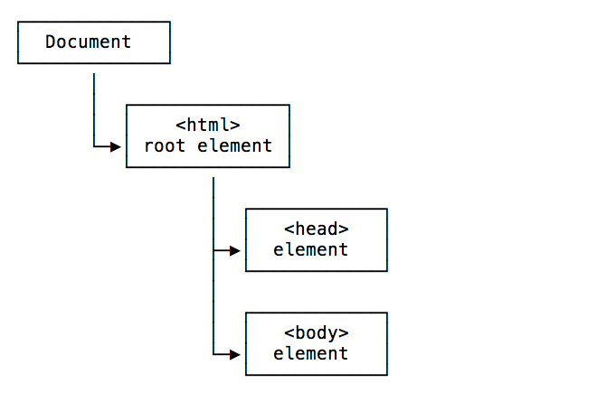
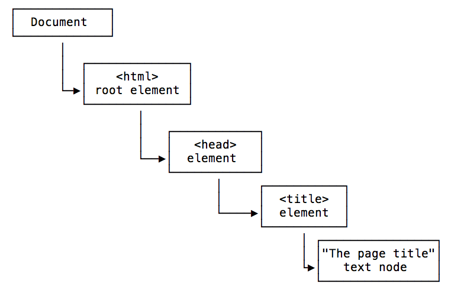
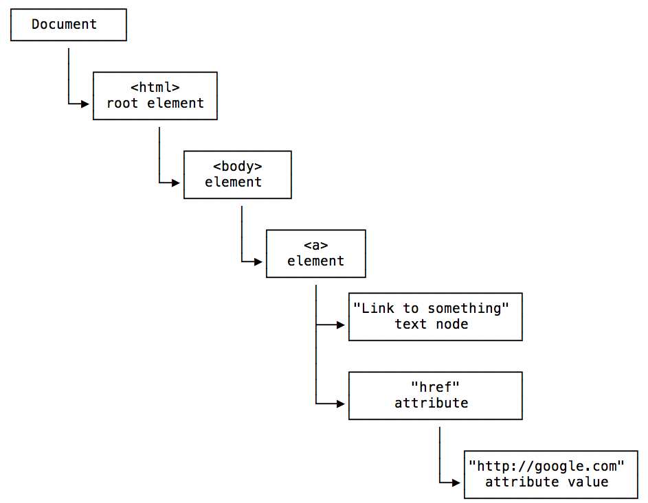
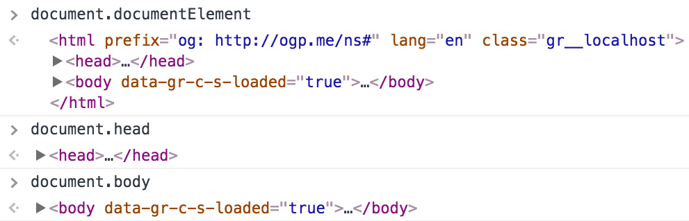
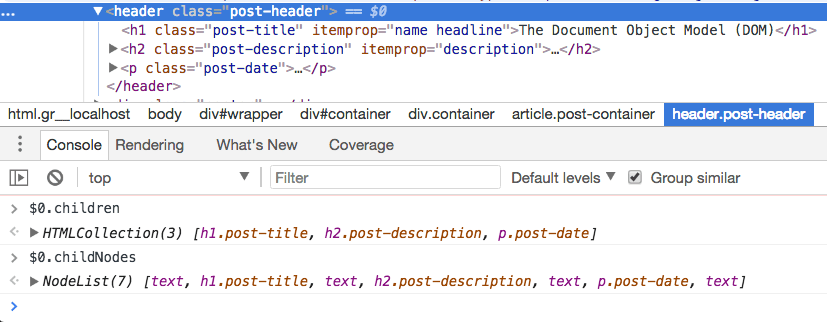
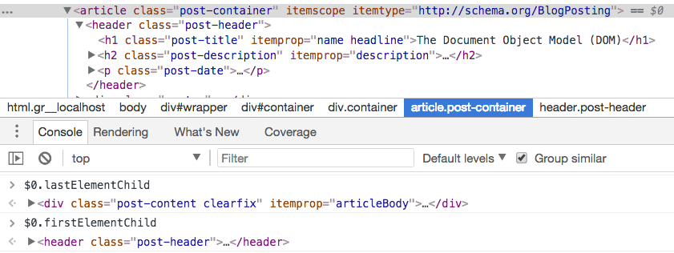

<!-- TOC -->

- [The Window object](#the-window-object)
  - [Properties](#properties)
  - [Methods](#methods)
- [The Document object](#the-document-object)
- [Types of Nodes](#types-of-nodes)
- [Traversing the DOM](#traversing-the-dom)
  - [Getting the parent](#getting-the-parent)
  - [Getting the children](#getting-the-children)
  - [Getting the siblings](#getting-the-siblings)
- [Editing the DOM](#editing-the-dom)

<!-- /TOC -->

The DOM is the browser internal representation of a web page. When the browser retrieves your HTML from your server, the parser analyzes the structure of your code, and creates a model of it. Based on this model, the browser then renders the page on the screen.

Browsers expose an API that you can use to interact with the DOM. That's how modern JavaScript frameworks work, they use the DOM API to tell the browser what to display on the page.

In Single Page Applications, the DOM continuously changes to reflect what appears on the screen, and as a developer you can inspect it using the [Browser Developer Tools](/browser-dev-tools/).

The DOM is language-agnostic, and the de-facto standard to access the DOM is by using [JavaScript](/javascript/), since it's the only language that browsers can run.

> The DOM is standardized by WHATWG in the [DOM Living Standard Spec](https://dom.spec.whatwg.org/).

With JavaScript you can interact with the DOM to:

- inspect the page structure
- access the page metadata and headers
- edit the CSS styling
- attach or remove event listeners
- edit any node in the page
- change any node attribute

and much more.

The main 2 objects provided by the DOM API, the ones you will interact the most with, are `document` and `window`.

## The Window object

The `window` object represents the window that contains the DOM document.

`window.document` points to the `document` object loaded in the window.

Properties and methods of this object can be called without referencing `window` explicitly, because it represents the global object. So, the previous property `window.document` is usually called just `document`.

### Properties

Here is a list of useful properties you will likely reference a lot:

- `console` points to the browser debugging console. Useful to print error messages or logging, using `console.log`, `console.error` and other tools (see the [Browser DevTools](/browser-dev-tools/) article)
- `document` as already said, points to the `document` object, key to the DOM interactions you will perform
- `history` gives access to the [**History API**](/history-api/)
- `location` gives access to the [Location interface](https://developer.mozilla.org/en-US/docs/Web/API/Location), from which you can determine the URL, the protocol, the hash and other useful information.
- `localStorage` is a reference to the [Web Storage API](/web-storage-api/) localStorage object
- `sessionStorage` is a reference to the Web Storage API sessionStorage object

### Methods

The `window` object also exposes useful methods:

- `alert()`: which you can use to display alert dialogs
- `postMessage()`: used by the [Channel Messaging API](/channel-messaging-api/)
- [`requestAnimationFrame()`](/requestanimationframe/): used to perform animations in a way that's both performant and easy on the CPU
- `setInterval()`: call a function every n milliseconds, until the interval is cleared with `clearInterval()`
- `clearInterval()`: clears an interval created with `setInterval()`
- [`setTimeout()`](/javascript-timers/): execute a function after n milliseconds
- [`setImmediate()`](/javascript-timers/): execute a function as soon as the browser is ready
- `addEventListener()`: add an event listener to the document
- `removeEventListener()`: remove an event listener from the document

See the full reference of all the properties and methods of the `window` object at <https://developer.mozilla.org/en-US/docs/Web/API/Window>

## The Document object

The `document` object represents the DOM tree loaded in a window.

Here is a representation of a portion of the DOM pointing to the head and body tags:



Here is a representation of a portion of the DOM showing the head tag, containing a title tag with its value:



Here is a representation of a portion of the DOM showing the body tag, containing a link, with a value and the href attribute with its value:



The Document object can be accessed from `window.document`, and since `window` is the global object, you can use the shortcut `document` object directly from the browser console, or in your JavaScript code.

This Document object has a ton of properties and methods. The [Selectors API](/selectors-api/) methods are the ones you'll likely use the most:

- `document.getElementById()`
- `document.querySelector()`
- `document.querySelectorAll()`
- `document.getElementsByTagName()`
- `document.getElementsByClassName()`

You can get the document title using `document.title`, and the URL using `document.URL`. The referrer is available in `document.referrer`, the domain in `document.domain`.

From the `document` object you can get the body and head [Element nodes](https://developer.mozilla.org/en-US/docs/Web/API/Element):

- `document.documentElement`: the Document node
- `document.body`: the `body` Element node
- `document.head`: the `head` Element node



You can also get a list of all the element nodes of a particular type, like an [HTMLCollection](https://developer.mozilla.org/en-US/docs/Web/API/HTMLCollection) of all the links using `document.links`, all the images using `document.images`, all the forms using `document.forms`.

The document [cookies](/cookies/) are accessible in `document.cookie`. The last modified date in `document.lastModified`.

You can do much more, even get _old school_ and fill your scripts with `document.write()`, a method that was used a lot back in the early days of JavaScript to interact with the pages.

See the full reference of all the properties and methods of the `document` object at <https://developer.mozilla.org/en-US/docs/Web/API/Document>

## Types of Nodes

There are different types of nodes, some of which you already saw in the example images above. The main ones you will see are:

- **Document**: the document Node, the start of the tree
- **Element**: an HTML tag
- **Attr**: an attribute of a tag
- **Text**: the text content of an Element or Attr Node
- **Comment**: an HTML comment
- **DocumentType**: the [Doctype](/doctype/) declaration

## Traversing the DOM

The DOM is a tree of elements, with the Document node at the root, which points to the `html` Element node, which in turn points to its child element nodes `head` and `body`, and so on.

From each of those elements, you can navigate the DOM structure and move to different nodes.

### Getting the parent

Every element has one and one single parent.

To get it, you can use [`Node.parentNode`](https://developer.mozilla.org/en-US/docs/Web/API/Node/parentNode) or [`Node.parentElement`](https://developer.mozilla.org/en-US/docs/Web/API/Node/parentElement) (where Node means a node in the DOM).

They are almost the same, except when ran on the `html` element: `parentNode` returns the parent of the specified node in the DOM tree, while `parentElement` returns the DOM node's parent Element, or null if the node either has no parent, or its parent isn't a DOM Element.

People most usually use `parentNode`.

### Getting the children

To check if a Node has child nodes, use **`Node.hasChildNodes()`** which returns a boolean value.

To access all the Element Nodes children of a node, use **`Node.childNodes`**.

The DOM also exposes a `Node.children` method, but it will not just include Element nodes, but it includes also the white space between elements as Text nodes, which is not something you generally want.



To get the first child Element Node, use **`Node.firstElementChild`**, and to get the last child Element Node, use **`Node.lastElementChild`**:



The DOM also exposes `Node.firstChild` and `Node.lastChild`, with the difference that they do not "filter" the tree for Element nodes only, and they will also show empty Text nodes that indicate white space.

In short, to navigate children Element Nodes use

- `Node.childNodes`
- `Node.firstElementChild`
- `Node.lastElementChild`

### Getting the siblings

In addition to getting the parent and the children, since the DOM is a tree you can also get the siblings of any Element Node.

You can do so using

- **`Node.previousElementSibling`**
- **`Node.nextElementSibling`**

The DOM also exposes `previousSibling` and `nextSibling`, but as their counterparts described above, they include white spaces as Text nodes, so you generally avoid them.

## Editing the DOM

The DOM offers various methods to edit the nodes of the page and alter the document tree.

With

- `document.createElement()`: creates a new Element Node
- `document.createTextNode()`: creates a new Text Node

you can create new elements, and add them the the DOM elements you want, as children, by using `document.appendChild()`:

```js
const div = document.createElement('div')
div.appendChild(document.createTextNode('Hello world!'))
```

- `first.removeChild(second)` removes the child node "second" from the node "first".
- `document.insertBefore(newNode, existingNode)` inserts "newNode" as a sibling of "existingNode", placing it before that in the DOM tree structure.
- `element.appendChild(newChild)` alters the tree under "element", adding a new child Node "newChild" to it, after all the other children.
- `element.prepend(newChild)` alters the tree under "element", adding a new child Node "newChild" to it, before other child elements. You can pass one or more child Nodes, or even a string which will be interpreted as a Text node.
- `element.replaceChild(newChild, existingChild)` alters the tree under "element", replacing "existingChild" with a new Node "newChild".
- `element.insertAdjacentElement(position, newElement)` inserts "newElement" in the DOM, positioned relatively to "element" depending on "position" parameter value. [See the possible values](https://developer.mozilla.org/en-US/docs/Web/API/Element/insertAdjacentElement).
- `element.textContent = 'something'` changes the content of a Text node to "something".
