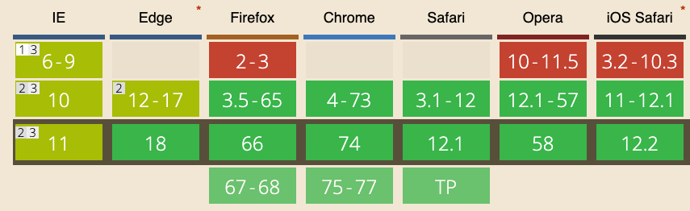

Using the Drag and Drop API you can define which elements in the page are draggable, and intercept when the user drags an element.

It's very well supported on modern browsers:



Before we start studying the API, we must know how to define which elements in the page are **draggable**. We can do so by adding the `draggable` attribute in the page HTML, with a value of `true`:

```html
<div draggable="true">
  ...
</div>
```

This is enough to make the element draggable.

> Tip: images, text selections and links are draggable by default unless you set `draggable` to false on them

We can also drag files from the user computer inside the browser. In this case we are transferring **files**.

Where can we drag elements to is another point we need to clarify. As well as we can't just drag any element, we can't also just drop into any element. The element must be valid **drop target**.

To make an element a drop target you listen for its `dragover` event and you either return false from it, or you call `preventDefault()` on the event passed:

```js
const element = document.querySelector('#my-drop-target)
element.addEventListener('dragover', event => {
  event.preventDefault()
})
```

Once we do so, we have a draggable element and a drop target, and we can start. The events we can interact with  on the draggable element are:

- `dragstart`
- `drag`
- `dragend`

On the drop target:

- `dragenter`
- `dragover`
- `dragleave`
- `drop`


## Overview of a drag and drop operation and the events fired

When the user starts dragging a *draggable element*, clicking on it with the mouse and moving the mourse, or also tapping and keeping the tap and then moving the selection, the `dragstart` event is fired on it:

```js
element.addEventListener('dragstart', event => {
  //...
})
```

The `event` object passed as parameter to the event handling function is a `DragEvent` object.

It extends from the more general [Event object](https://developer.mozilla.org/en-US/docs/Web/API/Event), shared with all the other events: mouse, keyboard, scrolling, etc.

At this point, the element is being dragged, and the `drag` event is fired. Multiple times as the item is being dragged, so we must use throttling like for the `scroll` or `mouseover` events.

As soon as we enter a *drop target*:

1. the `dragenter` event is fired on the drop target
2. the `dragover` event is fired on the drop target

If a dragged element first enters a drop target and then moves away from it, the `dragleave` event is fired on the drop target.

If the user releases the mouse, the `dragend` event is fired on the element that is being dragged, and a `drop` event is fired on the drop target.

## Dragging data: `DataTransfer`

Every event related to drag and drop comes is a `DragEvent` object as I mentioned, and it comes with a property called [`dataTransfer`](https://developer.mozilla.org/en-US/docs/Web/API/DataTransfer) which holds the data being dragged, and offers 5 properties:

- `dropEffect`
- `effectAllowed`
- `files`
- `items` (read only)
- `types` (read only)

When the drag event starts, you can do a few operations.

## Set / get the effect

You can set the desired effect of the drag operation by setting the `effectAllowed` property in the `dragstart` event. You have a few options which set how the drop target should handle the dropped element:

- `none` it shouldn't be dropped
- `move` it can be moved
- `copy` it can be copied
- `link` it can be linked
- `copyMove` it can be copied or moved
- `copyLink` it can be copied or linked
- `linkMove` it can be moved or linked
- `all` it can be copied, moved or linked

(all are strings).

The default is `all`.

The `dropEffect` property is used to get the type of the drag and drop operation, which this time is set by the user through the use of modifier keys. For example, on a Mac pressing the `Alt` key sets the drop target to copy the item instead of moving it.

This property is not read only. We can edit it in a `dragenter` or `dragover` event, to one of those string values:

- `none` it shouldn't be dropped
- `move` it can be moved
- `copy` it can be copied
- `link` it can be linked

Example:

```js
element.addEventListener('dragenter', event => {
  event.dataTrasfer.dropEffect = 'move'
})
```

## The data being transferred

You can access the items being transferred from the `dataTransfer.items` property, which is an array-like object which you can iterate using a loop and get access to each [`DataTransferItem`](https://developer.mozilla.org/en-US/docs/Web/API/DataTransferItem) object.

`DataTransferItem` has 2 read-only properties:

- `kind`: the kind of the item being dragged. Returns a string containing `file` or `string`
- `type` the MIME type of the item

and it has 2 methods:

- `getAsFile()` returns a `File` object representing the data being dragged
- `getAsString()` executes the callback function pasing a string object representing the data being dragged

They have a similar name but work very differently. The first returns a `File` object:

```js
element.addEventListener('dragenter', event => {
  for (item of event.dataTrasfer.items) {
    const theFile = item.getAsFile()
  }
})
```

> Learn more about File objects at <https://flaviocopes.com/file/>

The second passes the item as a string to a callback function:

```js
element.addEventListener('dragenter', event => {
  for (item of event.dataTrasfer.items) {
    item.getAsString(theString => {
      console.log(theString)
    })
  }
})
```

The types of items files being dragged is stored in the `types` property of the `dataTransfer` object. It is an array containing the string `string` by default. If we are dragging a file, the corresponding type is a string of value `Files`.

If there are files being transferred, in addition to being listed in `dataTransfer.items`, they are stored in the `files` property of `dataTransfer`.

This property points to a `FileList` object listing the files being dragged.

Check out this demo on Codepen:

<p class="codepen" data-height="582" data-theme-id="0" data-default-tab="result" data-user="flaviocopes" data-slug-hash="JqXZoB" style="height: 582px; box-sizing: border-box; display: flex; align-items: center; justify-content: center; border: 2px solid; margin: 1em 0; padding: 1em;" data-pen-title="Drag and Drop!">
  <span>See the Pen <a href="https://codepen.io/flaviocopes/pen/JqXZoB/">
  Drag and Drop!</a> by Flavio Copes (<a href="https://codepen.io/flaviocopes">@flaviocopes</a>)
  on <a href="https://codepen.io">CodePen</a>.</span>
</p>
<script async src="https://static.codepen.io/assets/embed/ei.js"></script>
