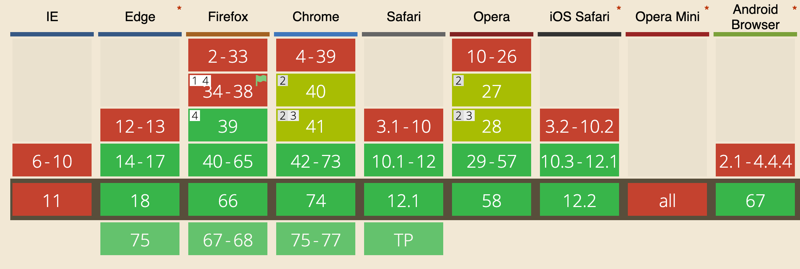
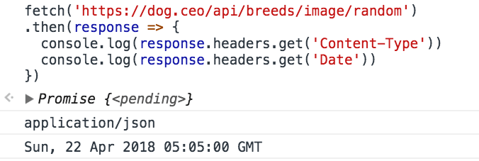
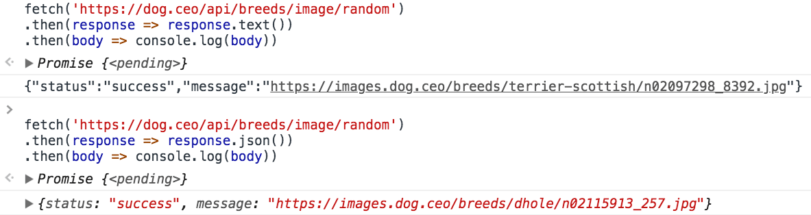

<!-- TOC -->

- [Introduction to the Fetch API](#introduction-to-the-fetch-api)
- [Using Fetch](#using-fetch)
  - [Catching errors](#catching-errors)
- [Response Object](#response-object)
  - [Metadata](#metadata)
    - [headers](#headers)
    - [status](#status)
    - [statusText](#statustext)
    - [url](#url)
  - [Body content](#body-content)
- [Request Object](#request-object)
- [Request headers](#request-headers)
- [POST Requests](#post-requests)
- [How to cancel a fetch request](#how-to-cancel-a-fetch-request)
- [Looking for more?](#looking-for-more)

<!-- /TOC -->

## Introduction to the Fetch API

Since IE5 was released in 1998, we've had the option to make asynchronous network calls in the browser using [XMLHttpRequest](/xhr/) (XHR).

Quite a few years after this, GMail and other rich apps made heavy use of it, and made the approach so popular that it had to have a name: **AJAX**.

Working directly with the XMLHttpRequest has always been a pain and it was almost always abstracted by some library, in particular jQuery has its own helper functions built around it:

- `jQuery.ajax()`
- `jQuery.get()`
- `jQuery.post()`

and so on.

They had a huge impact on making this more accessible in particular with regards to making sure all worked on older browsers as well.

The **Fetch API**, has been standardized as a modern approach to asynchronous network requests, and uses **Promises** as a building block.

Fetch has a good support across the major browsers, except IE.



The polyfill <https://github.com/github/fetch> released by [GitHub](/github) allows us to use `fetch` on any browser.

## Using Fetch

Starting to use Fetch for GET requests is very simple:

```js
fetch('/file.json')
```

and you're already using it: fetch is going to make an HTTP request to get the `file.json` resource on the same domain.

As you can see, the `fetch` function is available in the global `window` scope.

Now let's make this a bit more useful, let's actually see what the content of the file is:

```js
fetch('./file.json')
  .then(response => response.json())
  .then(data => console.log(data))
```

Calling `fetch()` returns a [promise](/javascript-promises/). We can then wait for the promise to resolve by passing a handler with the `then()` method of the promise.

That handler receives the return value of the `fetch` promise, a **Response** object.

We'll see this object in detail in the next section.

### Catching errors

Since `fetch()` returns a promise, we can use the `catch` method of the promise to intercept any error occurring during the execution of the request, and the processing done in the `then` callbacks:

```js
fetch('./file.json')
.then(response => {
  //...
})
.catch(err => console.error(err))
```

Another way of catching errors is to manage them in the first `then`:

```js
fetch('./file.json')
.then(response => {
  if (!response.ok) { throw Error(response.statusText) }
  return response
})
.then(response => {
  //...
})
```

## Response Object

The Response Object returned by a `fetch()` call contains all the information about the request and the response of the network request.

### Metadata

#### headers

Accessing the `headers` property on the `response` object gives you the ability to look into the HTTP headers returned by the request:

```js
fetch('./file.json').then(response => {
  console.log(response.headers.get('Content-Type'))
  console.log(response.headers.get('Date'))
})
```



#### status

This property is an integer number representing the HTTP response status.

- 101, 204, 205, or 304 is a null body status
- 200 to 299, inclusive, is an OK status (success)
- 301, 302, 303, 307, or 308 is a redirect

```js
fetch('./file.json').then(response => console.log(response.status))
```

#### statusText

`statusText` is a property representing the status message of the response. If the request is successful, the status is `OK`.

```js
fetch('./file.json').then(response => console.log(response.statusText))
```

#### url

`url` represents the full URL of the property that we fetched.

```js
fetch('./file.json').then(response => console.log(response.url))
```

### Body content

A response has a body, accessible using several methods:

- `text()` returns the body as a string
- `json()` returns the body as a [JSON](/json/)-parsed object
- `blob()` returns the body as a [Blob](/blob/) object
- `formData()` returns the body as a FormData object
- `arrayBuffer()` returns the body as an [`ArrayBuffer`](/arraybuffer/) object

All those methods return a promise. Examples:

```js
fetch('./file.json')
  .then(response => response.text())
  .then(body => console.log(body))
```

```js
fetch('./file.json')
  .then(response => response.json())
  .then(body => console.log(body))
```



The same can be written using the [ES2017](/es2017/) [async functions](/javascript-async-await/):

```js
;(async () => {
  const response = await fetch('./file.json')
  const data = await response.json()
  console.log(data)
})()
```

## Request Object

The Request object represents a resource request, and it's usually created using the `new Request()` API.

Example:

```js
const req = new Request('/api/todos')
```

The Request object offers several read-only properties to inspect the resource request details, including

- `method`: the request's method (GET, POST, etc.)
- `url`: the URL of the request.
- `headers`: the associated Headers object of the request
- `referrer`: the referrer of the request
- `cache`: the cache mode of the request (e.g., default, reload, no-cache).

And exposes several methods including `json()`, `text()` and `formData()` to process the body of the request.

The full API can be found at <https://developer.mozilla.org/docs/Web/API/Request>

## Request headers

Being able to set the HTTP request header is essential, and `fetch` gives us the ability to do this using the Headers object:

```js
const headers = new Headers()
headers.append('Content-Type', 'application/json')
```

or:

```js
const headers = new Headers({
  'Content-Type': 'application/json'
})
```

To attach the headers to the request, we use the Request object, and pass it to `fetch()` instead of passing the URL.

Instead of:

```js
fetch('./file.json')
```

we do

```js
const request = new Request('./file.json', {
  headers: new Headers({
    'Content-Type': 'application/json'
  })
})
fetch(request)
```

The Headers object is not limited to setting value, but we can also query it:

```js
headers.has('Content-Type')
headers.get('Content-Type')
```

and we can delete a header that was previously set:

```js
headers.delete('X-My-Custom-Header')
```

## POST Requests

Fetch also allows to use any other HTTP method in your request: POST, PUT, DELETE or OPTIONS.

Specify the method in the method property of the request, and pass additional parameters in the header and in the request body:

Example of a POST request:

```js
const options = {
  method: 'post',
  headers: {
    'Content-type': 'application/x-www-form-urlencoded; charset=UTF-8'
  },
  body: 'name=Flavio&test=1'
}

fetch(url, options).catch(err => {
  console.error('Request failed', err)
})
```

## How to cancel a fetch request

For a few years after `fetch` was introduced, there was no way to abort a request once opened.

Now we can, thanks to the introduction of `AbortController` and `AbortSignal`, a generic API to notify **abort** events

You integrate this API by passing a signal as a fetch parameter:

```js
const controller = new AbortController()
const signal = controller.signal

fetch('./file.json', { signal })
```

You can set a timeout that fires an abort event 5 seconds after the fetch request has started, to cancel it:

```js
setTimeout(() => controller.abort(), 5 * 1000)
```

Conveniently, if the fetch already returned, calling `abort()` won't cause any error.

When an abort signal occurs, fetch will reject the promise with a `DOMException` named `AbortError`:

```js
fetch('./file.json', { signal })
  .then(response => response.text())
  .then(text => console.log(text))
  .catch(err => {
    if (err.name === 'AbortError') {
      console.error('Fetch aborted')
    } else {
      console.error('Another error', err)
    }
  })
```

## Looking for more?

Working with network is hard, right? You might find that the [Axios](/axios/) JavaScript library might be a better fit for your needs with some additional features built upon Fetch. Check it out!
