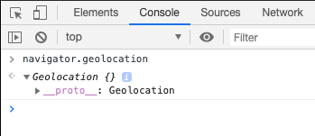
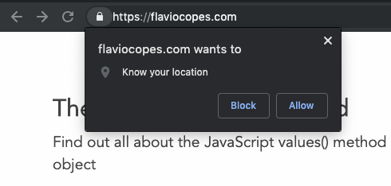
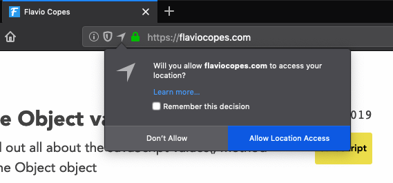
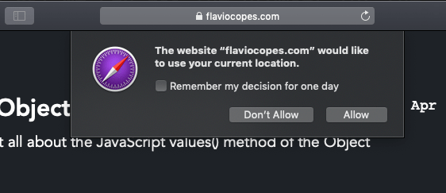
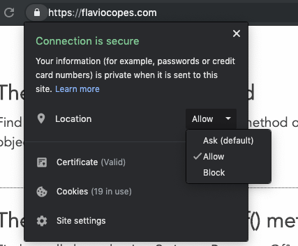

The browser exposes a `navigator.geolocation` object, through which we'll do all the geolocation operations.

It's only available on pages served using HTTPS, for security purposes, and it's available on all modern browsers.

```js
navigator.geolocation
```



> Since `window` is the global object, we can access `navigator` without specifying `window.navigator`

The `window.navigator` property exposed by browsers points to a **Navigator object** which is a _container object_ that makes a lot of Web Platform APIs available to us.

The `geolocation` object provides the following methods:

- `getCurrentPosition()`
- `watchPosition()`
- `clearWatch()`

The first one is used to get the current position coordinates. When we call this method for the first time, the browser automatically asks the user for the permission to share this information to us.

This is how this interface looks in Chrome:



on Firefox:



and on Safari:



This needs to be done only once per origin. You can change the decision you made, and revert a permission decision. This is how you do so with Chrome, by clicking the lock icon near the domain:



Once this permission is granted, we can proceed.

## Getting the user's position

Let's start with this sample code:

```js
navigator.geolocation.getCurrentPosition(() => {})
```

The permission panel should appear. Allow the permission.

Notice how I passed an empty [arrow function](/javascript-arrow-functions/), because the function wants a callback function.

This function is passed a `Position` object, which contains the actual location:

```js
navigator.geolocation.getCurrentPosition(position => {
  console.log(position)
})
```

This object has 2 properties:

- `coords`, a `Coordinates` object
- `timestamp`, the [UNIX timestamp](https://flaviocopes.com/javascript-dates/) when the position was retrieved

The `Coordinates` object comes with several properties that define the location:

- `accuracy` the accuracy of the position measured, expressed in meters
- `altitude` the altitude value measured
- `altitudeAccuracy` the accuracy of the altitude measured, expressed in meters
- `heading` the direction towards which the device is traveling. Expressed in degrees (0 = North, East = 90, South = 180, West = 270)
- `latitude` the latitude value measured
- `longitude` the longitude value measured
- `speed` the speed at which the device is traveling, expressed in meters per second

Depending on the implementation and the device, some of those will be `null`. For example on Chrome running on my MacBook Air I only got values for `accuracy`, `latitude` and `longitude`.

```js
navigator.geolocation.getCurrentPosition(position => {
  console.log(position.coords.latitude)
  console.log(position.coords.longitude)
})
```

## Watching the position for changes

In addition to getting the user position once, which you can do using `getCurrentPosition()`, you can use the `watchPosition()` method of `navigator.geolocation` to register a callback function that will be called upon each and every change that the device will communicate to us.

Usage:

```js
navigator.geolocation.watchPosition(position => {
	console.log(position)
})
```

Of course the browser will ask for the permission also with this method, if it was not already granted.

We can stop watching for a position by calling the `navigator.geolocation.clearWatch()` method, passing it the `id` returned by `watchPosition()`:

```js
const id = navigator.geolocation.watchPosition(position => {
	console.log(position)
})

//stop watching after 10 seconds
setTimeout(() => {
  navigator.geolocation.clearWatch(id)
}, 10 * 1000)
```

## If the user denies the position

Remember the permission popup window the browser shows when we call one of the methods to get the position?

If the user denies that, we can intercept this scenario by adding an error handling function, as the second parameter to the methods `getCurrentPosition()` and `watchPosition()`.

```js
navigator.geolocation.getCurrentPosition(position => {
  console.log(position)
}, error => {
	console.error(error)
})
```

The object passed to the second parameter contains a `code` property to distinguish between error types:

- `1` means permission denied
- `2` means position unavailable
- `3` means timeout

## Adding more options

When I talked about errors previously, I mentioned the timeout error. Looking up the position can take some time and we can set a maximum time allowed to perform the operation, as an option.

You can add a timeout by adding a third parameter to the methods `getCurrentPosition()` and `watchPosition()`, an object.

```js
navigator.geolocation.getCurrentPosition(position => {
  console.log(position)
}, error => {
	console.error(error)
}, {

})
```

Inside this object we can pass the properties

- `timeout` to set the number of milliseconds before the request errors out
- `maximumAge` to set the maximum "age" of the position cached by the browser. We don't accept one older than the set amount of milliseconds
- `enableHighAccuracy` a boolean by default `false`, requires a position with the highest level of accuracy possible (which might take more time and more power)

Example usage:

```js
navigator.geolocation.getCurrentPosition(position => {
  console.log(position)
}, error => {
	console.error(error)
}, {
  timeout: 1000,
  maximumAge: 10000,
  enableHighAccuracy: true
})
```
