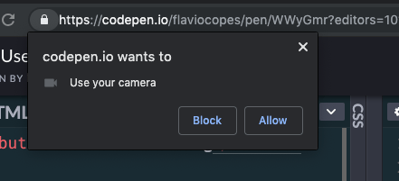

The `MediaDevices` object exposed by `navigator.mediaDevices` gives us the `getUserMedia` method.

> Warning: the `navigator` object exposes a `getUserMedia()` method as well, which might still work but is **deprecated**. The API has been moved inside the `mediaDevices` object for consistency purposes.

This is how we can use this method.

Say we have a button:

```html
<button>Start streaming</button>
```

We wait until the user clicks this button, and we call the `navigator.mediaDevices.getUserMedia()` method.

We pass an object that describes the media constraints we want. If we want a video input we'll call

```js
navigator.mediaDevices.getUserMedia({
  video: true
})
```

We can be very specific with those constraints:

```js
navigator.mediaDevices.getUserMedia({
  video: {
    minAspectRatio: 1.333,
    minFrameRate: 60,
    width: 640,
    heigth: 480
  }
})
```

You can get a list of all the constraints supported by the device by calling `navigator.mediaDevices.getSupportedConstraints()`.

If we just want the audio we can pass `audio: true`:

```js
navigator.mediaDevices.getUserMedia({
  audio: true
})
```

and if we want both:

```js
navigator.mediaDevices.getUserMedia({
  video: true,
  audio: true
})
```

This method returns a promise, so we'll use async/await to get the result in a `stream` variable:

```js
document.querySelector('button').addEventListener('click', async (e) => {
  const stream = await navigator.mediaDevices.getUserMedia({
    video: true
  })
})
```

Clicking the button will trigger a panel in the browser to allow for the permission to use the media devices:



See on Codepen: [https://codepen.io/flaviocopes/pen/WWyGmr](https://codepen.io/flaviocopes/pen/WWyGmr)

Once we are done, the `stream` object we got from `getUserMedia()` can now be used for various things. The most immediate is to display the video stream in a `video` element in the page:

```html
<button>Start streaming</button>
<video autoplay>Start streaming</button>
```

```js
document.querySelector('button').addEventListener('click', async (e) => {
  const stream = await navigator.mediaDevices.getUserMedia({
    video: true
  })
  document.querySelector('video').srcObject = stream
})
```

See on Codepen: [https://codepen.io/flaviocopes/pen/wZXzbB](https://codepen.io/flaviocopes/pen/wZXzbB)

## An example

Here is a Codepen example that asks you to access the video camera and plays the video in the page:

<p data-height="265" data-theme-id="0" data-slug-hash="rqRqpX" data-default-tab="js,result" data-user="flaviocopes" data-pen-title="WebRTC MediaStream simple example" data-preview="true" class="codepen">See the Pen <a href="https://codepen.io/flaviocopes/pen/rqRqpX/">WebRTC MediaStream simple example</a> by Flavio Copes (<a href="https://codepen.io/flaviocopes">@flaviocopes</a>) on <a href="https://codepen.io">CodePen</a>.</p>
<script async src="https://static.codepen.io/assets/embed/ei.js"></script>

We add a button to get access to the camera, then we add a `video` element, with the `autoplay` attribute.

```html
<button id="get-access">Get access to camera</button>
<video autoplay></video>
```

The JS listens for a click on the button, then calls `navigator.mediaDevices.getUserMedia()` asking for the video. Then we access the name of the camera used by calling `stream.getVideoTracks()` on the result of the call to `getUserMedia()`.

The stream is set to be the source object for the `video` tag, so that playback can happen:

```js
document.querySelector('#get-access').addEventListener('click', async function init(e) {
  try {
    const stream = await navigator.mediaDevices.getUserMedia({
      video: true
    })
    document.querySelector('video').srcObject = stream
    document.querySelector('#get-access').setAttribute('hidden', true)
    setTimeout(() => { track.stop() }, 3 * 1000)
  } catch (error) {
    alert(`${error.name}`)
    console.error(error)
  }
})
```

The arguments of getUserMedia() can specify additional requirements for the video stream:

```js
navigator.mediaDevices.getUserMedia({
  video: {
    mandatory: { minAspectRatio: 1.333, maxAspectRatio: 1.334 },
    optional: [
      { minFrameRate: 60 },
      { maxWidth: 640 },
      { maxHeigth: 480 }
    ]
  }
}, successCallback, errorCallback);
```

To get an audio stream you would ask for the audio media object too, and call `stream.getAudioTracks()` instead of `stream.getVideoTracks()`.

After 3 seconds of playback we stop the video streaming by calling `track.stop()`.
