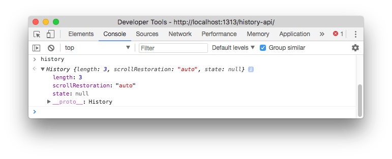

<!-- TOC -->

- [Introduction](#introduction)
- [Access the History API](#access-the-history-api)
- [Navigate the history](#navigate-the-history)
- [Add an entry to the history](#add-an-entry-to-the-history)
- [Modify history entries](#modify-history-entries)
- [Access the current history entry state](#access-the-current-history-entry-state)
- [The `onpopstate` event](#the-onpopstate-event)

<!-- /TOC -->

## Introduction

The History API lets you **interact with the browser history**, **trigger the browser navigation methods** and **change the address bar content**.

It's especially useful in combination with modern Single Page Applications, on which you never make a server-side request for new pages, but instead the page is always the same: just the internal content changes.

A **modern JavaScript application** running in the browser that does not interact with the History API, either explicitly or at the framework level, is going to be a poor experience to the user, since **the back and forward buttons break**.

Also, when navigating the app, **the view changes but the address bar does not**.

And also **the reload button breaks**: reloading the page, since there is no deep linking, is going to make the browser show a different page

The History API was introduced in HTML5 and is now [supported by all modern browsers](https://caniuse.com/#feat=history). IE supports it since version 10, and if you need to support IE9 and older, use the [History.js library](https://github.com/browserstate/history.js/).

## Access the History API

The History API is available on the `window` object, so you can call it like this: `window.history` or `history`, since `window` is the global object.



## Navigate the history

Let's start with the simplest thing you can do with the History API.

Go back to the previous page:

```js
history.back()
```

this goes to the previous entry in the session history. You can forward to the next page using

```js
history.forward()
```

This is exactly just like using the browser back and forward buttons.

`go()` lets you navigate back or forward multiple levels deep. For example

```js
history.go(-1) //equivalent to history.back()
history.go(-2) //equivalent to calling history.back() twice
history.go(1) //equivalent to history.forward()
history.go(3) //equivalent to calling history.forward() 3 times
```

To know how many entries there are in the history, you can call

```js
history.length
```

## Add an entry to the history

Using `pushState()` you can create a new history entry programmatically. You pass 3 parameters.

The first is an object which can contain anything (there is a size limit however, and the object needs to be serializable).

The second parameter is currently unused by major browsers, so you generally pass an empty string.

The third parameter is a URL associated to the new state. Note that the URL needs to belong to the same origin domain of the current URL.

```js
const state = { name: 'Flavio' }
history.pushState(state, '', '/user')
```

Calling this won't change the content of the page, and does not cause any browser action like changing `window.location` would.

## Modify history entries

While `pushState()` lets you add a new state to the history, **`replaceState()`** allows you to edit the current history state.

```js
history.pushState({}, '', '/posts')
const state = { post: 'first' }
history.pushState(state, '', '/post/first')
const state = { post: 'second' }
history.replaceState(state, '', '/post/second')
```

If you now call

```js
history.back()
```

the browser goes straight to `/posts`, since `/post/first` was **replaced** by `/post/second`

## Access the current history entry state

Accessing the property

```js
history.state
```

returns the current state object (the first parameter passed to `pushState` or `replaceState`).

## The `onpopstate` event

This event is called on `window` every time the active history state changes, with the current state as the callback parameter:

```js
window.onpopstate = event => {
  console.log(event.state)
}
```

will log the new state object (the first parameter passed to `pushState` or `replaceState`) every time you call `history.back()`, `history.forward()` or `history.go()`.
