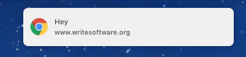
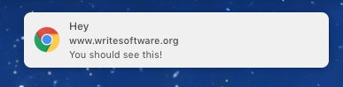

<!-- TOC -->

- [Introduction to the Notification API](#introduction-to-the-notification-api)
- [Permissions](#permissions)
- [Create a notification](#create-a-notification)
  - [Add a body](#add-a-body)
  - [Add an image](#add-an-image)
- [Close a notification](#close-a-notification)

<!-- /TOC -->

## Introduction to the Notification API

The **Notifications API** is the interface that browsers expose to the developer to allow **showing messages to the user**, with their permission, even if the web site / web app is not open in the browser.

Those messages are consistent and native, which means that the receiving person is used to the UI and UX of them, being system-wide and not specific to your site.

In combination with the [Push API](/push-api) this technology can be a successful way to increase user engagement and to enhance the capabilities of your app.

> The Notifications API interacts heavily with [Service Workers](/service-workers), as they are required for Push Notifications. You _can_ use the Notifications API without Push, but its use cases are limited.

```js
if (window.Notification && Notification.permission !== "denied") {
	Notification.requestPermission((status) => {
    // status is "granted", if accepted by user
		var n = new Notification('Title', {
			body: 'I am the body text!',
			icon: '/path/to/icon.png' // optional
		})
	})
}
```


```js
n.close()
```

## Permissions

To show a notification to the user, you must have permission to do so.

The `Notification.requestPermission()` method call requests this permission.

You can call

```js
Notification.requestPermission()
```

in this very simple form, and it will show a permission permission granting panel - unless permission was already granted before.

To do something when the user interacts (allows or denies), you can attach a processing function to it:

```js
const process = (permission) => {
  if (permission === "granted") {
    // ok we can show the permission
  }
}

Notification.requestPermission((permission) => {
  process(permission)
}).then((permission) => {
  process(permission)
})
```

See how we pass in a callback and also we expect a [promise](/javascript-promises/). This is because of different implementations of `Notification.requestPermission()` made in the past, which we now must support as we don't know in advance which version is running in the browser. So to keep things in a single location I extracted the permission processing in the `process()` function.

In both cases that function is passed a `permission` string which can have one of these values:

- `granted`: the user accepted, we **can** show a permission
- `denied`: the user denied, we **can't** show any permission

Those values can also be retrieved checking the `Notification.permission` property, which - if the user already granted permissions - evaluates to `granted` or `denied`, but if you haven't called `Notification.requestPermission()` yet, it will resolve to `default`.

## Create a notification

The `Notification` object exposed by the `window` object in the browser allows you to create a notification and to customize its appearance.

Here is the simplest example, that works after you asked for permissions:

```js
Notification.requestPermission()
new Notification('Hey')
```



You have a few options to customize the notification.

### Add a body

First, you can add a body, which is usually shown as a single line:

```js
new Notification('Hey', {
  body: 'You should see this!'
})
```



### Add an image

You can add an icon property:

```js
new Notification('Hey', {
  body: 'You should see this!',
  icon: '/user/themes/writesoftware/favicon.ico'
})
```


> More customization options, with platform-specific properties, can be found at <https://developer.mozilla.org/docs/Web/API/Notification>

## Close a notification

You might want to close a notification once you opened it.

To do so, create a reference to the notification you open:

```js
const n = new Notification('Hey')
```

and then you can close it later, using:

```js
n.close()
```

or with a timeout:

```js
setTimeout(n.close(), 1 * 1000)
```
