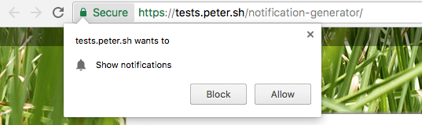

<!-- TOC -->

- [Is it well supported?](#is-it-well-supported)
- [How it works](#how-it-works)
  - [Overview](#overview)
- [Getting the user's permission](#getting-the-users-permission)
  - [Check if Service Workers are supported](#check-if-service-workers-are-supported)
  - [Check if the Push API is supported](#check-if-the-push-api-is-supported)
  - [Register a Service Worker](#register-a-service-worker)
  - [Request permission from the user](#request-permission-from-the-user)
  - [Subscribe the user and get the PushSubscription object](#subscribe-the-user-and-get-the-pushsubscription-object)
  - [Send the PushSubscription object to your server](#send-the-pushsubscription-object-to-your-server)
- [How the Server side works](#how-the-server-side-works)
  - [Registering a new client subscription](#registering-a-new-client-subscription)
  - [Sending a Push message](#sending-a-push-message)
  - [In the real world...](#in-the-real-world)
- [Receive a Push event](#receive-a-push-event)
  - [Displaying a notification](#displaying-a-notification)

<!-- /TOC -->

The Push API allows a web app to receive messages pushed by a server, even if the web app is not currently open in the browser or not running on the device

Using the Push API you can send messages to your users, pushing them from the server to the client, even when the user is not browsing the site.

This lets you deliver notifications and content updates, giving you the ability to have a more engaged audience.

This is huge because one of the missing pillars of the mobile web, compared to native apps, was the ability to receive notifications, along with offline support.

## Is it well supported?

The Push API is a recent addition to the browser APIs, and it's currently supported by Chrome (Desktop and Mobile), Firefox and Opera since 2016, Edge since version 17 (early 2018). See more about the current state of browsers support at <https://caniuse.com/#feat=push-api>

IE does not support it, and [Safari has its own implementation](https://developer.apple.com/notifications/safari-push-notifications/).

Since Chrome and Firefox support it, approximately 60% of the users browsing on the desktop have access to it, so it's quite _safe_ to use.


## How it works

### Overview

When a user visits your web app, you can trigger a panel asking permission to send updates. A [Service Worker](/service-workers) is installed, and operating in the background listens for a [Push Event](/service-workers#push-events).

> Push and Notifications are a separate concept and API, sometimes mixed because of the _push notifications_ term used in iOS. Basically, the Notifications API is invoked when a push event is received using the Push API.

Your **server** sends the notification to the client, and the Service Worker, if given permission, receives a **push event**. The Service Worker reacts to this event by **triggering a notification**.

## Getting the user's permission

The first step in working with the Push API is getting the user's permission to receive data from you.

> Many sites implement this panel badly, showing it on the first page load. The user is not yet convinced your content is good, and they will deny the permission. Do it wisely.

There are 6 steps:

1. Check if Service Workers are supported
2. Check if the Push API is supported
3. Register a Service Worker
4. Request permission from the user
5. Subscribe the user and get the PushSubscription object
6. Send the PushSubscription object to your server

### Check if Service Workers are supported

```js
if (!('serviceWorker' in navigator)) {
  // Service Workers are not supported. Return
  return
}
```

### Check if the Push API is supported

```js
if (!('PushManager' in window)) {
  // The Push API is not supported. Return
  return
}
```

### Register a Service Worker

This code register the Service Worker located in the `worker.js` file placed in the domain root:

```js
window.addEventListener('load', () => {
  navigator.serviceWorker.register('/worker.js')
  .then((registration) => {
    console.log('Service Worker registration completed with scope: ',
      registration.scope)
  }, (err) => {
    console.log('Service Worker registration failed', err)
  })
})
```

To know more about how Service Workers work in detail, check out the [Service Workers guide](/service-workers).

### Request permission from the user

Now that the Service worker is registered, you can request the permission.

The API to do this changed over time, and it went from accepting a callback function as a parameter to returning a [Promise](/javascript-promises/), breaking the backward and forward compatibility, and we need to do **both** as we don't know which approach is implemented by the user's browser.

The code is the following, calling `Notification.requestPermission()`.

```js
const askPermission = () => {
  return new Promise((resolve, reject) => {
    const permissionResult = Notification.requestPermission((result) => {
      resolve(result)
    })
    if (permissionResult) {
      permissionResult.then(resolve, reject)
    }
  })
  .then((permissionResult) => {
    if (permissionResult !== 'granted') {
      throw new Error('Permission denied')
    }
  })
}
```

The `permissionResult` value is a string, that can have the value of:
- `granted`
- `default`
- `denied`

This code causes the browser to show the permission dialogue:



**If the user clicks Block, you won't be able to ask for the user's permission any more**, unless they manually go and unblock the site in an advanced settings panel in the browser (very unlikely to happen).

### Subscribe the user and get the PushSubscription object

If the user gave us permission, we can subscribe it and by calling `registration.pushManager.subscribe()`.

```js
const APP_SERVER_KEY = 'XXX'

window.addEventListener('load', () => {
  navigator.serviceWorker.register('/worker.js')
  .then((registration) => {
    askPermission().then(() => {
      const options = {
        userVisibleOnly: true,
        applicationServerKey: urlBase64ToUint8Array(APP_SERVER_KEY)
      }
      return registration.pushManager.subscribe(options)
    }).then((pushSubscription) => {
      // we got the pushSubscription object
    }
  }, (err) => {
    console.log('Service Worker registration failed', err)
  })
})
```

`APP_SERVER_KEY` is a string - called _Application Server Key_ or _VAPID key_ - that identifies the application public key, part of a public / private key pair.

It will be used as part of the validation that for security reasons occurs to make sure you (and only you, not someone else) can send a push message back to the user.

### Send the PushSubscription object to your server

In the previous snippet we got the `pushSubscription` object, which contains all we need to send a push message to the user. We need to send this information to our server, so we're able to send notifications later on.

We first create a JSON representation of the object

```js
const subscription = JSON.stringify(pushSubscription)
```

and we can post it to our server using the [Fetch API](/fetch-api):

```js
const sendToServer = (subscription) => {
  return fetch('/api/subscription', {
    method: 'POST',
    headers: {
      'Content-Type': 'application/json'
    },
    body: JSON.stringify(subscription)
  })
  .then((res) => {
    if (!res.ok) {
      throw new Error('An error occurred')
    }
    return res.json()
  })
  .then((resData) => {
    if (!(resData.data && resData.data.success)) {
      throw new Error('An error occurred')
    }
  })
}

sendToServer(subscription)
```

Server-side, the `/api/subscription` endpoint receives the POST request and can store the subscription information into its storage.

## How the Server side works

So far we only talked about the client-side part: getting a user's permission to be notified in the future.

What about the server? What should it do, and how should it interact with the client?

> These server-side examples uses Express.js (<http://expressjs.com/>) as the base HTTP framework, but you can write a server-side Push API handler in any language or framework

### Registering a new client subscription

When the client sends a new subscription, remember we used the `/api/subscription` HTTP POST endpoint, sending the PushSubscription object details in JSON format, in the body.

We initialize Express.js:

```js
const express = require('express')
const app = express()
```

This utility function makes sure the request is valid, has a body and an endpoint property, otherwise it returns an error to the client:

```js
const isValidSaveRequest = (req, res) => {
  if (!req.body || !req.body.endpoint) {
    res.status(400)
    res.setHeader('Content-Type', 'application/json')
    res.send(JSON.stringify({
      error: {
        id: 'no-endpoint',
        message: 'Subscription must have an endpoint'
      }
    }))
    return false
  }
  return true
}
```

The next utility function saves the subscription to the database, returning a promise resolved when the insertion completed (or failed). The `insertToDatabase` function is a placeholder, we're not going into those details here:

```js
const saveSubscriptionToDatabase = (subscription) => {
  return new Promise((resolve, reject) => {
    insertToDatabase(subscription, (err, id) => {
      if (err) {
        reject(err)
        return
      }

      resolve(id)
    })
  })
}
```

We use those functions in the POST request handler below. We check if the request is valid, then we save the request and then we return a `data.success: true` response back to the client, or an error:

```js
app.post('/api/subscription', (req, res) => {
  if (!isValidSaveRequest(req, res)) {
    return
  }

  saveSubscriptionToDatabase(req, res.body)
  .then((subscriptionId) => {
    res.setHeader('Content-Type', 'application/json')
    res.send(JSON.stringify({ data: { success: true } }))
  })
  .catch((err) => {
    res.status(500)
    res.setHeader('Content-Type', 'application/json')
    res.send(JSON.stringify({
      error: {
        id: 'unable-to-save-subscription',
        message: 'Subscription received but failed to save it'
      }
    }))
  })
})

app.listen(3000, () => {
  console.log('App listening on port 3000')
})
```

### Sending a Push message

Now that the server has registered the client in its list, we can send it Push messages. Let's see how that works by creating an example code snippet that fetches all subscriptions and sends a Push message to all of them at the same time.

We use a library because the [**Web Push protocol**](https://developers.google.com/web/fundamentals/push-notifications/web-push-protocol) is **complex**, and a lib allows us to abstract away a lot of low level code that makes sure we can work safely and correctly handle any edge case.

> This example uses the `web-push` [Node.js](/nodejs/) library (<https://github.com/web-push-libs/web-push>) to handle sending the Push message

We first initialize the `web-push` lib, and we generate a tuple of private and public keys, and set them as the VAPID details:

```js
const webpush = require('web-push')
const vapidKeys = webpush.generateVAPIDKeys()

const PUBLIC_KEY = 'XXX'
const PRIVATE_KEY = 'YYY'

const vapidKeys = {
  publicKey: PUBLIC_KEY,
  privateKey: PRIVATE_KEY
}

webpush.setVapidDetails(
  'mailto:my@email.com',
  vapidKeys.publicKey,
  vapidKeys.privateKey
)
```

Then we set up a `triggerPush()` method, responsible for sending the push event to a client. It just calls `webpush.sendNotification()` and catches any error. If the return error HTTP status code is [410](https://developer.mozilla.org/docs/Web/HTTP/Status/410), which means **gone**, we delete that subscriber from the database.

```js
const triggerPush = (subscription, dataToSend) => {
  return webpush.sendNotification(subscription, dataToSend)
  .catch((err) => {
    if (err.statusCode === 410) {
      return deleteSubscriptionFromDatabase(subscription._id)
    } else {
      console.log('Subscription is no longer valid: ', err)
    }
  })
}
```

We don't implement getting the subscriptions from the database, but we leave it as a stub:

```js
const getSubscriptionsFromDatabase = () => {
  //stub
}
```

The meat of the code is the callback of the POST request to the `/api/push` endpoint:

```js
app.post('/api/push', (req, res) => {
  return getSubscriptionsFromDatabase()
  .then((subscriptions) => {
    let promiseChain = Promise.resolve()
    for (let i = 0; i < subscriptions.length; i++) {
      const subscription = subscriptions[i]
      promiseChain = promiseChain.then(() => {
        return triggerPush(subscription, dataToSend)
      })
    }
    return promiseChain
  })
  .then(() => {
    res.setHeader('Content-Type', 'application/json')
    res.send(JSON.stringify({ data: { success: true } }))
  })
  .catch((err) => {
    res.status(500)
    res.setHeader('Content-Type', 'application/json')
    res.send(JSON.stringify({
      error: {
        id: 'unable-to-send-messages',
        message: `Failed to send the push ${err.message}`
      }
    }))
  })
})
```

What the above code does is: it gets all the subscriptions from the database, then it iterates on them, and it calls the `triggerPush()` function we explained before.

Once the subscriptions are done, we return a successful JSON response, unless an error occurred and we return a 500 error.

### In the real world...

It's unlikely that you'll set up your own Push server unless you have a very special use case, or you just want to learn the tech or you like to DIY. Instead, you usually want to use platforms such as OneSignal (<https://onesignal.com>) which transparently handle Push events to all kind of platforms, Safari and iOS included, for free.

## Receive a Push event

When a Push event is sent from the server, how does the client get it?

It's a normal [JavaScript](/javascript/) event listener, on the `push` event, which runs inside a Service Worker:

```js
self.addEventListener('push', (event) => {
  // data is available in event.data
})
```

`event.data` contains the [`PushMessageData`](https://developer.mozilla.org/docs/Web/API/PushMessageData) object which exposes methods to retrieve the push data sent by the server, in the format you want:

- **arrayBuffer()** : as an [`ArrayBuffer`](/arraybuffer/) object
- **blob()**: as a [Blob](/blob/) object
- **json()**: parsed as [JSON](/json/)
- **text()**: plain text

You'll normally use `event.data.json()`.

### Displaying a notification

Here we intersect a bit with the [Notifications API](/notifications-api), but for a good reason, as one of the main use cases of the Push API is to display notifications.

Inside our `push` event listener in the Service Worker, we need to display the notification to the user, and to tell the event to wait until the browser has shown it before the function can terminate. We extend the event lifetime until the browser has done displaying the notification (until the promise has been resolved), otherwise the Service Worker could be stopped in the middle of your processing:

```js
self.addEventListener('push', (event) => {
  const promiseChain = self.registration.showNotification('Hey!')
  event.waitUntil(promiseChain)
})
```

More on notifications in the [Notifications API Guide](/notifications-api).