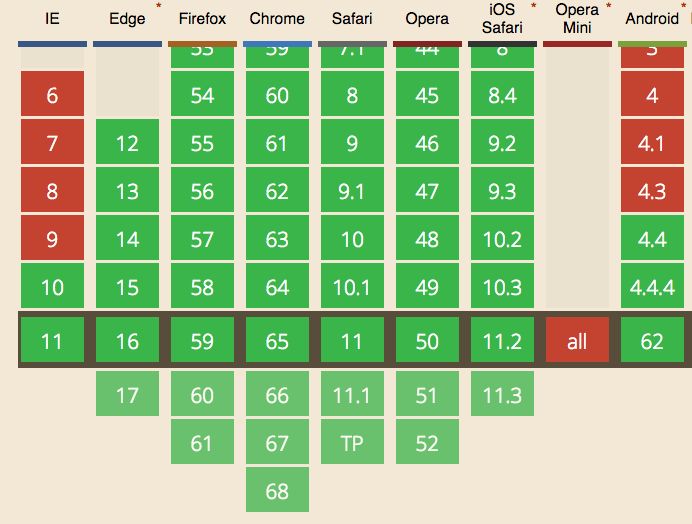
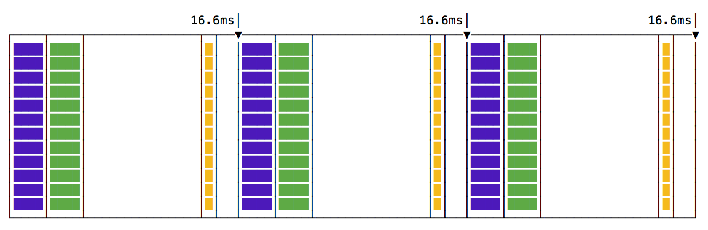
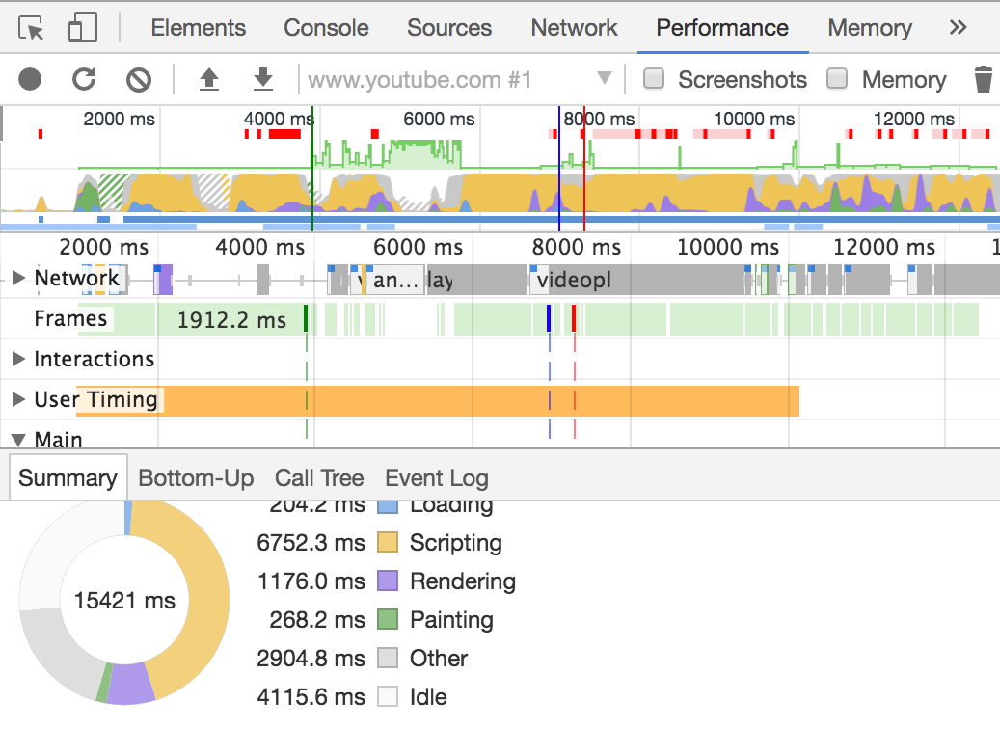
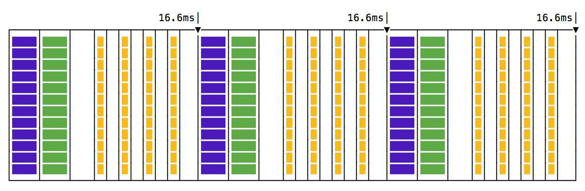
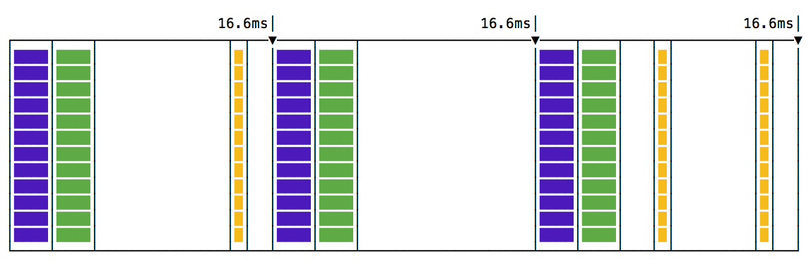
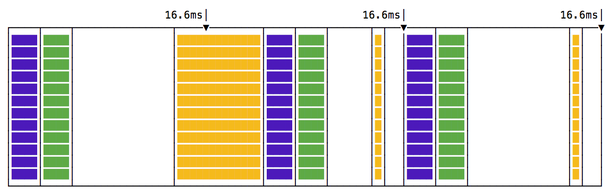
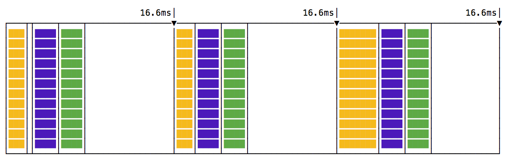

`requestAnimationFrame()` is a relatively recent browser API. It gives a more predictable way to hook into the browser render cycle.

It's currently supported by all modern browsers (and IE 10+)



It's not an API specific to animations, but that's where it is used the most.

JavaScript has an event loop. It continuously runs to execute JavaScript.

In the past, animations were performed using `setTimeout()` or `setInterval()`. You perform a little bit of an animation, and you call `setTimeout()` to repeat again this code in a few milliseconds from now:

```js
const performAnimation = () => {
  //...
  setTimeout(performAnimation, 1000 / 60)
}
setTimeout(performAnimation, 1000 / 60)
```

or

```js
const performAnimation = () => {
  //...
}
setInterval(performAnimation, 1000 / 60)
```

You can stop an animation by getting the timeout or interval reference, and clearing it:

```js
let timer

const performAnimation = () => {
  //...
  timer = setTimeout(performAnimation, 1000 / 60)
}

timer = setTimeout(performAnimation, 1000 / 60)

//...

clearTimeout(timer)
```

> The `1000 / 60` interval between the `performAnimation()` calls is determined by the monitor refresh rate, which is in most of the cases 60 Hz (60 repaints per second), because it's useless to perform a repaint if the monitor cannot show it due to its limitations. It leads to ~16.6ms of time we have at our disposal to display every single frame.

The problem with this approach is that even though we specify this precision accurately, the browser might be busy performing other operations, and our setTimeout calls might not make it in time for the repaint, and it's going to be delayed to the next cycle.

This is bad because we lose one frame, and in the next the animation is performed 2 times, causing the eye to notice the clunky animation.

Check this example on Glitch of an [animation built using of setTimeout()](https://flavio-settimeout-animation.glitch.me/).

<div class="glitch-embed-wrap" style="height: 681px; width: 100%;">
  <iframe src="https://glitch.com/embed/#!/embed/flavio-settimeout-animation?path=script.js&previewFirst=true" alt="flavio-settimeout-animation on glitch" style="height: 100%; width: 100%; border: 0;"></iframe>
</div>
<br>
`requestAnimationFrame` is the standard way to perform animations, and it works in a very different way event though the code looks very similar to the setTimeout/setInterval code:

```js
let request

const performAnimation = () => {
  request = requestAnimationFrame(performAnimation)
  //animate something
}

requestAnimationFrame(performAnimation)

//...

cancelAnimationFrame(request) //stop the animation
```

This example on Glitch of an [animation built using of requestAnimationFrame()](https://flavio-requestanimationframe-example.glitch.me/) shows how

<div class="glitch-embed-wrap" style="height: 997px; width: 100%;">
  <iframe src="https://glitch.com/embed/#!/embed/flavio-requestanimationframe-example?path=script.js&previewSize=33&previewFirst=true&sidebarCollapsed=true" alt="flavio-requestanimationframe-example on glitch" style="height: 100%; width: 100%; border: 0;"></iframe>
</div>

## Optimization

`requestAnimationFrame()` since its introduction was very CPU friendly, causing animations to stop if the current window or tab is not visible.

At the time requestAnimationFrame() was introduced, setTimeout/setInterval did run even if the tab was hidden, but now since this approach proved to be successful also to battery savings, browsers also implemented throttling for those events, allowing max 1 execution per each second.

Using `requestAnimationFrame` the browser can further optimize the resource consumption and make the animations smoother.

## Timeline examples

This is the perfect timeline if you use setTimeout or setInterval:



you have a set of paint (green) and render (purple) events, and your code is in the yellow box - by the way, these are the colors used in the Browser DevTools as well to represent the timeline:



The illustration shows the perfect case. You have painting and rendering every 60ms, and your animation happens in between, perfectly regular.

If you used a higher frequency call for your animation function:



Notice how in each frame we call 4 animation steps, before any rendering happens, an this will make the animation feel very choppy.

What if setTimeout cannot run on time due to other code blocking the event loop? We end up with a missed frame:



What if an animation step takes a little bit more than you anticipate?



the render and paint events will be delayed as well.

This is how `requestAnimationFrame()` works visually:



all the animation code runs **before** the rendering and painting events. This makes for a more predictable code, and there's a lot of time to do the animation without worrying about going past the 16ms time we have at our disposal.

<div class="web-only">
  <p>The best video on <code>requestAnimationFrame()</code> and the event loop in general is the talk by Jake Archibald at SmashingConf in early 2018. I highly recommend watching it, Jake is an amazing speaker, explains things in simple terms and the talk is a joy to watch:</p>

  <center>
  <iframe src="https://player.vimeo.com/video/254947206" width="640" height="360" frameborder="0" webkitallowfullscreen mozallowfullscreen allowfullscreen></iframe>
  </center>
</div>
