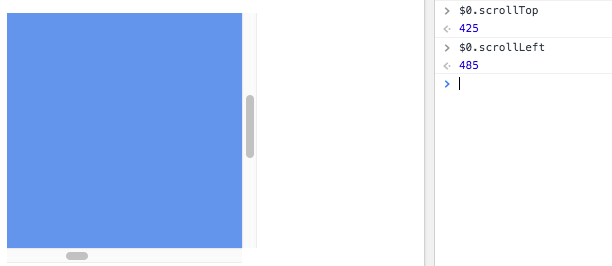

Scrolling a page to see the content below the fold is probably the most common event happening on a page, more than clicks or keyboard events.

You can listen for the `scroll` event on the `window` object to get information every time the user scrolls the page:

```js
window.addEventListener('scroll', event => {
  // scroll event detected
})
```

Inside the event handler you can check the current vertical scrolling position by checking the `window` property `window.scrollY`, and the horizontal scolling using `window.scrollX`.

```js
window.addEventListener('scroll', event => {
  console.log(window.scrollY)
  console.log(window.scrollX)
})
```

Keep in mind that `scroll` event is not a one-time thing.

It fires a lot of times during scrolling, not just at the end or beginning of the scrolling, so there's a problem if you need to do any kind of operation.

You shouldn't do any computation or manipulation in the handler event handler directly, but we should use _throttling_ instead.

## Throttling

The `scroll` event is not fired one-time per event, but rather they continuously call their event handler function during all the duration of the action.

This is because it provide coordinates so you can track what's happening.

If you perform a complex operation in the event handler, you will affect the performance and cause a sluggish experience to your site users.

Libraries that provide throttling like [Lodash](https://lodash.com/docs/4.17.10#throttle) implement it in 100+ lines of code, to handle every possible use case. A simple and easy to understand implementation is this, which uses [setTimeout](https://flaviocopes.com/javascript-timers/) to cache the scroll event every 100ms:

```js
let cached = null
window.addEventListener('scroll', event => {
  if (!cached) {
    setTimeout(() => {
      //you can access the original event at `cached`
      cached = null
    }, 100)
  }
  cached = event
})
```

> Throttling also applies to the `mousemove` event we saw in the mouse events lesson. Same thing - that event is fired multiple times as you move the mouse.

Here's an example on Codepen:

<p class="codepen" data-height="384" data-theme-id="0" data-default-tab="js,result" data-user="flaviocopes" data-slug-hash="BejPwV" style="height: 384px; box-sizing: border-box; display: flex; align-items: center; justify-content: center; border: 2px solid; margin: 1em 0; padding: 1em;" data-pen-title="Scrolling Events">
  <span>See the Pen <a href="https://codepen.io/flaviocopes/pen/BejPwV/">
  Scrolling Events</a> by Flavio Copes (<a href="https://codepen.io/flaviocopes">@flaviocopes</a>)
  on <a href="https://codepen.io">CodePen</a>.</span>
</p>
<script async src="https://static.codepen.io/assets/embed/ei.js"></script>

## How to get the scroll position of an element

When you are building a user interface in the browser, you might have an element which can be scrolled, and it's a common need to know the horizontal and vertical scrolling it currently has.

How can you do that?

Once you have the element, you can inspect its  `scrollLeft` and `scrollTop` properties.

The `0, 0` position is always found in the top left corner, so any scrolling is relative to that.

Example:

```js
const container = document.querySelector('. container')
container.scrollTop
container.scrollLeft
```

Those properties are read/write, so you can also **set** the scroll position:

```js
const container = document.querySelector('. container')
container.scrollTop = 1000
container.scrollLeft = 1000
```


