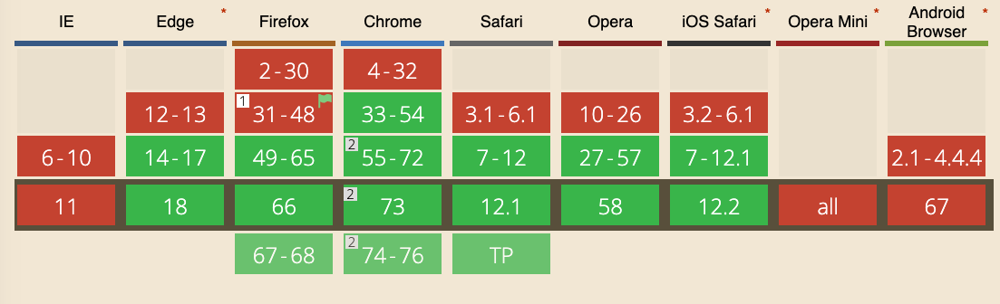
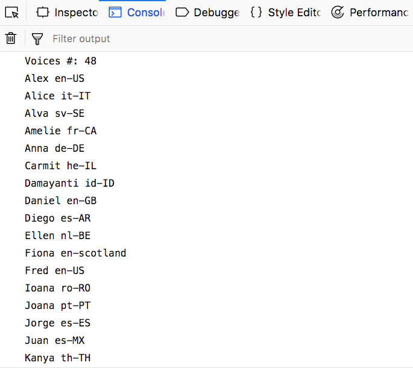
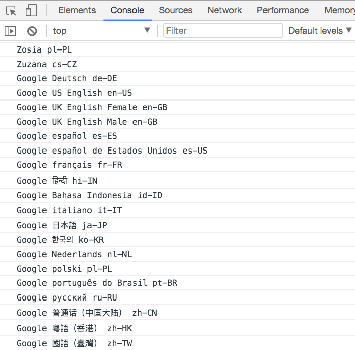

The Speech Synthesis API is an awesome tool provided by modern browsers.

Introduced in 2014, it's now [widely adopted](https://caniuse.com/#feat=speech-synthesis) and available in Chrome, Firefox, Safari and Edge. IE is not supported.



It's part of the Web Speech API, along with the **Speech Recognition API**, although that is only currently supported, in experimental mode, on Chrome.

I used it recently to provide an alert on a page that monitored some parameters. When one of the numbers went up, I was alerted thought the computer speakers.

## Getting started

The most simple example of using the **Speech Synthesis API** stays on one line:

```js
speechSynthesis.speak(new SpeechSynthesisUtterance('Hey'))
```

Copy and paste it in your browser console, and your computer should speak!

## The API

The API exposes several objects to the `window` object.

### `SpeechSynthesisUtterance`

`SpeechSynthesisUtterance` represents a speech request. In the example above we passed it a string. That's the message the browser should read aloud.

Once you got the utterance object, you can perform some tweaks to edit the speech properties:

```js
const utterance = new SpeechSynthesisUtterance('Hey')
```

- `utterance.rate`: set the speed, accepts between [0.1 - 10], defaults to 1
- `utterance.pitch`: set the pitch, accepts between [0 - 2], defaults to 1
- `utterance.volume`: sets the volume, accepts between [0 - 1], defaults to 1
- `utterance.lang`: set the language (values use a BCP 47 language tag, like `en-US` or `it-IT`)
- `utterance.text`: instead of setting it in the constructor, you can pass it as a property. Text can be maximum 32767 characters
- `utterance.voice`: sets the voice (more on this below)

Example:

```js
const utterance = new SpeechSynthesisUtterance('Hey')
utterance.pitch = 1.5
utterance.volume = 0.5
utterance.rate = 8
speechSynthesis.speak(utterance)
```

## Set a voice

The browser has a different number of voices available.

To see the list, use this code:

```js
console.log(`Voices #: ${speechSynthesis.getVoices().length}`)

speechSynthesis.getVoices().forEach(voice => {
  console.log(voice.name, voice.lang)
})
```



Here is one of the cross browser issues. The above code works in Firefox, Safari (and possibly Edge but I didn't test it), but **does not work in Chrome**. Chrome requires the voices handling in a different way, and requires a callback that is called when the voices have been loaded:

```js
const voiceschanged = () => {
  console.log(`Voices #: ${speechSynthesis.getVoices().length}`)
  speechSynthesis.getVoices().forEach(voice => {
    console.log(voice.name, voice.lang)
  })
}
speechSynthesis.onvoiceschanged = voiceschanged
```

After the callback is called, we can access the list using `speechSynthesis.getVoices()`.

I believe this is because Chrome - if there is a network connection - checks additional languages from the Google servers:



If there is no network connection, the number of languages available is the same as Firefox and Safari. The additional languages are available where the network is enabled, but the API works offline as well.

## Cross browser implementation to get the language

Since we have this difference, we need a way to abstract it to use the API. This example does this abstraction:

```js
const getVoices = () => {
  return new Promise(resolve => {
    let voices = speechSynthesis.getVoices()
    if (voices.length) {
      resolve(voices)
      return
    }
    speechSynthesis.onvoiceschanged = () => {
      voices = speechSynthesis.getVoices()
      resolve(voices)
    }
  })
}

const printVoicesList = async () => {
  ;(await getVoices()).forEach(voice => {
    console.log(voice.name, voice.lang)
  })
}

printVoicesList()
```

[See on Glitch](https://glitch.com/edit/#!/flavio-get-list-voices-speech-api?path=script.js)

## Use a custom language

The default voice speaks in english.

You can use any language you want, by setting the utterance `lang` property:

```js
let utterance = new SpeechSynthesisUtterance('Ciao')
utterance.lang = 'it-IT'
speechSynthesis.speak(utterance)
```

## Use another voice

If there is more than one voice available, you might want to choose the other. For example the default italian voice is female, but maybe I want a male voice. That's the second one we get from th voices list.

```js
const lang = 'it-IT'
const voiceIndex = 1

const speak = async text => {
  if (!speechSynthesis) {
    return
  }
  const message = new SpeechSynthesisUtterance(text)
  message.voice = await chooseVoice()
  speechSynthesis.speak(message)
}

const getVoices = () => {
  return new Promise(resolve => {
    let voices = speechSynthesis.getVoices()
    if (voices.length) {
      resolve(voices)
      return
    }
    speechSynthesis.onvoiceschanged = () => {
      voices = speechSynthesis.getVoices()
      resolve(voices)
    }
  })
}

const chooseVoice = async () => {
  const voices = (await getVoices()).filter(voice => voice.lang == lang)

  return new Promise(resolve => {
    resolve(voices[voiceIndex])
  })
}

speak('Ciao')
```

[See on Glitch](https://glitch.com/edit/#!/flavio-speech-api-example?path=script.js)

## Values for the language

Those are some examples of the languages you can use:

- Arabic (Saudi Arabia) ➡️ `ar-SA`
- Chinese (China) ➡️ `zh-CN`
- Chinese (Hong Kong SAR China) ➡️ `zh-HK`
- Chinese (Taiwan) ➡️ `zh-TW`
- Czech (Czech Republic) ➡️ `cs-CZ`
- Danish (Denmark) ➡️ `da-DK`
- Dutch (Belgium) ➡️ `nl-BE`
- Dutch (Netherlands) ➡️ `nl-NL`
- English (Australia) ➡️ `en-AU`
- English (Ireland) ➡️ `en-IE`
- English (South Africa) ➡️ `en-ZA`
- English (United Kingdom) ➡️ `en-GB`
- English (United States) ➡️ `en-US`
- Finnish (Finland) ➡️ `fi-FI`
- French (Canada) ➡️ `fr-CA`
- French (France) ➡️ `fr-FR`
- German (Germany) ➡️ `de-DE`
- Greek (Greece) ➡️ `el-GR`
- Hindi (India) ➡️ `hi-IN`
- Hungarian (Hungary) ➡️ `hu-HU`
- Indonesian (Indonesia) ➡️ `id-ID`
- Italian (Italy) ➡️ `it-IT`
- Japanese (Japan) ➡️ `ja-JP`
- Korean (South Korea) ➡️ `ko-KR`
- Norwegian (Norway) ➡️ `no-NO`
- Polish (Poland) ➡️ `pl-PL`
- Portuguese (Brazil) ➡️ `pt-BR`
- Portuguese (Portugal) ➡️ `pt-PT`
- Romanian (Romania) ➡️ `ro-RO`
- Russian (Russia) ➡️ `ru-RU`
- Slovak (Slovakia) ➡️ `sk-SK`
- Spanish (Mexico) ➡️ `es-MX`
- Spanish (Spain) ➡️ `es-ES`
- Swedish (Sweden) ➡️ `sv-SE`
- Thai (Thailand) ➡️ `th-TH`
- Turkish (Turkey) ➡️ `tr-TR`

## Mobile

On iOS the API works but must be triggered by a user action callback, like a response to a tap event, to provide a better experience to users and avoid unexpected sounds out of your phone.

You can't do like in the desktop where you can make your web pages speak something out of the blue.
