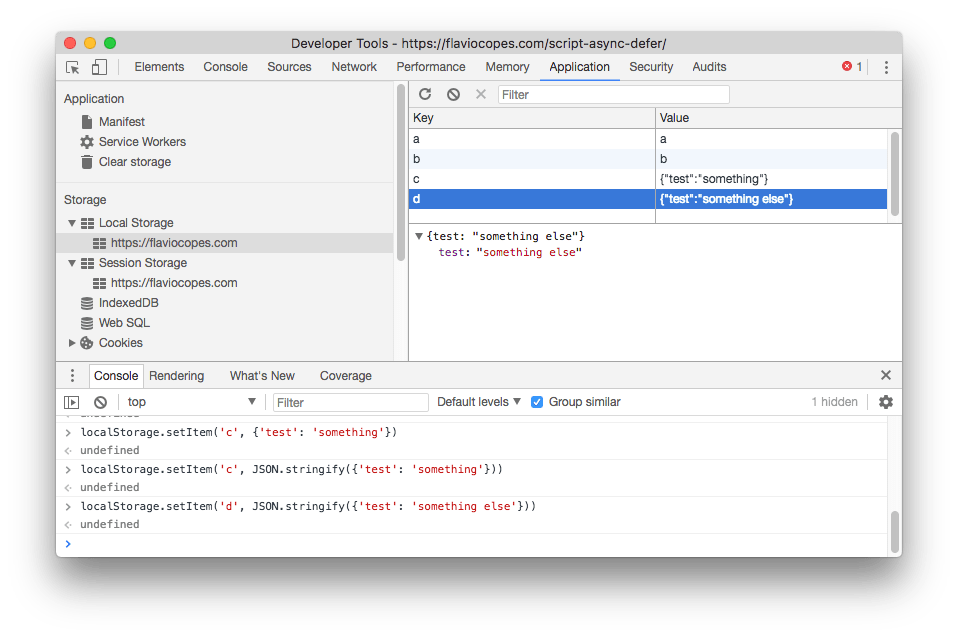
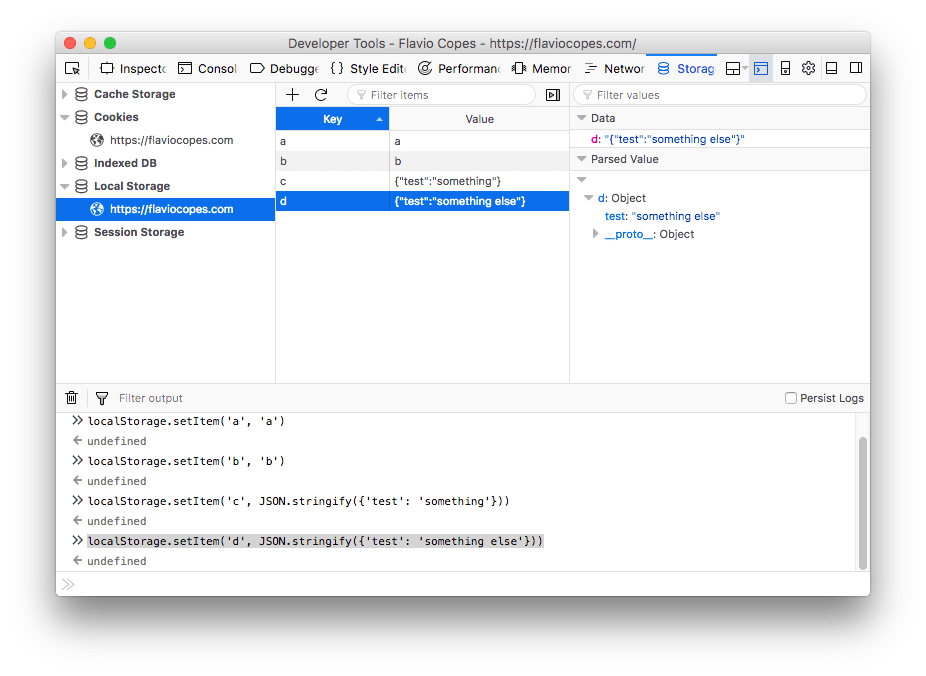
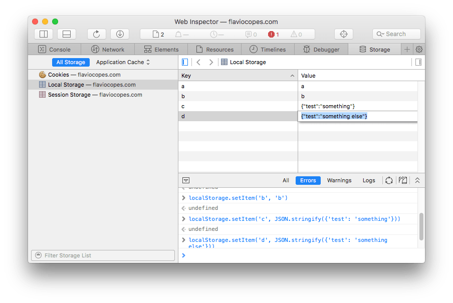

<!-- TOC -->

- [Introduction](#introduction)
- [How to access the storage](#how-to-access-the-storage)
- [Methods](#methods)
  - [`setItem(key, value)`](#setitemkey-value)
  - [`getItem(key)`](#getitemkey)
  - [`removeItem(key)`](#removeitemkey)
  - [`key(n)`](#keyn)
  - [`clear()`](#clear)
- [Storage size limits](#storage-size-limits)
  - [Desktop](#desktop)
  - [Mobile](#mobile)
  - [Going over quota](#going-over-quota)
- [Developer Tools](#developer-tools)
  - [Chrome](#chrome)
  - [Firefox](#firefox)
  - [Safari](#safari)

<!-- /TOC -->

## Introduction

The Web Storage API defines two storage mechanisms which are very important: **Session Storage** and **Local Storage**.

They are part of the set of storage options available on the Web Platform, which includes:

- [Cookies](/cookies/)
- [IndexedDB](/indexeddb/)
- [The Cache API](/cache-api/)

> Application Cache is deprecated, and Web SQL is not implemented in Firefox, Edge and IE.

Both Session Storage and Local Storage provide a private area for your data. Any data you store cannot be accessed by other websites.

Session Storage maintains the data stored into it for the duration of the page session. If multiple windows or tabs visit the same site, they will have two different Session Storage instances.

When a tab/window is closed, the Session Storage for that particular tab/window is cleared.

> Session storage is meant to allow the scenario of handling different processes happening on the same site independently, something not possible with cookies for example, which are shared in all sessions.

Local Storage instead persists the data until it's explicitly removed, either by you or by the user. It's never cleaned up automatically, and it's shared in all the sessions that access a site.

Both Local Storage and Session Storage are **protocol specific**: data stored when the page is accessed using `http` is not available when the page is served with `https`, and vice versa.

Web Storage is only accessible in the browser. It's not sent to the server like cookies do.

## How to access the storage

Both Local and Session Storage are available on the `window` object, so you can access them using `sessionStorage` and `localStorage`.

Their set of properties and methods is exactly the same, because they return the same object, a [Storage](https://developer.mozilla.org/en-US/docs/Web/API/Storage) object.

The Storage Object has a single property, `length`, which is the number of data items stored into it.

## Methods

### `setItem(key, value)`

`setItem()` adds an item to the storage. Accepts a string as key, and a string as a value:

```js
localStorage.setItem('username', 'flaviocopes')
localStorage.setItem('id', '123')
```

If you pass any value that's not a string, it will be converted to string:

```js
localStorage.setItem('test', 123) //stored as the '123' string
localStorage.setItem('test', { test: 1 }) //stored as "[object Object]"
```

### `getItem(key)`

`getItem()` is the way to retrieve a string value from the storage, by using the key string that was used to store it:

```js
localStorage.getItem('username') // 'flaviocopes'
localStorage.setItem('id') // '123'
```

### `removeItem(key)`

`removeItem()` removes the item identified by `key` from the storage, returning nothing (an `undefined` value):

```js
localStorage.removeItem('id')
```

### `key(n)`

Every item you store has an index number.

> It might appear the number is consecutive, so the first time you use `setItem()`, that item can be referenced using `key(0)`, the next with `key(1)` and so on, but it's not. MDN says "The order of keys is user-agent defined, so you should not rely on it".

If you reference a number that does not point to a storage item, it returns `null`.

### `clear()`

`clear()` removes everything from the storage object you are manipulating:

```js
localStorage.setItem('a', 'a')
localStorage.setItem('b', 'b')
localStorage.length //2
localStorage.clear()
localStorage.length //0
```

## Storage size limits

Through the Storage API you can store a lot more data than you would be able with cookies.

The amount of storage available on Web might differ by storage type (local or session), browser, and by device type. A [research](https://www.html5rocks.com/en/tutorials/offline/quota-research/) by html5rocks.com points out those limits:

### Desktop

- Chrome, IE, Firefox: 10MB
- Safari: 5MB for local storage, unlimited session storage

### Mobile

- Chrome, Firefox: 10MB
- iOS Safari and WebView: 5MB for local storage, session storage unlimited unless in iOS6 and iOS7 where it's 5MB
- Android Browser: 2MB local storage, unlimited session storage

### Going over quota

You need to handle quota errors, especially if you store lots of data. You can do so with a try/catch:

```js
try {
  localStorage.setItem('key', 'value')
} catch (domException) {
  if (
    ['QuotaExceededError', 'NS_ERROR_DOM_QUOTA_REACHED'].includes(
      domException.name
    )
  ) {
    // handle quota limit exceeded error
  }
}
```

## Developer Tools

The DevTools of the major browsers all offer a nice interface to inspect and manipulate the data stored in the Local and Session Storage.

### Chrome



### Firefox



### Safari


