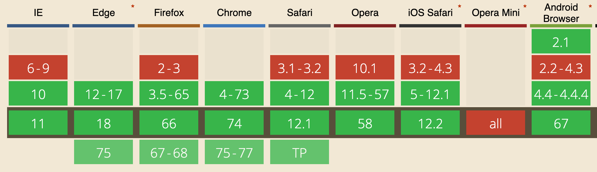

<!-- TOC -->

- [Introduction](#introduction)
- [Browser support for Web Workers](#browser-support-for-web-workers)
- [Create a Web Worker](#create-a-web-worker)
- [Communication with a Web Worker](#communication-with-a-web-worker)
  - [Using postMessage in the Web Worker object](#using-postmessage-in-the-web-worker-object)
    - [Send back messages](#send-back-messages)
    - [Multiple event listeners](#multiple-event-listeners)
  - [Using the Channel Messaging API](#using-the-channel-messaging-api)
- [Web Worker Lifecycle](#web-worker-lifecycle)
- [Loading libraries in a Web Worker](#loading-libraries-in-a-web-worker)
- [APIs available in Web Workers](#apis-available-in-web-workers)

<!-- /TOC -->

## Introduction

JavaScript is single threaded. Nothing can run in parallel at the same time.

This is great because we don't need to worry about a whole set of issues that would happen with concurrent programming.

With this limitation, JavaScript code is forced to be efficient from the start, otherwise the user would have a bad experience. Expensive operations should be asynchronous to avoid blocking the thread.

As the needs of JavaScript applications grew, this started to become a problem in some scenarios.

Web Workers introduce the possibility of parallel execution inside the browser.

They have quite a few limitations:

- no access to the [DOM](/dom/): the Window object and the Document object
- they can communicate back with the main JavaScript program using messaging
- they need to be loaded from the same origin (domain, port and protocol)
- they don't work if you serve the page using the file protocol (`file://`)

The global scope of a Web Worker, instead of Window which is in the main thread, is a [`WorkerGlobalScope`](https://developer.mozilla.org/en-US/docs/Web/API/WorkerGlobalScope) object.

## Browser support for Web Workers

Pretty good!



You can check for Web Workers support using

```js
if (typeof Worker !== 'undefined') {
}
```

## Create a Web Worker

You create a Web Worker by initializing a Worker object, loading a JavaScript file from the same origin:

```js
const worker = new Worker('worker.js')
```

## Communication with a Web Worker

There are two main ways to communicate to a Web Worker:

- the postMessage API offered by the Web Worker object
- the [Channel Messaging API](/channel-messaging-api/)

### Using postMessage in the Web Worker object

You can send messages using `postMessage` on the `Worker` object.

Important: a message is transferred, not shared.

> main.js

```js
const worker = new Worker('worker.js')
worker.postMessage('hello')
```

> worker.js

```js
onmessage = event => {
  console.log(event.data)
}

onerror = event => {
  console.error(event.message)
}
```

#### Send back messages

A worker can send back messages to the function that created it. using its global `postMessage()` function:

> worker.js

```js
onmessage = event => {
  console.log(event.data)
  postMessage('hey')
}

onerror = event => {
  console.error(event.message)
}
```

> main.js

```js
const worker = new Worker('worker.js')
worker.postMessage('hello')

worker.onmessage = event => {
  console.log(event.data)
}
```

#### Multiple event listeners

If you want to setup multiple listeners for the `message` event, instead of using `onmessage` create an event listener (applies to the `error` event as well):

> worker.js

```js
addEventListener('message', event => {
  console.log(event.data)
  postMessage('hey')
}, false)

addEventListener('message', event => {
  console.log(`I'm curious and I'm listening too`)
}, false)

addEventListener('error', event => {
  console.log(event.message)
}, false)
```

> main.js

```js
const worker = new Worker('worker.js')
worker.postMessage('hello')

worker.addEventListener('message', event => {
  console.log(event.data)
}, false)
```

### Using the Channel Messaging API

Instead of using the built-in postMessage API offered by Web Workers, we can choose to use the more general-purpose [Channel Messaging API](/channel-messaging-api/) to communicate to them.

> main.js

```js
const worker = new Worker('worker.js')
const messageChannel = new MessageChannel()
messageChannel.port1.addEventListener('message', event => {
  console.log(event.data)
})
worker.postMessage(data, [messageChannel.port2])
```

> worker.js

```js
addEventListener('message', event => {
  console.log(event.data)
})
```

A Web Worker can send messages back by posting a message to `messageChannel.port2`, like this:

```js
addEventListener('message', event => {
  event.ports[0].postMessage(data)
})
```

## Web Worker Lifecycle

Web Workers are launched and if they do not stay in listening mode for messages through `worker.onmessage` or by adding an event listener, they will be shut down as soon as their code is run through completion.

A Web Worker can be stopped using its `terminate()` method from the main thread, and inside the worker itself using the global method `close()`:

> main.js

```js
const worker = new Worker('worker.js')
worker.postMessage('hello')
worker.terminate()
```

> worker.js

```js
worker.onmessage = event => {
  console.log(event.data)
  close()
}

worker.onerror = event => {
  console.error(event.message)
}
```

## Loading libraries in a Web Worker

Web Workers can use the `importScripts()` global function defined in their global scope:

```js
importScripts('../utils/file.js', './something.js')
```

## APIs available in Web Workers

As said before, the DOM is not reachable by a Web Worker, so you cannot interact with the `window` and `document` objects. Also `parent` is unavailable.

You can however use many other APIs, which include:

- the [XHR API](/xhr/)
- the [Fetch API](/fetch-api/)
- the BroadcastChannel API
- the [FileReader API](/filereader/)
- [IndexedDB](/indexeddb/)
- the [Notifications API](/notifications-api/)
- [Promises](/javascript-promises)
- [Service Workers](/service-workers/)
- the [Channel Messaging API](/channel-messaging-api)
- the [Cache API](/cache-api/)
- the [Console API](/console-api/) (`console.log()` and friends)
- the [JavaScript Timers](/javascript-timers) (`setTimeout`, `setInterval`...)
- the CustomEvents API: `addEventListener()` and `removeEventListener()`
- the current URL, which you can access through the `location` property in read mode
- [WebSockets](/websockets/)
- WebGL
- SVG Animations
