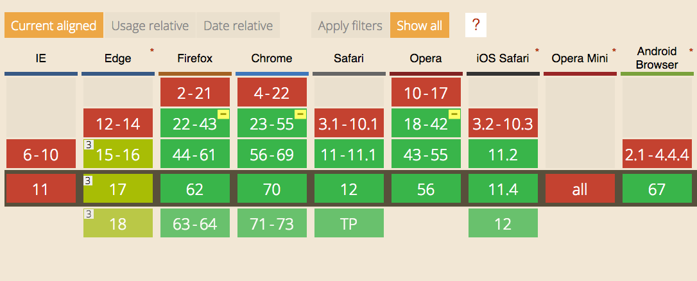

WebRTC stands for **Web Real Time Communication**.

It allows to create a direct data communication between browsers.

You can use it to

- stream audio
- stream video
- share files
- video chat
- create a peer-to-peer data sharing service
- create multiplayer games

and more.

It's an effort to make real-time communication applications easy to create, leveraging Web technologies, so that no 3rd party plugin or external technology is needed beside your Web browser.

There should be no need for a plugin to perform RTC in the future, but all should instead rely on a standard technology - WebRTC.

It is supported by all the modern browsers (with partial support from Edge which does not support `RTCDataChannel` - see later):



WebRTC implements the following APIs:

- **`MediaStream`** gets access to data streams from the user's end, like the camera and the microphone
- **`RTCPeerConnection`** handles communication of audio and video streaming between peers
- **`RTCDataChannel`**: handles communication of other kinds of data (arbitrary data)

With video and audio communication you'll use `MediaStream` and `RTCPeerConnection`.

Other kind of application, like gaming, file sharing and others rely on `RTCDataChannel`.

In this article I'll create an example using WebRTC to connect two remote webcams, using a [Websockets](/websockets/) server using [Node.js](/nodejs/).

> Tip: in your projects you'll likely use a library that abstracts away many of those details. This tutorial aims to explain the WebRTC technology, so you know what is going on under the hood.

## MediaStream

This API lets you access the camera and microphone stream using JavaScript.

Here is a simple example that asks you to access the video camera and plays the video in the page:

<p data-height="265" data-theme-id="0" data-slug-hash="rqRqpX" data-default-tab="js,result" data-user="flaviocopes" data-pen-title="WebRTC MediaStream simple example" data-preview="true" class="codepen">See the Pen <a href="https://codepen.io/flaviocopes/pen/rqRqpX/">WebRTC MediaStream simple example</a> by Flavio Copes (<a href="https://codepen.io/flaviocopes">@flaviocopes</a>) on <a href="https://codepen.io">CodePen</a>.</p>
<script async src="https://static.codepen.io/assets/embed/ei.js"></script>

We add a button to get access to the camera, then we add a `video` element, with the `autoplay` attribute.

We also add the [WebRTC Adapter](https://github.com/webrtchacks/adapter) which helps for cross-browser compatibility:

```html
<button id="get-access">Get access to camera</button>
<video autoplay></video>
<script src="https://webrtc.github.io/adapter/adapter-latest.js"></script>
```

The JS listens for a click on the button, then calls `navigator.mediaDevices.getUserMedia()` asking for the video. Then we access the name of the camera used by calling `stream.getVideoTracks()` on the result of the call to `getUserMedia()`.

The stream is set to be the source object for the `video` tag, so that playback can happen:

```js
document.querySelector('#get-access').addEventListener('click', async function init(e) {
  try {
    const stream = await navigator.mediaDevices.getUserMedia({
      video: true
    })
    document.querySelector('video').srcObject = stream
    document.querySelector('#get-access').setAttribute('hidden', true)
    setTimeout(() => { track.stop() }, 3 * 1000)
  } catch (error) {
    alert(`${error.name}`)
    console.error(error)
  }
})
```

The arguments of getUserMedia() can specify additional requirements for the video stream:

```js
navigator.mediaDevices.getUserMedia({
  video: {
    mandatory: { minAspectRatio: 1.333, maxAspectRatio: 1.334 },
    optional: [
      { minFrameRate: 60 },
      { maxWidth: 640 },
      { maxHeigth: 480 }
    ]
  }
}, successCallback, errorCallback);
```

To get an audio stream you would ask for the audio media object too, and call `stream.getAudioTracks()` instead of `stream.getVideoTracks()`.

After 3 seconds of playback we stop the video streaming by calling `track.stop()`.

## Signaling

Signaling is not part of the WebRTC protocol but it's an essential part for real time communication.

Via signaling, devices communicate between each other and agree on the communication initialization, sharing information such as IP addresses and ports, resolutions and more.

You are free to choose any kind of communication mechanism, including:

- Websockets
- Channel Messaging API
- XHR

We implement it using Websockets.

Install `ws` using [npm](/npm/):

```bash
npm init
npm install ws
```

We start with a simple Websockets server skeleton:

```js
const WebSocket = require('ws')

const wss = new WebSocket.Server({ port: 8080 })

wss.on('connection', ws => {
  console.log('User connected')

  ws.on('message', message => {
    console.log(`Received message => ${message}`)
  })

  ws.on('close', () => {
    //handle closing
  })
})
```

We first add a 'username' box to our frontend, so the user can pick a username before connecting to the server.

```html
<div id="login">
  <label for="username">Login</label>
  <input id="username" placeholder="Login" required="" autofocus="">
  <button id="login">Login</button>
</div>
```

In the client JavaScript we initialize the Websocket to the server:

```js
const ws = new WebSocket('ws://localhost:8080')

ws.onopen = () => {
  console.log('Connected to the signaling server')
}

ws.onerror = err => {
  console.error(err)
}
```

When the user enters the username and clicks the login button we get the username value and we check it, then we send this information to the server:

```js
document.querySelector('button#login').addEventListener('click', event => {
  username = document.querySelector('input#username').value

  if (username.length < 0) {
    alert('Please enter a username 🙂')
    return
  }

  sendMessage({
    type: 'login',
    username: username
  })
})
```

`sendMessage` is a wrapper function for sending a JSON-encoded message the the Websocket server. We use a `type` parameter to separate different kind of messages we'll send:

```js
const sendMessage = message => {
  ws.send(JSON.stringify(message))
}
```

Server side, we decode the JSON message and we detect the message type

```js
ws.on('message', message => {
  let data = null

  try {
    data = JSON.parse(message)
  } catch (error) {
    console.error('Invalid JSON', error)
    data = {}
  }

  switch (data.type) {
    case 'login':
      console.log('User logged', data.username)
      break
  }
})
```

We must add the user to a list of connected users, stored in an associative array `users`:

```js
const users = {}
```

If there is another user already with this same username, we send an error to the client, otherwise we add the user to the array, storing the Websocket connection:

```js
//...
case 'login':
  console.log('User logged', data.username)
  if (users[data.username]) {
    sendTo(ws, { type: 'login', success: false })
  } else {
    users[data.username] = ws
    ws.username = data.username
    sendTo(ws, { type: 'login', success: true })
  }
  break
```

Client-side, when this happens we handle the message and we call the `getUserMedia()` function:

```js
ws.onmessage = msg => {
  console.log('Got message', msg.data)

  const data = JSON.parse(msg.data)

  switch (data.type) {
    case 'login':
      handleLogin(data.success)
      break
  }
}
```

```js
//handleLogin...
navigator.mediaDevices.getUserMedia(
  { video: true, audio: true },
  localStream => {
    //...
  },
  error => {
    console.error(error)
  }
)
```

Inside the success callback, which gets the local stream object, we first hide the `#login` div and we can show a new div that hosts the `video` elements:

```html
<div id="call">
  <video id="local" autoplay></video>
  <video id="remote" autoplay></video>
</div>
```

```js
document.querySelector('div#login').style.display = 'none'
document.querySelector('div#call').style.display = 'block'
```

so that we can start streaming it on the `video#local` element in the page:

```js
document.querySelector('video#local').src = window.URL.createObjectURL(localStream)
```

## RTCPeerConnection

Now we must configure an RTCPeerConnection.

There are a few alien terms you'll find now. **ICE** stands for _Internet Connectivity Establishment_, and **STUN** stands for _Session Traversal of User Datagram Protocol [UDP] Through Network Address Translators [NATs])_

In practice, we must have a way to get 2 computers located in local networks (like your home) to talk to each other. Since most users are behind a NAT router, computers cannot accept incoming connections out of the box.

There is a lot of code that's just needed so we can have 2 endpoints to connect to each other, before the connection takes place.

The peer connection must be initiated using a STUN server and that server will send back our ICE candidate to communicate with another peer.

This is basically what the code below does:

```js
//using Google public stun server
const configuration = {
  iceServers: [{ url: 'stun:stun2.1.google.com:19302' }]
}

connection = new RTCPeerConnection(configuration)

connection.addStream(localStream)

connection.onaddstream = event => {
  document.querySelector('video#remote').srcObject = event.stream
}

connection.onicecandidate = event => {
  if (event.candidate) {
    sendMessage({
      type: 'candidate',
      candidate: event.candidate
    })
  }
}
```

We configure an ICE server using the Google public STUN server (which works fine for testing purposes, but you'll most likely need to configure your own for production use).

Then we add the local stream to that connection using `addStream()`, and we pass 2 callback handlers for the `RTCPeerConnection.onaddstream` and `RTCPeerConnection.onicecandidate` events.

`RTCPeerConnection.onaddstream` is called when we have a remote audio/video stream coming in, and we assign it to the remote `video` element to stream.

For data, the event would be called `RTCPeerConnection.ondatachannel` and instead of using the `addStream()` method you would have used `createDataChannel()`.

`RTCPeerConnection.onicecandidate` is called when we receive an ICE candidate, and we send it to our server.

Before this happens we must attempt to connect to a peer.

In this simple example we must know the username of the other person we want to connect to, and they must already be "logged in".

One of the 2 users must enter the username in the box and click the "Call" button.

```html
<div>
  <input id="username-to-call" placeholder="Username to call" />
  <button id="call">Call</button>
  <button id="close-call">Close call</button>
</div>
```

In the client JavaScript we listen for the click event on this button and we get the username value.

If the username is valid we store it in the `otherUsername` variable we'll use later, and we create an **offer**.

```js
let otherUsername

document.querySelector('button#call').addEventListener('click', () => {
  const callToUsername = document.querySelector('input#username-to-call').value

  if (callToUsername.length === 0) {
    alert('Enter a username 😉')
    return
  }

  otherUsername = callToUsername

  // create an offer
  connection.createOffer(
    offer => {
      sendMessage({
        type: 'offer',
        offer: offer
      })

      connection.setLocalDescription(offer)
    },
    error => {
      alert('Error when creating an offer')
      console.error(error)
    }
  )
})
```

Once we get the offer by calling `RTCPeerConnection.createOffer()`, we pass it to our server and we call `RTCPeerConnection.setLocalDescription()` to configure the connection.

On the server side, we process the offer and we send it to the user that we want to connect to, passed as `data.otherUsername`:

```js
case 'offer':
  console.log('Sending offer to: ', data.otherUsername)
  if (users[data.otherUsername] != null) {
    ws.otherUsername = data.otherUsername
    sendTo(users[data.otherUsername], {
      type: 'offer',
      offer: data.offer,
      username: ws.username
    })
  }
  break
```

The client receives this offer as a Websocket message, and we call the `handleOffer` method:

```js
ws.onmessage = msg => {
  //...
  switch (data.type) {
    //...
    case 'offer':
      handleOffer(data.offer, data.username)
      break
  }
}
```

This method accepts the offer and the username, and we first call `RTCPeerConnection.setRemoteDescription()` to specify the properties of the remote end of the connection, then `RTCPeerConnection.createAnswer()` to create the answer to the offer.

Once the answer is created, we use it to set the properties of the local end of the connection and we post it to our server, using the `sendMessage` function.

The `RTCSessionDescription` object describes the connection capabilities and must be initialized before the RTC can happen. We must set both the description of the local end of the connection (`setLocalDescription`), and the description of the other end of the connection (`setRemoteDescription`).

```js
const handleOffer = (offer, username) => {
  otherUsername = username
  connection.setRemoteDescription(new RTCSessionDescription(offer))
  connection.createAnswer(
    answer => {
      connection.setLocalDescription(answer)
      sendMessage({
        type: 'answer',
        answer: answer
      })
    },
    error => {
      alert('Error when creating an answer')
      console.error(error)
    }
  )
}
```

On the server side we handle the `answer` event:

```js
case 'answer':
  console.log('Sending answer to: ', data.otherUsername)
  if (users[data.otherUsername] != null) {
    ws.otherUsername = data.otherUsername
    sendTo(users[data.otherUsername], {
      type: 'answer',
      answer: data.answer
    })
  }
  break
```

We check if the username we want to talk with exists, then we set it as the `otherUsername` of the Websocket connection. We send the answer back to that user.

On the client side that user will get the `answer` message that triggers the `handleAnswer()` method, which calls `RTCPeerConnection.setRemoteDescription()` to synchronize the properties of the remote end of the connection:

```js
ws.onmessage = msg => {
  //...
  switch (data.type) {
    //...
    case 'answer':
      handleAnswer(data.answer)
      break
  }
}

const handleAnswer = answer => {
  connection.setRemoteDescription(new RTCSessionDescription(answer))
}
```

Now that the session descriptions have been synchronized, the two peers start to determine how to establish the connection between them, using the ICE protocol. This is the key part that works around the NAT routers limitations.

`RTCPeerConnection` produces an ICE candidate and calls its `onicecandidate` callback function. In the callback we send the ICE candidate to the other end of connection, using our `sendMessage()` function:

```js
connection.onicecandidate = event => {
  if (event.candidate) {
    sendMessage({
      type: 'candidate',
      candidate: event.candidate
    })
  }
}
```

On the server side we handle the `candidate` event by sending it to the other peer:

```js
//...
case 'candidate':
  console.log('Sending candidate to:', data.otherUsername)

  if (users[data.otherUsername] != null) {
    sendTo(users[data.otherUsername], {
      type: 'candidate',
      candidate: data.candidate
    })
  }

  break
```

The other peer receives it on the client:

```js
ws.onmessage = msg => {
  //...
  switch (data.type) {
    //...
    case 'candidate':
      handleCandidate(data.candidate)
      break
  }
}

const handleCandidate = candidate => {
  connection.addIceCandidate(new RTCIceCandidate(candidate))
}
```

We call `RTCPeerConnection.addIceCandidate()` to add the candidate locally.

At this point the ICE exchange steps and session description are complete, negotiation is done and WebRTC can connect the two remote peers, using the connection mechanism that was automatically agreed upon.

**We now have 2 computers directly communicating to each other exchanging their webcam streams!**

## Closing the connection

The connection can be closed programmatically. We have a button "Close call" that we can click once the connection has been made:

```html
<button id="close-call">Close call</button>
```

```js
document.querySelector('button#close-call').addEventListener('click', () => {
  sendMessage({
    type: 'close'
  })

  handleClose()
})

const handleClose = () => {
  otherUsername = null
  document.querySelector('video#remote').src = null

  connection.close()
  connection.onicecandidate = null
  connection.onaddstream = null
}
```

On the client side we remove the remote streaming and we close the `RTCPeerConnection` connection, setting the callback for its events to null.

We send the `close` message to the server, which in turn sends it to the remote peer:

```js
case 'close':
  console.log('Disconnecting from', data.otherUsername)
  users[data.otherUsername].otherUsername = null
  if (users[data.otherUsername] != null) {
    sendTo(users[data.otherUsername], { type: 'close' })
  }
  break
```

so in the client side we can call the `handleClose()` function:

```js
ws.onmessage = msg => {
  //...
  switch (data.type) {
    //...
    case 'close':
      handleClose()
      break
  }
}
```

The complete example is available on this Gist:

<script src="https://gist.github.com/flaviocopes/e0844d71da2348d14ec8b6742d8b2795.js"></script>