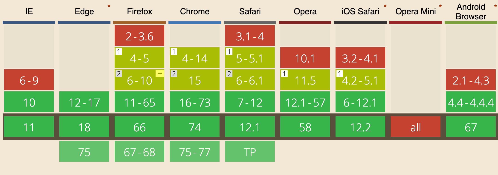

WebSockets are an alternative to HTTP communication in Web Applications.

They offer a long lived, bidirectional communication channel between client and server.

Once established, the channel is kept open, offering a very fast connection with low latency and overhead.

## Browser support for WebSockets

WebSockets are supported by all modern browsers.



## How WebSockets differ from HTTP

HTTP is a very different protocol, and also a different way of communicate.

HTTP is a request/response protocol: the server returns some data when the client requests it.

With WebSockets:

- the **server can send a message to the client** without the client explicitly requesting something
- the client and the server can **talk to each other simultaneously**
- **very little data overhead** needs to be exchanged to send messages. This means a **low latency communication**.

**WebSockets** are great for **real-time** and **long-lived** communications.

**HTTP** is great for **occasional data exchange** and interactions initiated by the client.

**HTTP is much simpler** to implement, while WebSockets require a bit more overhead.

## Secured WebSockets

Always use the secure, encrypted protocol for WebSockets, `wss://`.

`ws://` refers to the unsafe WebSockets version (the `http://` of WebSockets), and should be avoided for obvious reasons.

## Create a new WebSockets connection

```js
const url = 'wss://myserver.com/something'
const connection = new WebSocket(url)
```

`connection` is a [WebSocket](https://developer.mozilla.org/en-US/docs/Web/API/WebSocket) object.

When the connection is successfully established, the `open` event is fired.

Listen for it by assigning a callback function to the `onopen` property of the `connection` object:

```js
connection.onopen = () => {
  //...
}
```

If there's any error, the `onerror` function callback is fired:

```js
connection.onerror = error => {
  console.log(`WebSocket error: ${error}`)
}
```

## Sending data to the server using WebSockets

Once the connection is open, you can send data to the server.

You can do so conveniently inside the `onopen` callback function:

```js
connection.onopen = () => {
  connection.send('hey')
}
```

## Receiving data from the server using WebSockets

Listen with a callback function on `onmessage`, which is called when the `message` event is received:

```js
connection.onmessage = e => {
  console.log(e.data)
}
```

## Implement a server in Node.js

[ws](https://github.com/websockets/ws) is a popular WebSockets library for [Node.js](/nodejs/).

We'll use it to build a WebSockets server. It can also be used to implement a client, and use WebSockets to communicate between two backend services.

Install it using [npm](/npm/):

```bash
npm init
npm install ws
```

The code you need to write is very little:

```js
const WebSocket = require('ws')

const wss = new WebSocket.Server({ port: 8080 })

wss.on('connection', ws => {
  ws.on('message', message => {
    console.log(`Received message => ${message}`)
  })
  ws.send('ho!')
})
```

This code creates a new server on port 8080 (the default port for WebSockets), and adds a callback function when a connection is established, sending `ho!` to the client, and logging the messages it receives.

## See a live example on Glitch

Here is a live example of a WebSockets server: <https://glitch.com/edit/#!/flavio-websockets-server-example>

<!-- Copy and Paste Me -->
<div class="glitch-embed-wrap" style="height: 324px; width: 100%;">
  <iframe src="https://glitch.com/embed/#!/embed/flavio-websockets-server-example?path=server.js&previewSize=0&previewFirst=true" alt="flavio-websockets-server-example on glitch" style="height: 100%; width: 100%; border: 0;"></iframe>
</div>

<p></p>

Here is a WebSockets client that interacts with the server: <https://glitch.com/edit/#!/flavio-websockets-client-example>

<!-- Copy and Paste Me -->
<div class="glitch-embed-wrap" style="height: 371px; width: 100%;">
  <iframe src="https://glitch.com/embed/#!/embed/flavio-websockets-client-example?path=script.js&previewSize=0&previewFirst=true" alt="flavio-websockets-client-example on glitch" style="height: 100%; width: 100%; border: 0;"></iframe>
</div>
