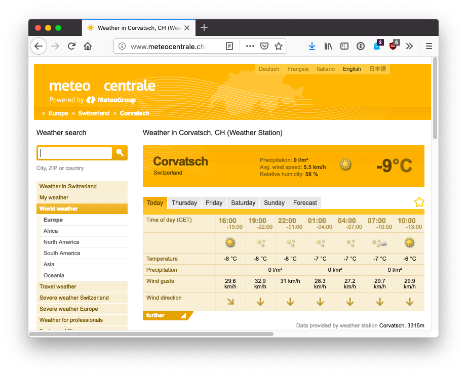
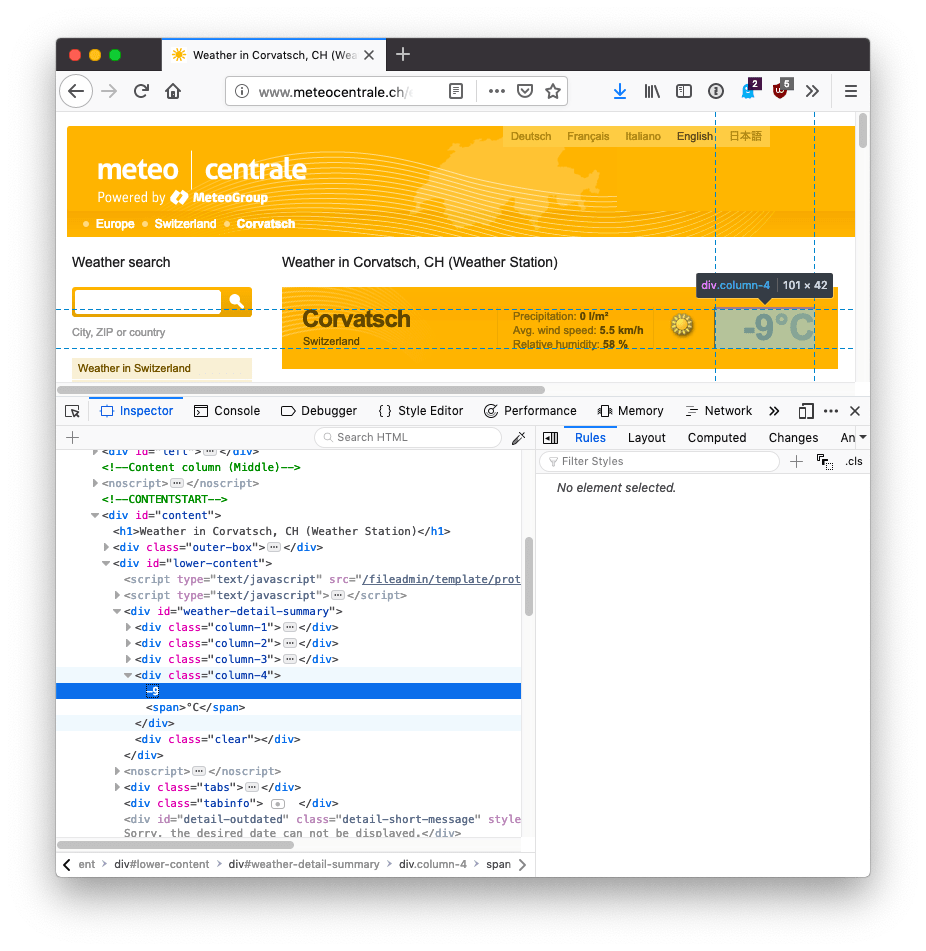

Web Scraping is the task of downloading a web page and extracting some kind of information from it.

I recently made a little project with an Arduino board with a LCD display attached. Using Johnny-Five, which lets us program the Arduino using Node.js, I wanted to fetch the temperature measured at the top of a mountain, and show it on the Arduino board.

I used **Puppeteer** to do the task of scraping. Puppeteer is a great tool built by Google. It's a Node library we can use to control a headless Chrome instance.

This means we are basically use Chrome, but programmatically.

There are many practical uses for Puppeteer, including automating testing, make screenshots, create server-side rendered versions of single page apps, and more.

Start by installing it using

```bash
npm install puppeteer
```

In a Node.js file, require it:

```js
const puppeteer = require('puppeteer');
```

then we can use the `launch()` method to create a browser instance:

```js
(async () => {
  const browser = await puppeteer.launch()
})()
```

We use `await`, and so we must wrap this method call in an [async function](https://flaviocopes.com/javascript-async-await/), which we [immediately invoke](/javascript-iife/).

Next we can use the `newPage()` method on the `browser` object to get the `page` object:

```js
(async () => {
  const browser = await puppeteer.launch()
  const page = await browser.newPage()
})()
```

Next up we call the `goto()` method on the `page` object to load that page:

```js
(async () => {
  const browser = await puppeteer.launch()
  const page = await browser.newPage()
  await page.goto('https://website.com')
})()
```

Finally, we can get the page **content** calling the `evaluate()` method of `page`. This method takes a callback function where we can add the code needed to retrieve the elements of the page we need. The function is executed in the context of a page, so we have access to `document` and all the browser APIs. We return a new object, and this will be the result of our `evaluate()` method call.

We can use the [Selectors API](https://flaviocopes.com/selectors-api/) and retrieve data from the page.

```js
(async () => {
  const browser = await puppeteer.launch()
  const page = await browser.newPage()
  await page.goto('https://website.com')

	const result = await page.evaluate(() => {
  	//...
	})
})()
```

Let's get to the particular problem I have. This is the page which hosts the meteo station, located on the top of a mountain at 3315m: <http://www.meteocentrale.ch/it/europa/svizzera/meteo-corvatsch/details/S067910/>



I want to get that `-9°C` text. Using the browser inspector I can see it has a `column-4` class attached. It's not an ideal class name, as it's not meaningful, and might change if they decide to add a new column, but this is what we got:



This is the complete code up to now:

```js
const puppeteer = require('puppeteer');

(async () => {
  const browser = await puppeteer.launch()
  const page = await browser.newPage()
  await page.goto('http://www.meteocentrale.ch/it/europa/svizzera/meteo-corvatsch/details/S067910/')

	const result = await page.evaluate(() => {
 	  let temperature = document.querySelector('.column-4').innerText
    return {
	    temperature
	  }
  })

  console.log(result)

  browser.close()
})()
```

If we run this code, `result` will have this value:

```js
{
  temperature: '-9°C'
}
```

or whatever the temperature is right now.
