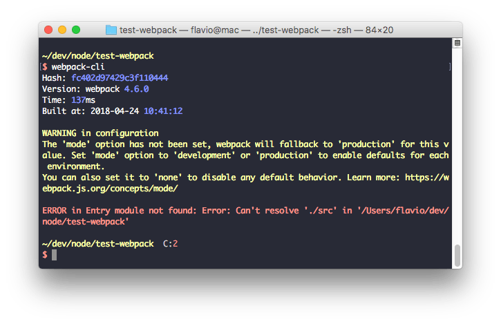
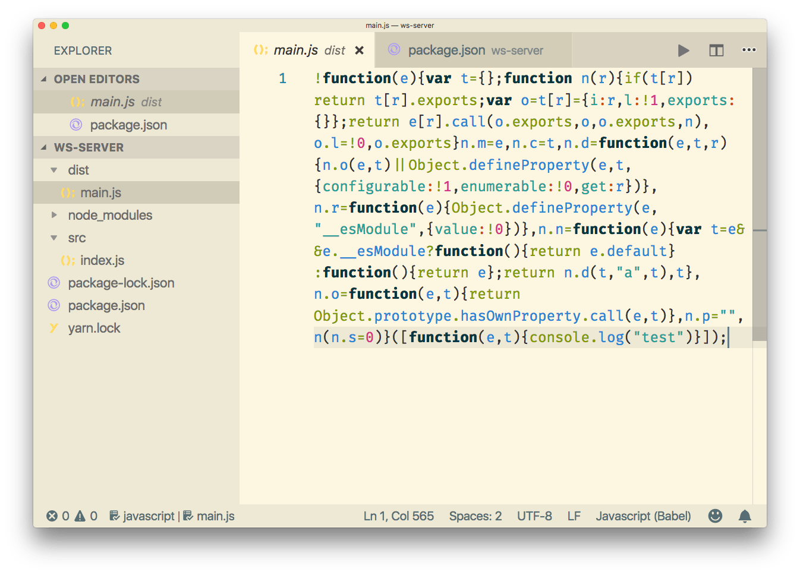
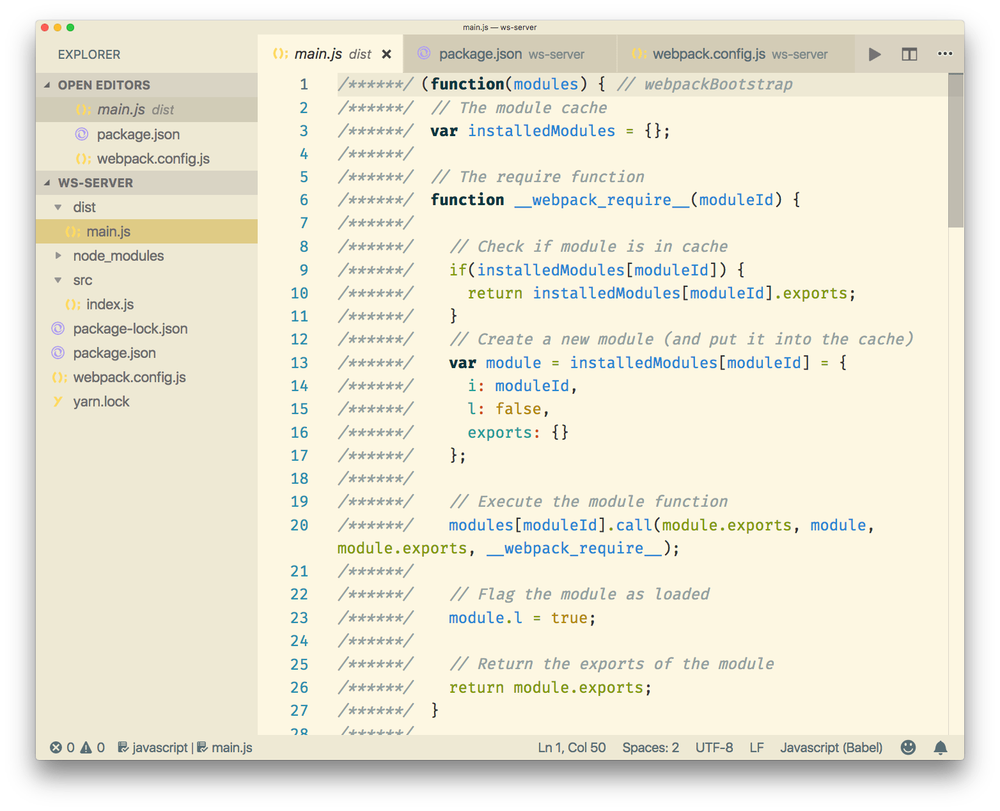

<!-- TOC -->

- [What is webpack?](#what-is-webpack)
- [Installing webpack](#installing-webpack)
  - [Global install](#global-install)
  - [Local install](#local-install)
- [Webpack configuration](#webpack-configuration)
- [The entry point](#the-entry-point)
- [The output](#the-output)
- [Loaders](#loaders)
- [Plugins](#plugins)
- [The webpack mode](#the-webpack-mode)
- [Running webpack](#running-webpack)
- [Watching changes](#watching-changes)
- [Handling images](#handling-images)
- [Process your SASS code and transform it to CSS](#process-your-sass-code-and-transform-it-to-css)
- [Generate Source Maps](#generate-source-maps)

<!-- /TOC -->

##  What is webpack?

Webpack is a tool that lets you compile JavaScript modules, also known as **module bundler**.

Given a large number of files, it generates a single file (or a few files) that run your app.

It can perform many operations:

- helps you bundle your resources.
- watches for changes and re-runs the tasks.
- can run Babel transpilation to ES5, allowing you to use the latest [JavaScript](https://flaviocopes.com/javascript/) features without worrying about browser support.
- can transpile CoffeeScript to JavaScript
- can convert inline images to data URIs.
- allows you to use require() for CSS files.
- can run a development webserver.
- can handle hot module replacement.
- can split the output files into multiple files, to avoid having a huge js file to load in the first page hit.
- can perform [tree shaking](https://flaviocopes.com/javascript-glossary/#tree-shaking).

Webpack is not limited to be use on the frontend, it's also useful in backend Node.js development as well.

Predecessors of webpack, and still widely used tools, include:

- Grunt
- Broccoli
- Gulp

There are lots of similarities in what those and Webpack can do, but the main difference is that those are known as **task runners**, while webpack was born as a module bundler.

It's a more focused tool: you specify an entry point to your app (it could even be an HTML file with script tags) and webpack analyzes the files and bundles all you need to run the app in a single JavaScript output file (or in more files if you use code splitting).

## Installing webpack

Webpack can be installed globally or locally for each project.

### Global install

Here's how to install it globally with [Yarn](https://flaviocopes.com/yarn/):

```
yarn global add webpack webpack-cli
```

with [npm](https://flaviocopes.com/npm/):

```
npm i -g webpack webpack-cli
```

once this is done, you should be able to run

```bash
webpack-cli
```



### Local install

Webpack can be installed locally as well. It's the recommended setup, because webpack can be updated per-project, and you have less resistance to using the latest features just for a small project rather than updating all the projects you have that use webpack.

With [Yarn](https://flaviocopes.com/yarn/):

```
yarn add webpack webpack-cli -D
```

with [npm](https://flaviocopes.com/npm/):

```
npm i webpack webpack-cli --save-dev
```

Once this is done, add this to your `package.json` file:

```json
{
  //...
  "scripts": {
    "build": "webpack"
  }
}
```

once this is done, you can run webpack by typing

```bash
yarn build
```

in the project root.

## Webpack configuration

By default, webpack (starting from version 4) does not require any config if you respect these conventions:

- the **entry point** of your app is `./src/index.js`
- the output is put in `./dist/main.js`.
- Webpack works in production mode

You can customize every little bit of webpack of course, when you need. The webpack configuration is stored in the `webpack.config.js` file, in the project root folder.

## The entry point

By default the entry point is `./src/index.js`
This simple example uses the `./index.js` file as a starting point:

```js
module.exports = {
  /*...*/
  entry: './index.js'
  /*...*/
}
```

## The output

By default the output is generated in `./dist/main.js`. This example puts the output bundle into `app.js`:

```js
module.exports = {
  /*...*/
  output: {
    path: path.resolve(__dirname, 'dist'),
    filename: 'app.js'
  }
  /*...*/
}
```

## Loaders

Using webpack allows you to use `import` or `require` statements in your JavaScript code to not just include other JavaScript, but any kind of file, for example CSS.

Webpack aims to handle all our dependencies, not just JavaScript, and loaders are one way to do that.

For example, in your code you can use:

```js
import 'style.css'
```

by using this loader configuration:

```js
module.exports = {
  /*...*/
  module: {
    rules: [
      { test: /\.css$/, use: 'css-loader' },
    }]
  }
  /*...*/
}
```

The [regular expression](https://flaviocopes.com/javascript-regular-expressions/) targets any CSS file.

A loader can have options:

```js
module.exports = {
  /*...*/
  module: {
    rules: [
      {
        test: /\.css$/,
        use: [
          {
            loader: 'css-loader',
            options: {
              modules: true
            }
          }
        ]
      }
    ]
  }
  /*...*/
}
```
You can require multiple loaders for each rule:

```js
module.exports = {
  /*...*/
  module: {
    rules: [
      {
        test: /\.css$/,
        use:
          [
            'style-loader',
            'css-loader',
          ]
      }
    ]
  }
  /*...*/
}
```

In this example, `css-loader`  interprets the `import 'style.css'` directive in the CSS. `style-loader` is then responsible for injecting that CSS in the DOM, using a `<style>` tag.

The order matters, and it's reversed (the last is executed first).

What kind of loaders are there? Many! [You can find the full list here](https://webpack.js.org/loaders/).

A commonly used loader is [Babel](https://flaviocopes.com/babel/), which is used to transpile modern JavaScript to ES5 code:

```js
module.exports = {
  /*...*/
  module: {
    rules: [
      {
        test: /\.js$/,
        exclude: /(node_modules|bower_components)/,
        use: {
          loader: 'babel-loader',
          options: {
            presets: ['@babel/preset-env']
          }
        }
      }
    ]
  }
  /*...*/
}
```

This example makes Babel preprocess all our React/JSX files:

```js
module.exports = {
  /*...*/
  module: {
    rules: [
      {
        test: /\.(js|jsx)$/,
        exclude: /node_modules/,
        use: 'babel-loader'
      }
    ]
  },
  resolve: {
    extensions: [
      '.js',
      '.jsx'
    ]
  }
  /*...*/
}
```

[See the `babel-loader` options here](https://webpack.js.org/loaders/babel-loader/).

## Plugins

Plugins are like loaders, but on steroids. They can do things that loaders can't do, and they are the main building block of webpack.

Take this example:

```js
module.exports = {
  /*...*/
  plugins: [
    new HTMLWebpackPlugin()
  ]
  /*...*/
}
```

The `HTMLWebpackPlugin` plugin has the job of automatically creating an HTML file, adding the output JS bundle path, so the JavaScript is ready to be served.

There are [lots of plugins available](https://webpack.js.org/plugins/).

One useful plugin, `CleanWebpackPlugin`, can be used to clear the `dist/` folder before creating any output, so you don't leave files around when you change the name of the output file:

```js
module.exports = {
  /*...*/
  plugins: [
    new CleanWebpackPlugin(['dist']),
  ]
  /*...*/
}
```


## The webpack mode

This mode (introduced in webpack 4) sets the environment on which webpack works. It can be set to `development` or `production` (defaults to production, so you only set it when moving to development)

```js
module.exports = {
  entry: './index.js',
  mode: 'development',
  output: {
    path: path.resolve(__dirname, 'dist'),
    filename: 'app.js'
  }
}
```

Development mode:

- builds very fast
- is less optimized than production
- does not remove comments
- provides more detailed error messages and suggestions
- provides a better debugging experience

Production mode is slower to build, since it needs to generate a more optimized bundle. The resulting JavaScript file is smaller in size, as it removes many things that are not needed in production.

I made a sample app that just prints a `console.log` statement.

Here's the production bundle:



Here's the development bundle:



## Running webpack

Webpack can be run from the command line manually if installed globally, but generally you write a script inside the `package.json` file, which is then run using `npm` or `yarn`.

For example this `package.json` scripts definition we used before:

```js
"scripts": {
  "build": "webpack"
}
```

allows us to run `webpack` by running

```bash
npm run build
```

or

```bash
yarn run build
```

or

```bash
yarn build
```

## Watching changes

Webpack can automatically rebuild the bundle when a change in your app happens, and keep listening for the next change.

Just add this script:

```js
"scripts": {
  "watch": "webpack --watch"
}
```

and run


```bash
npm run watch
```

or

```bash
yarn run watch
```

or

```bash
yarn watch
```

One nice feature of the watch mode is that the bundle is only changed if the build has no errors. If there are errors, `watch` will keep listening for changes, and try to rebuild the bundle, but the current, working bundle is not affected by those problematic builds.

## Handling images

Webpack allows us to use images in a very convenient way, using the [`file-loader`](https://webpack.js.org/loaders/file-loader/) loader.

This simple configuration:

```js
module.exports = {
  /*...*/
  module: {
    rules: [
      {
        test: /\.(png|svg|jpg|gif)$/,
        use: [
          'file-loader'
        ]
      }
    ]
  }
  /*...*/
}
```

Allows you to import images in your JavaScript:

```js
import Icon from './icon.png'

const img = new Image()
img.src = Icon
element.appendChild(img)
```

(`img` is an HTMLImageElement. Check the [Image docs](https://developer.mozilla.org/en-US/docs/Web/API/HTMLImageElement/Image))

`file-loader` can handle other asset types as well, like fonts, CSV files, xml, and more.

Another nice tool to work with images is the `url-loader` loader.

This example loads any PNG file smaller than 8KB as a [data URL](https://flaviocopes.com/data-urls/).

```js
module.exports = {
  /*...*/
  module: {
    rules: [
      {
        test: /\.png$/,
        use: [
          {
            loader: 'url-loader',
            options: {
              limit: 8192
            }
          }
        ]
      }
    ]
  }
  /*...*/
}
```

## Process your SASS code and transform it to CSS

Using `sass-loader`, `css-loader` and `style-loader`:

```js
module.exports = {
  /*...*/
  module: {
    rules: [
      {
        test: /\.scss$/,
        use: [
          'style-loader',
          'css-loader',
          'sass-loader'
        ]
      }
    ]
  }
  /*...*/
}
```

## Generate Source Maps

Since webpack bundles the code, Source Maps are mandatory to get a reference to the original file that raised an error, for example.

You tell webpack to generate source maps using the `devtool` property of the configuration:


```js
module.exports = {
  /*...*/
  devtool: 'inline-source-map',
  /*...*/
}
```

`devtool` has [many possible values](https://webpack.js.org/configuration/devtool/), the most used probably are:

- `none`: adds no source maps
- `source-map`: ideal for production, provides a separate source map that can be minimized, and adds a reference into the bundle, so development tools know that the source map is available. Of course you should configure the server to avoid shipping this, and just use it for debugging purposes
- `inline-source-map`: ideal for development, inlines the source map as a Data URL
