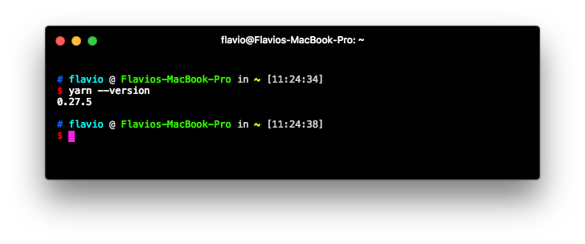
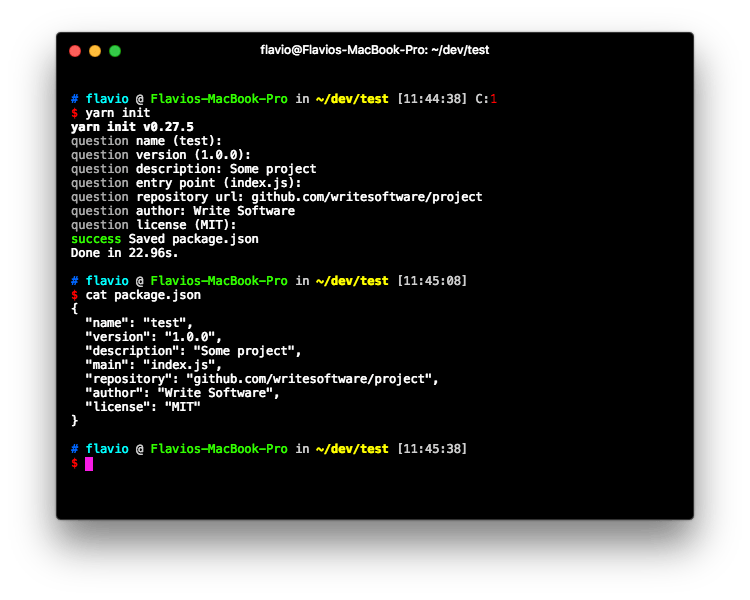
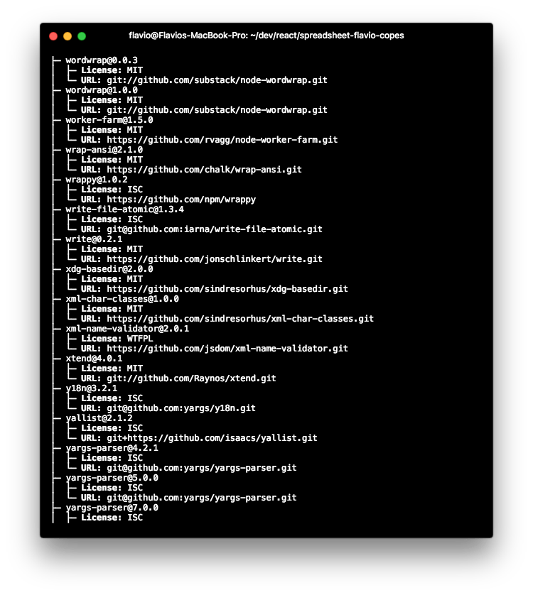
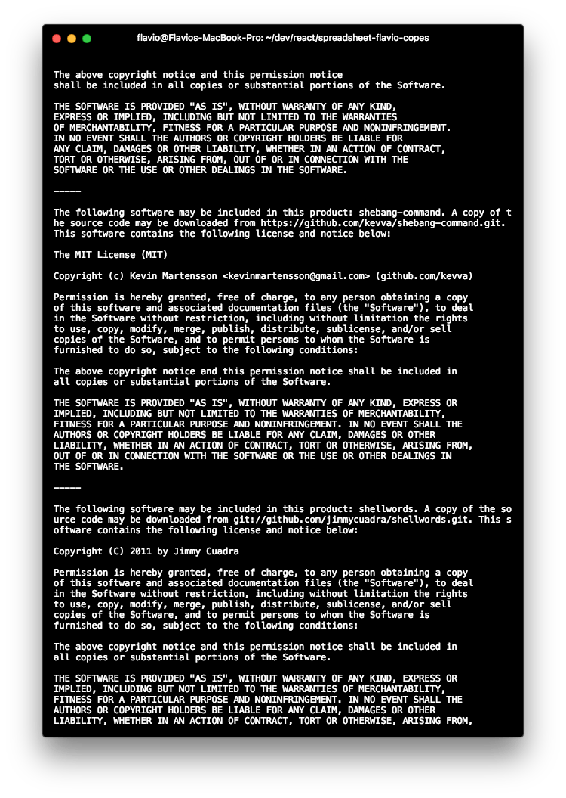
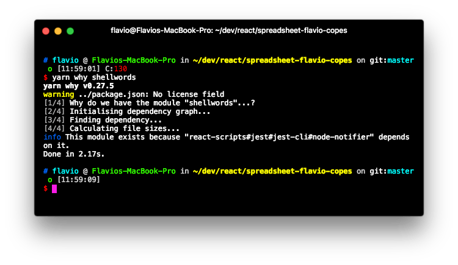
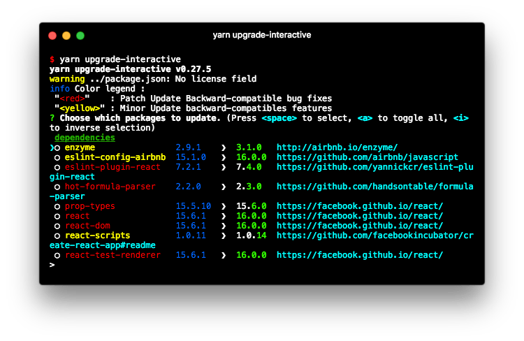

<!-- TOC -->

- [Intro to Yarn](#intro-to-yarn)
- [Install Yarn](#install-yarn)
- [Managing packages](#managing-packages)
  - [Initialize a new project](#initialize-a-new-project)
  - [Install the dependencies of an existing project](#install-the-dependencies-of-an-existing-project)
  - [Install a package locally](#install-a-package-locally)
  - [Install a package globally](#install-a-package-globally)
  - [Install a package locally as a development dependency](#install-a-package-locally-as-a-development-dependency)
  - [Remove a package](#remove-a-package)
- [Inspecting licenses](#inspecting-licenses)
- [Inspecting dependencies](#inspecting-dependencies)
- [Upgrading packages](#upgrading-packages)
- [How to upgrade Yarn](#how-to-upgrade-yarn)

<!-- /TOC -->

## Intro to Yarn

Yarn is a [JavaScript](/javascript/) Package Manager, a direct competitor of [npm](/npm/), and it's one of the Facebook Open Source projects.

It's **compatible with npm packages**, so it has the great advantage of being a drop-in replacement for npm.

When it launched it used to be way faster than `npm` due to parallel download and caching, but now `npm` did catch up with many of its features and is now the solution I recommend.

Tools eventually converge to a set of features that keeps them on the same level to stay relevant, so we'll likely see those features in npm in the future - competition is nice for us users.

## Install Yarn

While you can install Yarn with [npm](/npm/) (`npm install -g yarn`), it's not recommended by the Yarn team.

System-specific installation methods are listed at <https://yarnpkg.com/en/docs/install>. On macOS for example you can use **Homebrew** and run

```bash
brew install yarn
```

but every Operating System has its own package manager of choice that will make the process very smooth.

In the end, you'll end up with the `yarn` command available in your shell:



## Managing packages

Yarn writes its dependencies to a file named `package.json`, which sits in the root folder of your project, and stores the dependencies files into the `node_modules` folder, _just like [npm](/npm/)_ if you used it in the past.

### Initialize a new project

```bash
yarn init
```

starts an interactive prompt that helps you quick start a project:



### Install the dependencies of an existing project

If you already have a `package.json` file with the list of dependencies but the packages have not been installed yet, run

```bash
yarn
```

or

```bash
yarn install
```

to start the installation process.

### Install a package locally

Installing a package into a project is done using

```bash
yarn add package-name
```

### Install a package globally

```bash
yarn global add package-name
```

### Install a package locally as a development dependency

```bash
yarn add --dev package-name
```

> Equivalent to the `--save-dev` flag in npm

### Remove a package

```bash
yarn remove package-name
```

## Inspecting licenses

When installing many dependencies, which in turn might have lots of dependencies, you install a number of packages, of which you don't have any idea about the license they use.

Yarn provides a handy tool that prints the license of any dependency you have:

```bash
yarn licenses ls
```



and it can also generate a disclaimer automatically including **all** the licenses of the projects you use:

```bash
yarn licenses generate-disclaimer
```



## Inspecting dependencies

Do you ever check the `node_modules` folder and wonder why a specific package was installed? `yarn why` tells you:

```bash
yarn why package-name
```



## Upgrading packages

If you want to upgrade a single package, run

```bash
yarn upgrade package-name
```

To upgrade all your packages, run

```bash
yarn upgrade
```

But this command can sometimes lead to problems, because you're blindly upgrading all the dependencies without worrying about major version changes.

Yarn has a great tool to selectively update packages in your project, which is a huge help for this scenario:

```bash
yarn upgrade-interactive
```



## How to upgrade Yarn

At the time of writing there is no auto-update command.

If you used `brew` to install it, like suggested above, use:

```bash
brew upgrade yarn
```

If instead you installed using npm, use:

```bash
npm uninstall yarn -g
npm install yarn -g
```